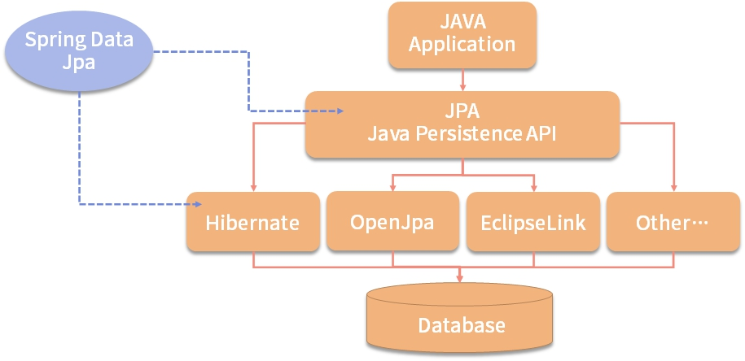
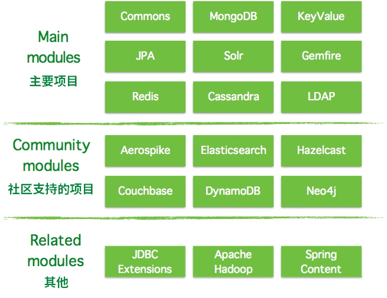
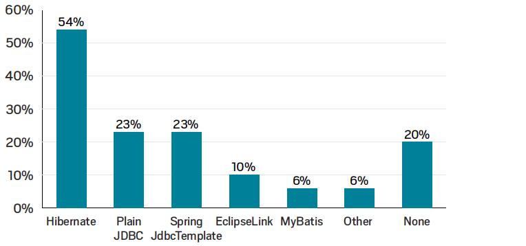
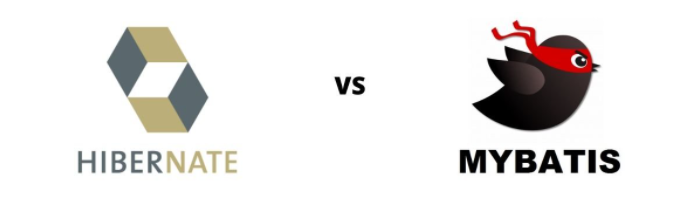

# :sunrise: JPA快速入门

> :pencil2: 修学好古，实事求是。—— 《汉书·河间献王刘德传》

## JPA介绍

JPA是Java Persistence API的简称，中文名为Java持久层API，是JDK 5.0注解或XML描述对象－关系表的映射关系，并将运行期的实体对象持久化到数据库中。Sun引入新的JPA ORM规范出于两个原因：其一，简化现有Java EE和Java SE应用开发工作；其二，Sun希望整合ORM技术，实现天下归一。

JPA包括以下3方面的内容：

- <font color=#42b983>一套API标准</font>
  - 在javax.persistence的包下面，用来操作实体对象，执行CRUD操作，框架在后台替代我们完成所有的事情，开发者从烦琐的JDBC和SQL代码中解脱出来。
- <font color=#42b983>面向对象的查询语言</font>
  - Java Persistence Query Language ( JPQL )。这是持久化操作中很重要的一个方面，通过面向对象而非面向数据库的查询语言查询数据，避免程序的SQL语句紧密耦合。
- <font color=#42b983>ORM（object/relational metadata）元数据的映射</font>
  - JPA支持XML和JDK5.0注解两种元数据的形式，元数据描述对象和表之间的映射关系，框架据此将实体对象持久化到数据库表中。

JPA实际是基于Hibernate的JPA技术实现，并针对JPA规范的再次封装，并引用了JPQL（Java Persistence Query Language）查询语言，属于Spring整个生态体系的一部分。

目前，Hibernate 3.2+、TopLink 10.1.3以及OpenJPA都提供了JPA的实现，以及最后的Spring的整合Spring Data JPA。目前互联网公司和传统公司大量使用了JPA的开发标准规范，如图：



## Spring Data介绍

Spring Data项目是从2010年发展起来的，从创立之初Spring Data就想提供一个大家熟悉的、一致的、基于Spring的数据访问编程模型，同时仍然保留底层数据存储的特殊特性。它可以轻松地让开发者使用数据访问技术，包括关系数据库、非关系数据库（NoSQL）和基于云的数据服务。

Spring Data Common是Spring Data所有模块的公用部分，该项目提供跨Spring数据项目的共享基础设施。它包含了技术中立的库接口以及一个坚持java类的元数据模型。

Spring Data不仅对传统的数据库访问技术JDBC、Hibernate、JDO、TopLick、JPA、Mybitas做了很好的支持、扩展、抽象、提供方便的API，还对NoSQL等非关系数据做了很好的支持，包括MongoDB、Redis、Apache Solr等。



## 目前生态

在2018年的JVM生态报告中，ORM框架使用占比，如下：



调查报告显示，有超过一半的开发人员使用了 Hibernate。其次有 23% 的受访者选择了 JDBC。但严格意义上来讲，JDBC 并不是 ORM 框架，所以说选择 None 这一选项的开发者也有可能使用 JDBC。

## MyBatis VS Hibernate



key | Hibernate | MyBatis
---------|----------|---------
 量级 | 重量级，功能齐全，精通较难 | 轻量级，上手简单，插件多
 SQL自由度 | 低，仅对基本的SQL语法有较好的支持，也支持手写SQL | 高，提供灵活的SQL编写方式
 开发效率 | 高，DAO层开发更简单，支持JPA | 低，需要维护SQL
 数据库无关性 |好，高度解耦，封装了JDBC实现，只需再配置中指定数据库 | 差。SQL依赖数据库
 缓存 | 自身的缓冲机制较好，可避免脏读，支持二级缓冲，三方缓冲机制 | 自身的缓冲机制较差，支持二级缓冲，三方缓冲机制
 映射 | POJO与数据库表映射，自动生成和执行SQL，完成的ORM | POJO与SQL映射，可映射到指定的POJO
 性能 | 稍低 | 稍高
 使用场景 | 适合单数据库，无多表关联，数据库结构不稳定的项目 | 擅长复杂的查询

## JPA项目搭建

### 环境要求

- JDK 1.8及以上
- MAVEN 3.0及以上
- IntelliJ IDEA（可选）

### 集成JPA

> 基于SpringBoot 2.5.5版本集成JPA

- 引入JPA与MySQL依赖

```xml
<dependency>
    <groupId>org.springframework.boot</groupId>
    <artifactId>spring-boot-starter-data-jpa</artifactId>
</dependency>
<dependency>
    <groupId>mysql</groupId>
    <artifactId>mysql-connector-java</artifactId>
    <scope>runtime</scope>
</dependency>
```

- 引入lombok依赖（可选）

```xml
<dependency>
    <groupId>org.projectlombok</groupId>
    <artifactId>lombok</artifactId>
    <scope>compile</scope>
</dependency>
```

- 数据源配置

```properties
spring.datasource.name=jpa-demo
spring.datasource.driver-class-name=com.mysql.cj.jdbc.Driver
spring.datasource.url=jdbc:mysql://localhost:3306/demo
spring.datasource.username=guest
spring.datasource.password=guest
```

### SQL脚本准备

创建用户表，SQL如下：

```sql
create table user
(
    id    int auto_increment
        primary key,
    name  varbinary(64)  null,
    email varbinary(255) null
) comment '用户表';
```

### 编写代码

1. 创建一个Entity，代码如下：

```java
@Getter
@Setter
@Entity
public class User {

    @GeneratedValue(strategy = GenerationType.IDENTITY)
    @Id
    private Integer id;
    private String name;
    private String email;
}
```

2. 继承CrudRepository接口，获得增删改查能力，代码如下：

```java
@Repository
public interface UserCrudRepository extends CrudRepository<User, Integer> {
}
```

3. 编写测试类

可以通过编写测试来测试CrudRepository的功能。

```java
@SpringBootTest
class UserCrudRepositoryTest {

    @Resource
    private UserCrudRepository userCrudRepository;

    @Test
    void testFindAll() {
        Iterable<User> users = userCrudRepository.findAll();
        assertThat(users).isNotNull();
    }
}
```

### 配置JPA自动生成建表语句

JPA支持在项目启动的时候根据Entity来自动生成建表语句，需求开启此功能，需要在application.properties配置以下参数：

```properties
spring.jpa.generate-ddl=true
```

> 一般正式开发，都是自动手动建立SQL。

### 配置SQL语句打印

JPA默认是不打印SQL语句的，在开发过程中，我们一般都需要打印SQL语句，以便快速定位问题，需要在application.properties配置以下参数：

```properties
spring.jpa.show-sql=true
```
