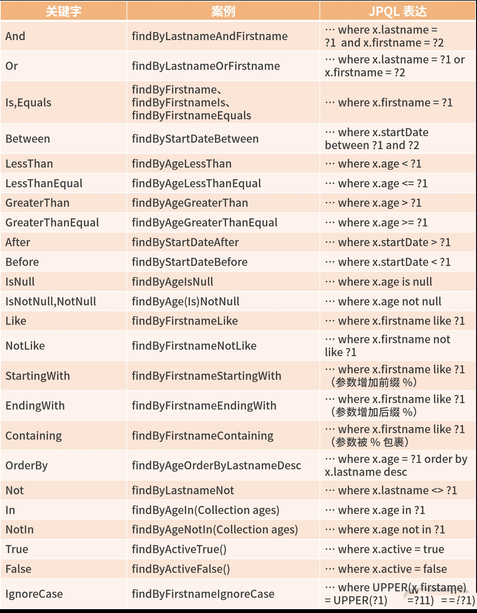
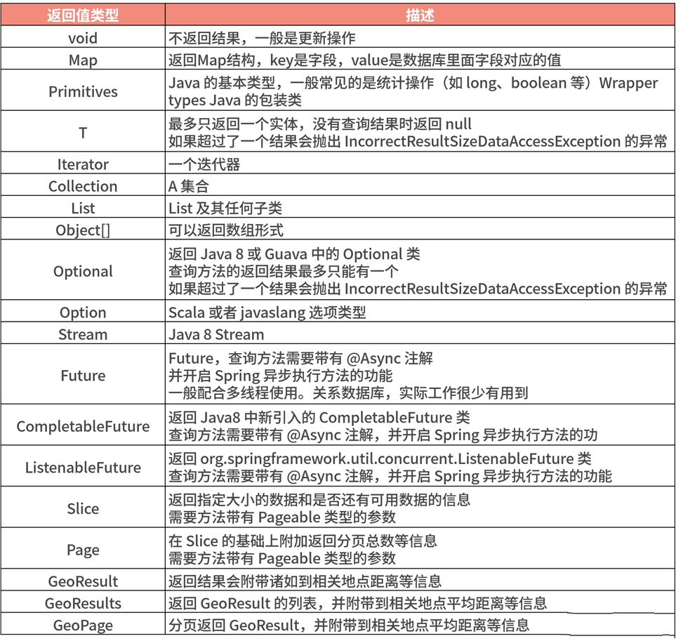

# JPA自定义查询

> :pencil2: 千里之行，始于足下。不积跬步，无以致千里。 ——荀子《劝学篇》

## 定义查询的方法

定义查询的方法有以下两种方法：

- 声明方法名称
- 通过@Query手动定义的查询

我们可以通过配置方法的查询策略，以决定使用以上哪一种策略。JPA通过@EnableJpaRepository(QueryLookupStrategy.Key.CREATE_IF_NOT_FOUND)注解提供了支持。

其中QueryLookupStrategy.Key的值一共有三个：

- CREATE：直接根据方法名创建。
- USE_DECLARED_QUERY: 声明式创建，即是通过注解方式。
- CREATE_IF_NOT_FOUND：这个是默认的，以上两种方式的结合版。先用声明方式进行查找，如果没有找到与方法相匹配的查询，就用create的方法名创建规则创建一个查询。

> 一般直接使用默认的，除非有特殊的需求。

## 定义查询方法（DQM）

带查询功能的方法名由查询策略（关键字）+ 查询字段 + 一些限制性条件组成，具有语义清晰、功能完整的特性，我们实际工作中 80% 的 API 查询都可以简单实现。



- 方法名的表达式通常是实体属性连接运算符的组合，如 And、or、Between、LessThan、GreaterThan、Like 等属性连接运算表达式。
- IgnoreCase 可以针对单个属性（如 findByLastnameIgnoreCase(…)），也可以针对查询条件里面所有的实体属性忽略大小写（所有属性必须在 String 情况下，如 findByLastnameAndFirstnameAllIgnoreCase(…)）。
- OrderBy 可以在某些属性的排序上提供方向（Asc 或 Desc），称为静态排序，也可以通过一个方便的参数 Sort 实现指定字段的动态排序的查询方法（如 repository.findAll(Sort.by(Sort.Direction.ASC, "myField"))）。

> JPA 还支持read、get、query、stream、count、exists、delete、remove等前缀。

### 查询结果处理

JPA 支持以下返回值：



#### 限制查询结果

有的时候我们想直接查询前几条数据，也不需要动态排序，那么就可以简单地在方法名字中使用 First 和 Top 关键字，来限制返回条数。

#### 分页查询结果

分页查询结果返回类型，有 Page 和 Slice, 它们的区别如下：

- <font color=#42b983>Page</font>：知道可用的元素和页面的总数。它通过基础框架里面触发计数查询来计算总数。由于这可能是昂贵的，具体取决于所使用的场景。
- <font color=#42b983>Slice</font>：只知道是否有下一个Slice可用，不会执行count，所以当查询较大的结果集时，只知道数据是足够的就可以了，而且相关的业务场景也不用关心一共有多少页。

#### 流式查询

可以通过使用 Java 8 Stream<T> 作为返回类型来逐步处理查询方法的结果，而不是简单地将查询结果包装在Stream数据存储中，特定的方法用于执行流。

#### 异步查询

可以使用 Spring 的异步方法执行功能异步的存储库查询。这意味着方法将在调用时立即返回，并且实际的查询执行将发生在已提交给 Spring TaskExecutor 的任务中，比较适合定时任务的实际场景。

```java
@Async
Future<User> findByFirstname(String firstname);

@Async
CompletableFuture<User> findOneByFirstname(String firstname);

@Async
ListenableFuture<User> findOneByLastname(String lastname);
```

#### Projections对查询结果的扩展

Spring JPA 对 Projections 扩展的支持是非常好的。从字面意思上理解就是映射，指的是和 DB 查询结果的字段映射关系。一般情况下，返回的字段和 DB 查询结果的字段是一一对应的，但有的时候，我们需要返回一些指定的字段，不需要全部返回，或者只返回一些复合型的字段，还要自己写逻辑。Spring Data 正是考虑到了这一点，允许对专用返回类型进行建模，以便我们有更多的选择，将部分字段显示成视图对象。

> [Projections Demo](https://github.com/LvanLiu/spring-boot-demo/blob/master/jpa-demo/src/test/java/com/lvan/jpademo/repository/ProjectionsTest.java)

## 通过注解创建查询方法

### @Query

先看一下语法及源码：

```java
public @interface Query {
	//指定JPQL的查询语句。(nativeQuery=true的时候，是原生的SQL语句)
	String value() default "";

    //定义一个特殊的count查询，用于分页查询时，查找页面元素的总个数。如果没有配置，将根据方法名派生一个count查询。
	String countQuery() default "";

	//根据哪个字段来count，如果没有配置countQuery和countProjection，将根据方法名派生count查询
	String countProjection() default "";

	//默认是false，表示value里面是不是原生的Sql语句
	boolean nativeQuery() default false;

	//可以指定一个query的名字，必须是唯一的。如果不指定，默认的生成规则是：{$domainClass}.${queryMethodName}
	String name() default "";

    //可以指定一个count的query名字，必须是唯一的。如果不指定，默认的生成规则是：{$domainClass}.${queryMethodName}
	String countName() default "";
}
```

使用JPQL,可以直接使用Sort、Pageable来进行分页和排序，而使用原生 SQL 对 Sort、Pageable支持不太友好。

> 使用JPQL查询有一个好处，就是启动的时候知道语法正确与否

### @Param

默认情况下，参数是通过顺序绑定在查询语句上的。这使得查询方法对参数位置的重构容易出错。为了解决这个问题，你可以使用@ Param注解指定方法参数的具体名称，通过绑定的参数名字做查询条件。

举个栗子：

```java
@Query(value = "select d from Department d where d.id = :id")
Department getByDepartmentId(@Param("id") Integer id);
```

### @Modifying

当我们需要自定义更新或者插入SQL时，那就要使用@Modifying和@Query注解来完成来了，先看下@Modifying的源码：

```java
public @interface Modifying {

	boolean flushAutomatically() default false;
	boolean clearAutomatically() default false;
}
```

通过源码，可以看出Modifying提供了两种策略，默认为false，它们的作用是：

- clearAutomatically: 如果配置了一级缓存，并且我们在同一个接口更新了对象，接着查询这个对象，如果该参数为false, 那么查询到的这个对象就是没有更新前的一个状态，为了解决这个问题，就需要将clearAutomatically设置为true，相当于清除缓存，那么下次查询就会从数据库去查询。
- flushAutomatically： 如果清除缓存前，更新entity还没刷新到数据库中，为了避免配置clearAutomatically为true时导致缓存丢失，需要配置flushAutomatically为true，保证将更新的entity刷新到数据库中。

----

[注解查询 Demo](https://github.com/LvanLiu/spring-boot-demo/blob/master/jpa-demo/src/test/java/com/lvan/jpademo/repository/QueryTest.java)