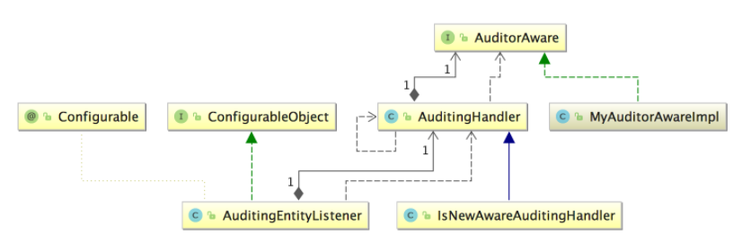
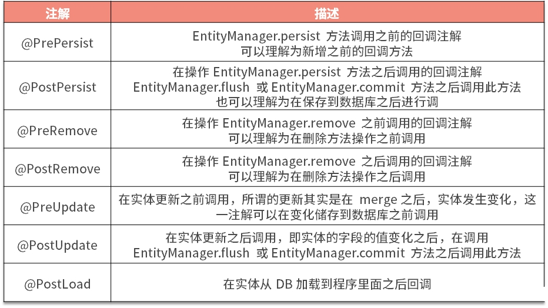

demo-all-in-one# JPA高级用法与实战

> :pencil2: 世界上哪有什么天才，我只是把别人喝咖啡的时间用在工作上了。——鲁迅

## Auditing及其事件介绍

Spring Data JPA为我们提供了审计功能的架构实现，提供了4个注解专门解决这件事情：

注解 | 作用 |
---------|----------
 @CreatedBy | 哪个用户创建的
 @CreatedDate | 创建时间
 @LastModifiedBy | 修改实体的用户
 @LastModifiedDate | 最后一次修改的时间

实现 Auditing 有三种方法：

- 在 `Entity` 配置以上注解
- `Entity`实现 `Auditable` 接口
- 利用 `@MappedSuperclass` 注解

### 在Entity配置以上注解

根据以下四个步骤集成：

1. `Entity` 实体中配置上以上四个注解
2. `Entity` 增加 `@EntityListeners(AuditingEntityListener.class)`
3. 实现`AuditorAware`接口，告诉 JPA 用户是谁
4. 通过`@EnableJpaAuditing`注解开启JPA的`Auditing`功能

?> [demo](https://github.com/LvanLiu/spring-boot-demo/blob/master/jpa-demo/src/test/java/com/lvan/jpademo/repository/AuditingRepositoryTest.java)

### Entity实现Auditable接口

与第一种方式的差异是，这里我们要去掉上面说的四个注解，并且要实现接口 `Auditable` 的方法。

?> [demo](https://github.com/LvanLiu/spring-boot-demo/blob/master/jpa-demo/src/test/java/com/lvan/jpademo/repository/AuditableRepositoryTest.java)

### 利用@MappedSuperclass注解

实际工作中我们还会对上面的实体部分进行改进，引入`@MappedSuperclass`注解，我们将`@Id`、`@CreatedBy`、`@CreatedDate`、`@LastModifiedBy`与`@LastModifiedDate`抽象到一个公用的基类里面，方便公用和形成每个表的字段约束。

!> 实际工作中，我们应选择 @MappedSuperclass 来对第一种方法进行优化。

?> [demo](https://github.com/LvanLiu/spring-boot-demo/blob/master/jpa-demo/src/test/java/com/lvan/jpademo/repository/MappedSuperclassRepositoryTest.java)

## 自定义Listener事件

### AuditingEntityListener剖析

在开始自定义`Listener`事件前，需要了解下`AuditingEntityListener` 的原理。`AuditingEntityListener` 类图如下：



`AuditingEntityListener` 通过委托设计模式，委托 `AuditingHandler` 进行处理，而 `AuditingHandler` 会先根据 `ID` 或者 `Version` 来判断对象是该新增还是更新，从而来决定更改哪些字段。而 `UserId` 则是通过自定义 `AuditorAware` 来提供的。

关于 `AuditingEntityListener` 怎么去监听新增或者更新事件呢？主要是通过 `@PrePersist`、`@PreUpdate` 来实现的。

### 事件回调注解

Java Persistence API底层提供了以下注解作为事件回调：



!> 这个方法都是同步机制，一旦报错将会影响所有底层代码执行

?> [自定义Listen Demo](https://github.com/LvanLiu/spring-boot-demo/blob/master/jpa-demo/src/main/java/com/lvan/jpademo/listen/DbOperateLogListener.java)

## 乐观锁和重试机制

- <font color=#42b983>悲观锁：</font>简单的理解就是把需要的数据全部加锁，在事务提交之前，这些数据全部不可读取和修改。
- <font color=#42b983>乐观锁：</font>使用对单条数据进行版本校验和比较，来保证本次的更新是最新的，否则就失败，效率要高很多。

### 数据库中锁实现

- <font color=#42b983>悲观锁</font>

```sql
select * from user where id = 1 for update
update user set name = 'test' where id = 1
```

通过使用`for update`给这条语句加锁，如果事务没有提交，其他任何读取和修改，都得排队等待。在代码中，我们加事务的java方法就会自然地形成了一个锁。

- <font color=#42b983>乐观锁</font>

```sql
update user set name = 'test', version = version + 1 where id = 1 and version = 1
```

假设本次查询`version=1`，在更新操作时，带上这次查出来的`Version`，这样只有和我们上次版本一样的时候才会更新，就不会出现互相覆盖的问题，保证了数据的原子性。

!> 乐观锁实际是 CAS 算法，在 JDK 并发包中广泛使用

### 优雅实现乐观锁

通过 AOP 方式实现乐观锁，能够动态维护，能够优雅地实现乐观锁。