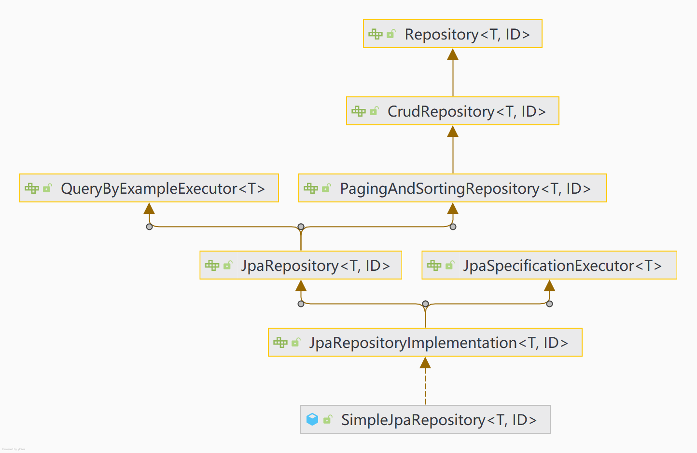

# :sunrise: JPA从入门到放弃系列——JPA基础查询

> :pushpin: 博观而约取，厚积而薄发。——苏轼

## Repository家族

掌握JPA Repository，是学好JPA的关键，以下是Repository家族类图：



## Repository接口

Repository位于Spring Data Common的lib里面，是Spring Data 里面做数据库操作的最底层的抽象接口、最顶级的父类，源码里面其实什么方法都没有，仅仅起到一个标识作用。管理域类以及域类的id类型作为类型参数，此接口主要作为标记接口捕获要使用的类型，并帮助你发现扩展此接口的接口。Spring底层做动态代理的时候发现只要是它的子类或者实现类，都代表储存库操作。

Repository的源码如下：

```java
@Indexed
public interface Repository<T, ID> {
}
```

## CrudRepository接口

CrudRepository接口提供了公共的通用的CRUD方法，源码如下：

```java
@NoRepositoryBean
public interface CrudRepository<T, ID> extends Repository<T, ID> {

	<S extends T> S save(S entity);

	<S extends T> Iterable<S> saveAll(Iterable<S> entities);

	Optional<T> findById(ID id);

	boolean existsById(ID id);

	Iterable<T> findAll();

	Iterable<T> findAllById(Iterable<ID> ids);

	long count();

	void deleteById(ID id);

	void delete(T entity);

	void deleteAllById(Iterable<? extends ID> ids);

	void deleteAll(Iterable<? extends T> entities);

	void deleteAll();
}
```

通过CrudRepository接口的定义，比较清晰地可以看出它所提供的功能，只是涉及批量CRUD的接口，如saveAll、findAll等，它们返回值都是Iterable接口。Iterable接口仅仅提供了遍历集合的功能，不像List接口，提供了size(), isEmpty()等比较丰富的功能。

## PagingAndSortingRepository接口

通过类的关系图，我们可以看到PagingAndSortingRepository继承CrudRepository所有的基本方法，它增加了分页和排序等对查询结果进行限制的基本的、常用的、通用的一些分页方法。

它的源码如下：

```java
@NoRepositoryBean
public interface PagingAndSortingRepository<T, ID> extends CrudRepository<T, ID> {

    /**
     * 根据排序取所有对象的集合
     */
	Iterable<T> findAll(Sort sort);

    /**
     * 根据分页和排序进行查询，并用Page对象封装。Pageable对象包含分页和Sort对象
     */
	Page<T> findAll(Pageable pageable);
}
```

## Example接口

> 掌握Example的用法，是掌握QueryByExampleExecutor接口使用的关键。

在了解QueryByExampleExecutor之前，需要先了解Example，我们通过源码学习它的用法和API，源码如下：

```java
public interface Example<T> {

	static <T> Example<T> of(T probe) {
		return new TypedExample<>(probe, ExampleMatcher.matching());
	}

	static <T> Example<T> of(T probe, ExampleMatcher matcher) {
		return new TypedExample<>(probe, matcher);
	}

	T getProbe();

	ExampleMatcher getMatcher();

	@SuppressWarnings("unchecked")
	default Class<T> getProbeType() {
		return (Class<T>) ProxyUtils.getUserClass(getProbe().getClass());
	}
}
```

根据以上源码，可以得知Example主要包括三部分内容：

- Probe: 实体对象，在持久化框架中与Table对应的域对象，一个对象代表数据库表中的一条记录。在构建查询条件时，一个实体对象代表的是查询条件中的“数值”部分，因此，实体对象也就是查询条件的封装类。
- ExampleMather: 匹配器，它是匹配“实体对象”的，表示如何使用“实体对象”中的“值”进行查询，它代表的是“查询方式”，解释了如何去查的问题。
- Example: 实例对象，代表的是完整的查询条件。由实体对象和匹配器共同构建。

## ExampleMather接口

**1. 起点**

ExampleMather接口中提供了两个起点方法：

```java
public interface ExampleMatcher {

	static ExampleMatcher matching() {
		return matchingAll();
	}

	static ExampleMatcher matchingAny() {
		return new TypedExampleMatcher().withMode(MatchMode.ANY);
	}

	static ExampleMatcher matchingAll() {
		return new TypedExampleMatcher().withMode(MatchMode.ALL);
	}
}
```

这些起点方法的主要作用是：使用and/or对查询条件进行连接。

- matching/matchingAll: 使用and来对查询条件进行连接
- matchingAny：使用or来对查询条件进行连接

举个栗子：

```java
 Employee employee = new Employee();
 employee.setName("Diana");
 employee.setDept("IT");
 //返回name为Diana或者Dept为IT的员工
 Example<Employee> employeeExample = Example.of(employee, ExampleMatcher.matchingAny());
 ....
 //返回name为Diana以及Dept为IT的员工
 Example<Employee> employeeExample2 = Example.of(employee, ExampleMatcher.matchingAll());
```

**2. 空值处理**

ExampleMatcher提供了空值处理选项，源码如下：

```java
default ExampleMatcher withIncludeNullValues() {
	return withNullHandler(NullHandler.INCLUDE);
}

default ExampleMatcher withIgnoreNullValues() {
	return withNullHandler(NullHandler.IGNORE);
}

ExampleMatcher withNullHandler(NullHandler nullHandler);

enum NullHandler {
	INCLUDE, IGNORE
}
```

根据以上源码，ExampleMather提供了两种NULL值处理方式：

- INCLUDE：包括
- IGNORE: 忽略

它们的作用标识作为条件的实体对象，一个属性值(条件值)为NULL时，表示是否参与过滤。当该选项值是INCLUDE时，表示仍参与过滤，会匹配数据库表中该字段值是Null的记录；若为IGNORE值，表示不参与过滤。

**3. 字符串匹配**

ExampleMatcher提供了字符串匹配方式选项，源码如下：

```java
public PropertySpecifier withStringMatcher(StringMatcher stringMatcher) {

	Assert.notNull(stringMatcher, "StringMatcher must not be null!");
	return new PropertySpecifier(this.path, stringMatcher, this.ignoreCase, this.valueTransformer);
}

enum StringMatcher {

	DEFAULT,
	EXACT,
	STARTING,
	ENDING,
	CONTAINING,
	REGEX;
}
```

StringMatcher中定义了6个可选值：

- DEFAULT：默认，效果同EXACT
- EXACT：相等
- STARTING：开始匹配
- ENDING：结束匹配
- CONTAINING：包含，模糊匹配
- REGEX：正则表达式

当我们使用withStringMatcher来匹配时，那么该配置对所有字符串属性过滤有效（封装条件类实体对象中的所有字符串），除非该属性在propertySpecifiers中单独定义自己的匹配方式。

当我们需要指定字段来进行字符串匹配时，可以采用以下两个方法：

```java
ExampleMatcher withMatcher(String propertyPath, GenericPropertyMatcher genericPropertyMatcher);
default ExampleMatcher withMatcher(String propertyPath, MatcherConfigurer<GenericPropertyMatcher> matcherConfigurer)

//A matcher that specifies StringMatcher string matching and case sensitivity. 
class GenericPropertyMatcher {
	public static GenericPropertyMatcher of(StringMatcher stringMatcher, boolean ignoreCase){..}
	public static GenericPropertyMatcher of(StringMatcher stringMatcher) {....}
	public GenericPropertyMatcher ignoreCase() {....}
	public GenericPropertyMatcher ignoreCase(boolean ignoreCase) {....}
	public GenericPropertyMatcher caseSensitive() {}
	public GenericPropertyMatcher contains() {....}
	public GenericPropertyMatcher endsWith() {....}
	public GenericPropertyMatcher startsWith() {....}
	public GenericPropertyMatcher exact() {....}
	public GenericPropertyMatcher storeDefaultMatching() {....}
	public GenericPropertyMatcher regex() {....}
	public GenericPropertyMatcher stringMatcher(StringMatcher stringMatcher) {....}
	public GenericPropertyMatcher transform(PropertyValueTransformer propertyValueTransformer){..}
}
```

withMatcher方法的第一个参数是需要匹配的字段，第二个参数则可以参考源码中GenericPropertyMatcher的定义，来选择字符串的匹配方式。

**4 忽略属性列表**

通过以下方法，来标识需要忽略的字段：

```java
withIgnorePaths(String... ignoredPaths)
```

它的作用是忽略属性列表，忽略的属性不参与查询过滤。虽然某些字段里面有值或者设置了其他匹配规则，只要放在ignoredPaths中，就会忽略此字段的，不作为过滤条件。

**5 忽略大小写**

通过以下方法，来选择大小写是否忽略：

```java
default ExampleMatcher withIgnoreCase() {
	return withIgnoreCase(true);
}
withIgnoreCase(true/false),
withIgnoreCase(String... propertyPaths)
```

它的作用是默认大小写忽略方式，布尔型，当值为false时，即不忽略，大小不相等。

当我们使用withIgnoreCase()或withIgnoreCase(true/false)方法时，该配置对所有字符串属性过滤有效。当我们需要指定特定字段忽略大小写，则可以采用withIgnoreCase(String... propertyPaths)方法。

**6 返回值转换**

当我们需要匹配到字段进行转换，可以采用以下方法：

```java
withTransformer(String propertyPath, PropertyValueTransformer propertyValueTransformer)
```

### QueryByExampleExecutor接口

按示例查询（QBE）是一种用户友好的查询技术，具有简单的接口。它允许动态查询创建，并且不需要编写包含字段名称的查询。

它所提供的功能如下：

```java
public interface QueryByExampleExecutor<T> {

	<S extends T> Optional<S> findOne(Example<S> example);
	<S extends T> Iterable<S> findAll(Example<S> example);
	<S extends T> Iterable<S> findAll(Example<S> example, Sort sort);
	<S extends T> Page<S> findAll(Example<S> example, Pageable pageable);
	<S extends T> long count(Example<S> example);
	<S extends T> boolean exists(Example<S> example);
}
```

QueryByExampleExecutor提供了以Example作为入参的查询方法。

QueryByExampleExecutor的特点及约束：

- 支持动态查询
- 不支持过滤条件分组，即不支持过滤条件用or（或）来连接，所有的过滤查件，都是简单一层的用and（并且）连接
- 仅支持字符串的开始/包含/结束/正则表达式匹配和其他属性类型的精确匹配，查询时，对一个要进行匹配的属性（如：姓名name），只能传入一个过滤条件值。

## JpaRepository接口

JpaRepository到这里可以进入分水岭了，上面的那些都是Spring Data为了兼容NoSQL而进行的一些抽象封装，从JpaRepository开始是对关系型数据库进行抽象封装。

JpaRepository提供的功能如下：

```java
@NoRepositoryBean
public interface JpaRepository<T, ID> extends PagingAndSortingRepository<T, ID>, QueryByExampleExecutor<T> {

    List<T> findAll();
    List<T> findAll(Sort sort);
    List<T> findAllById(Iterable<ID> ids);
    <S extends T> List<S> saveAll(Iterable<S> entities);
    void flush();
    <S extends T> S saveAndFlush(S entity);
    <S extends T> List<S> saveAllAndFlush(Iterable<S> entities);
    void deleteAllInBatch(Iterable<T> entities);
    void deleteAllByIdInBatch(Iterable<ID> ids);
    void deleteAllInBatch();
    T getById(ID id);
    <S extends T> List<S> findAll(Example<S> example);
    <S extends T> List<S> findAll(Example<S> example, Sort sort);
}
```

通过源码和CrudRepository相比较，它支持Query By Example，批量删除，提高删除效率，手动刷新数据库的更改方法，并将默认实现的查询结果变成了List。