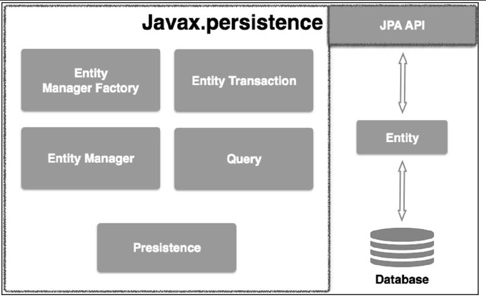

# :sunrise: JPA从入门到放弃系列——JPA常用注解详解

> 工作的最重要的动力是工作中的乐趣，是工作获得结果时的乐趣以及对这个结果的社会价值的认识。——爱因斯坦

## javax.persistence介绍

javax.persistence注意包括以下模块：



模块 | 说明 |
---------|----------
 EntityManagerFactory | 一个EntityManager的工厂类，创建并管理多个EntityManager实例
 EntityManager | 一个接口，管理持久化操作的对象，工作原理类似工厂的查询实例
 Entity | 实体是持久化对象，是存储在数据库中的记录
 EntityTransaction | 与EntityManager是一对一的关系，对于每一个EntityMnager，操作是由EntityTransaction类维护的
 Persistence | 这个类包含静态方法来获取EntityMangerFactory实例
 Query | 该接口由每个JPA供应商实现，能够获得符合标准的关系对象

上述的类和接口用于存储实体到数据库的一个记录，帮助程序员通过减少自己编写的代码将数据存储到数据库中，使他们能够专注于更重要的业务活动代码，如数据库表映射的类编写代码。

## 基础注解

### @Entity

通过Entity的源码了解它的功能：

```java
public @interface Entity {
    
    //可选，默认是此实体类的名字，全局唯一
	String name() default "";
}
```

@Entity定义对象将会成为被JPA管理的实体，将映射到指定的数据库表。

### @Table

@Table用于指定数据库的表名，源码如下：

```java
@Target(TYPE) 
@Retention(RUNTIME)
public @interface Table {
    //表的名字，可选。如果不填写，实体的名字就是表名
    String name() default "";

    //此表的catalog，可选
    String catalog() default "";

    //此表所在的schma，可选
    String schema() default "";

    //唯一性约束，只有创建表的时候有用，默认不需要
    UniqueConstraint[] uniqueConstraints() default {};
    
    //索引，只有创建表的时候有用，默认不需要
    Index[] indexes() default {};
}
```

### @Entity vs @Table

@Entity与@Table中都存在name属性，它们之间有什么区别？

- @Entity中的name用于JPQL查询
- @Table中的name与实际表名对应

### @Id

@Id定义属性为数据库的主键，一个实体里面必须有一个。

### @IdClass

@IdClass用于引入联合主键。源码如下：

```java
public @interface IdClass {
    //联合主键的类
    Class value();
}
```

作为联合主键的类，需要满足以下要求：

- 必须实现Serializable接口
- 必须有默认的public无参数的构造方法
- 必须覆盖equals和hashCode方法。equals方法用于判断两个对象是否相同，EntityManger通过find方法来查找Entity时是根据equals的返回值来判断的

> 扩展：[为什么重写了equals也要重写hashCode](https://juejin.cn/post/6844904005575901191)

### @GeneratedValue

@GeneratedValue为主键生成策略，它的源码如下：

```java
public @interface GeneratedValue {
    //指定ID的生成策略
    GenerationType strategy() default AUTO;
    //通过Sequences生成ID，常见的是Oracle数据库ID生成规则，需要配合@SequenceGenerator使用
    String generator() default "";
}
```

其中GenerationType提供了以下几种策略：

```java
public enum GenerationType {
    //通过表产生主键，框架由表模拟序列生成主键，使用该策略可以使应用更易于数据库迁移
    TABLE, 
    //通过序列产生主键，通过@SequenceGenerator注解指定序列名，MySQL不支持这种方式
    SEQUENCE, 
    //采用数据库ID自增长，一般用于MySQL数据库
    IDENTITY, 
    //JPA 自动选择合适的策略，是默认选项
    AUTO
}
```

### @Basic

@Basic表示属性是到数据库表的字段的映射。如果实体的字段上没有任何注解，默认即为@Basic。源码如下:

```java
public @interface Basic {
    //加载数据策略，有两个值选择，分别为：LAZY延迟加载 EAGER立即加载
    FetchType fetch() default EAGER;
    //设置这个字段是否可以为NULL，默认是true
    boolean optional() default true;
}
```

### @Transient

@Transient表示该属性并非一个到数据库表的字段的映射，表示非持久化属性，与@Basic作用相反。JPA映射数据库的时候忽略它。

### @Column

@Column定义该属性对应数据库中的列名。源码如下：

```java
public @interface Column {
    //数据库中表的列名，可选，如果不填写认为字段名和实体属性名一样
    String name() default "";

    //是否唯一，默认false, 可选
    boolean unique() default false;

    //数据字段是否允许为空，可选，默认false
    boolean nullable() default true;

    //执行insert的时候，是否包含此字段，默认true
    boolean insertable() default true;

    //执行update的时候，是否包含此字段，默认true
    boolean updatable() default true;

    //columnDefinition属性表示创建表时，该字段创建的SQL语句，一般用于通过Entity生成表定义时使用
    String columnDefinition() default "";

    //当前列所属的表的名称。
    String table() default "";

    //列的长度，仅对字符串类型的列生效。默认为255。
    int length() default 255;

    //列的精度，表示有效数值的总位数。默认为0。
    int precision() default 0;

    //列的精度，表示小数位的总位数。默认为0。
    int scale() default 0;
}
```

### @Temporal

@Temporal用来设置Date类型的属性映射到对应精度的字段。源码如下：

```java
public @interface Temporal {

    TemporalType value();
}
```

那么TemporalType有以下几种类型：

```java
public enum TemporalType {

    //映射为日期
    DATE, 

    //映射为时间
    TIME, 

    //映射为日期时间
    TIMESTAMP
}

```

举个栗子：

```java
@Temporal(TemporalType.DATE)
private Date createDate;
```

如果createDate不使用@Temporal, 默认的createDate则包含日期和时间

### @Enumerated

@Enumerated很好用，直接映射enum枚举类型的字段。源码如下：

```java
public @interface Enumerated {

    //枚举映射类型，默认时ORDINAL（枚举字段的下标）
    EnumType value() default ORDINAL;
}
```

EnumType有以下两个选项：

```java
public enum EnumType {
    //映射枚举字段的下标
    ORDINAL,
    //映射枚举的Name
    STRING
}
```

举个栗子：

```java
public enum EmployeeStatus {FULL_TIME, PART_TIME, CONTRACT}

@Entity
public class Employee {

    @Enumerated(EnumType.STRING)
    private EmployeeStatus status;
}
```

### @Lob

@Lob 将属性映射成数据库支持的大对象类型，支持以下两种数据库类型的字段。

- Clob（Character Large Ojects）类型是长字符串类型，java.sql.Clob、Character[]、char[]和String将被映射为Clob类型。
- Blob（Binary Large Objects）类型是字节类型，java.sql.Blob、Byte[]、byte[]和实现了Serializable接口的类型将被映射为Blob类型。
- Clob、Blob占用内存空间较大，一般配合@Basic(fetch=FetchType.LAZY)将其设置为延迟加载。

## 关联关系注解

### @JoinColumn

@JoinColumn用于定义外键关联的字段名称。源码如下：

```java
@Repeatable(JoinColumns.class)
@Target({METHOD, FIELD})
@Retention(RUNTIME)
public @interface JoinColumn {

    //目标表字段的名称
    String name() default "";

    //本实体的字段名，非必填，默认是本表ID
    String referencedColumnName() default "";

    //外键字段是否唯一
    boolean unique() default false;

    //外键字段是否允许为空
    boolean nullable() default true;

    //是否跟随一起新增
    boolean insertable() default true;

    //是否跟随一起更新
    boolean updatable() default true;

    //指定为列生成DDL时使用的SQL片段。
    String columnDefinition() default "";

    //指定该列对应的表名
    String table() default "";

    //用于指定或控制表生成时外键约束的生成
    ForeignKey foreignKey() default @ForeignKey(PROVIDER_DEFAULT);
}

```

@JoinColumn主要配合@OneToOne、@ManyToOne、@OneToMany一起使用，单独使用没有意义。

> @JoinColumns定义多个字段的关联关系。

### @OneToOne

@OneToOne用户描述关联表字段的一对一的关系。源码如下：

```java
public @interface OneToOne {
    //关系目标主体，非必填，默认该字段的类型
    Class targetEntity() default void.class;
    //指定级联操作策略
    CascadeType[] cascade() default {};
    //加载数据策略
    FetchType fetch() default EAGER;
    //是否允许为空
    boolean optional() default true;
    //关联关系被谁维护，非必填，一般不需要指定
    String mappedBy() default "";
    //是否级联删除，和CascadeType.REMOVE的效果一样，只要配置了两种中的一种就会自动级联删除
    boolean orphanRemoval() default false;
}

```

其中，CascadeType有几下类型：

```java
public enum CascadeType {
    //包括以下所有项 
    ALL, 
    //级联新建
    PERSIST, 
    //级联更新
    MERGE, 
    //级联删除
    REMOVE,
    //级联刷新
    REFRESH,
    //级联脱管/游离操作,如果你要删除一个实体，但是它有外键无法删除，你就需要这个级联权限了。它会撤销所有相关的外键关联
    DETACH
}
```

关于mappedBy的使用，需要注意以下点：

- 只有关系维护方才能操作两者的关系，被维护方即使设置了维护方属性进行存储也不会更新外键关联。
- mappedBy不能与@JoinColumn或者@JoinTable同时使用
- mappedBy的值指的是另一方的实体里面属性的字段，而不是数据库的字段，也不是实体的对象的名字

OneToOne需要配合@JoinColumn一起使用。注意：可以双向关联，也可以只配置一方，需要视实际需求而定。

### @OneToMany & @ManyToOne

@OneToMany：一对多关系
@ManyToOne: 多对一关系

@OneToMany与@ManyToOne可以相对存在，也可只存在一方。它们的源码如下：

```java
public @interface OneToMany {

    Class targetEntity() default void.class;
    CascadeType[] cascade() default {};
    FetchType fetch() default LAZY;
    String mappedBy() default "";
    boolean orphanRemoval() default false;
}

public @interface ManyToOne {

    Class targetEntity() default void.class;
    CascadeType[] cascade() default {};
    FetchType fetch() default EAGER;
    boolean optional() default true;
}
```

### @OrderBy

@OrderBy关联查询时排序，一般和@neToMany一起使用。源码如下：

```java
public @interface OrderBy {
    //要排序的字段， 默认是ASC
    String value() default "";
}
```

### @JoinTable

如果对象与对象之间有一个关联关系表的时候，就会用到@JoinTable，一般和@ManyToMany一起使用。源码如下：

```java
public @interface JoinTable {
    //中间关联关系表名
    String name() default "";
    String catalog() default "";
    String schema() default "";
    //主连接表字段
    JoinColumn[] joinColumns() default {};
    //被连接表的外键字段
    JoinColumn[] inverseJoinColumns() default {};
    ForeignKey foreignKey() default @ForeignKey(PROVIDER_DEFAULT);
    ForeignKey inverseForeignKey() default @ForeignKey(PROVIDER_DEFAULT);
    UniqueConstraint[] uniqueConstraints() default {};
    Index[] indexes() default {};
}
```

### @ManyToMany

@ManyToMany用于描述多对多的关系,和@OneToOne、@ManyToOne一样也有单向、双向之分。单向双向和注解没有关系，只看实体类之间是否相互引用。源码如下：

```java
public @interface ManyToMany {
    Class targetEntity() default void.class;
    CascadeType[] cascade() default {};
    FetchType fetch() default LAZY;
    String mappedBy() default "";
}

```

### 综合实例

以下只演示ManyToMany注解的使用，其他的关联注解使用都差不多，不一一列举。

```java
@DynamicInsert
@DynamicUpdate
@Getter
@Setter
@Entity
@Table
public class Department {

    @GeneratedValue(strategy = GenerationType.IDENTITY)
    @Id
    private Integer id;

    private Integer parentId;

    @Column(length = 16)
    private String name;

    private Integer sort;

    @Temporal(TemporalType.DATE)
    private Date createDate;

    @ManyToMany(fetch = FetchType.EAGER)
    @JoinTable(
            name = "department_user_mapping",
            joinColumns = @JoinColumn(name = "department_id", referencedColumnName = "id"),
            inverseJoinColumns = @JoinColumn(name = "user_id", referencedColumnName = "id"))
    private List<User> users;
}
```

其中，r如果在properties中配置了 spring.jpa.generate-ddl=true 的话，JPA会自动生成department_user_mapping表，并生成关联表的外键。如果没有，就需要手动创建关联表了。

### @EntityGraph

当使用@ManyToMany、@ManyToOne、@OneToMany、@OneToOne关联关系的时候，SQL真正执行的时候是由一条主表查询和N条子表查询组成的。这种查询效率一般比较低下，比如子对象有N个就会执行N+1条SQL。

可以采用Left join或inner join来提高效率，使用JPQL或者Criteria API也可以做到，但SpringData JPA为了简单地提高查询率，引入了EntityGraph的概念，可以解决N+1条SQL的问题。

JPA 2.1推出来的@EntityGraph、@NamedEntityGraph用来提高查询效率，很好地解决了N+1条SQL的问题。两者需要配合起来使用，缺一不可。@NamedEntityGraph配置在@Entity上面，而@EntityGraph配置在Repository的查询方法上面。我们来看一下实例。

举了栗子：

1. 先在Entity里面定义@NamedEntityGraph，其他都不变。其中，@NamedAttributeNode可以有多个，也可以有一个。

```java
@NamedEntityGraph(name = "Department.users", attributeNodes = {
        @NamedAttributeNode("users")
})
@DynamicInsert
@DynamicUpdate
@Getter
@Setter
@Entity
@Table
public class Department {

    @GeneratedValue(strategy = GenerationType.IDENTITY)
    @Id
    private Integer id;

    private Integer parentId;

    @Column(length = 16)
    private String name;

    private Integer sort;

    @Temporal(TemporalType.DATE)
    private Date createDate;

    @OneToMany(fetch = FetchType.EAGER)
    @JoinTable(
            name = "department_user_mapping",
            joinColumns = @JoinColumn(name = "department_id", referencedColumnName = "id"),
            inverseJoinColumns = @JoinColumn(name = "user_id", referencedColumnName = "id"))
    private List<User> users;
}

```

2. 只需要在查询方法上加@EntityGraph注解即可，其中value就是@NamedEntityGraph中的Name

```java
@EntityGraph(value ="Department.users")
@Query(value = "select d from Department d where d.name like %?1")
List<Department> listByNameLike(String name);
```

3. 解决前 vs 解决后

解决前，真正关联查询的SQL：

```MySQL
//主查询
select department0_.id          as id1_0_,
       department0_.create_date as create_d2_0_,
       department0_.name        as name3_0_,
       department0_.parent_id   as parent_i4_0_,
       department0_.sort        as sort5_0_
from department department0_
where department0_.name like ?

//子查询，子表若包含N条数据，那么这条语句就会有N条
select users0_.department_id as departme1_1_0_,
       users0_.user_id       as user_id2_1_0_,
       user1_.id             as id1_2_1_,
       user1_.age            as age2_2_1_,
       user1_.date           as date3_2_1_,
       user1_.email          as email4_2_1_,
       user1_.name           as name5_2_1_
from department_user_mapping users0_
         inner join user user1_ on users0_.user_id = user1_.id
where users0_.department_id = ?

```

解决后的SQL：

```MySQL
select department0_.id          as id1_0_0_,
       user2_.id                as id1_2_1_,
       department0_.create_date as create_d2_0_0_,
       department0_.name        as name3_0_0_,
       department0_.parent_id   as parent_i4_0_0_,
       department0_.sort        as sort5_0_0_,
       user2_.age               as age2_2_1_,
       user2_.date              as date3_2_1_,
       user2_.email             as email4_2_1_,
       user2_.name              as name5_2_1_,
       users1_.department_id    as departme1_1_0__,
       users1_.user_id          as user_id2_1_0__
from department department0_
         left outer join department_user_mapping users1_ on department0_.id = users1_.department_id
         left outer join user user2_ on users1_.user_id = user2_.id
where department0_.name like ?
```

由打印的SQL可以看出，使用了EntityGraph注解，它使用了left join来优化了关联的查询。

### 那些忘不了坑

- 所有的注解要么全配置在字段上，要么全配置在get方法上，不能混用，混用就会启动不起来，但是语法配置没有问题。
- 所有的关联都是支持单向关联和双向关联的，视具体业务场景而定。JSON序列化的时候使用双向注解会产生死循环，需要人为手动转化一次，或者使用@JsonIgnore。
- 在所有的关联查询中，表一般是不需要建立外键索引的。@mappedBy的使用需要注意。
- 级联删除比较危险，建议考虑清楚，或者完全掌握。
- 不同的关联关系的配置，@JoinClumn里面的name、referencedColumnName代表的意思是不一样的，很容易弄混，可以根据打印出来的SQL做调整。
- 当配置这些关联关系的时候建议大家直接在表上面，把外键建好，然后通过后面我们介绍的开发工具直接生成，这样可以减少自己调试的时间。