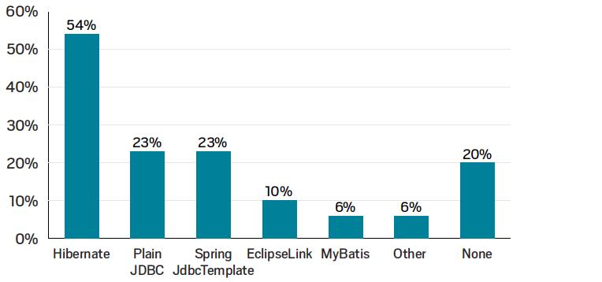
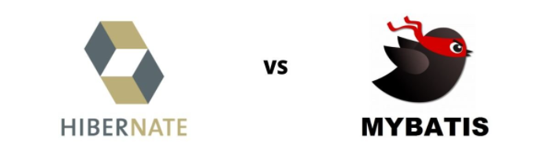

# :sunrise: JPA从入门到放弃系列——初识JPA

> 修学好古，实事求是。—— 《汉书·河间献王刘德传》

## ORM框架比较

### 目前生态

在2018年的JVM生态报告中，ORM框架使用占比，如下：

调查报告显示，有超过一半的开发人员使用了 Hibernate。其次有 23% 的受访者选择了 JDBC。但严格意义上来讲，JDBC 并不是 ORM 框架，所以说选择 None 这一选项的开发者也有可能使用 JDBC。

### Mybatis vs Hibernate

key | mybatis | Hibernate
---------|----------|---------
 量级 | 轻量级，上手简单，插件多 | 重量级，功能齐全，精通较难
 SQL自由度 | 高，提供灵活的SQL编写方式 | 低，仅对基本的SQL语法有较好的支持，也支持手写SQL
 开发效率 | 低，需要维护SQL | 高，DAO层开发更简单，支持JPA
 数据库无关性 | 差。SQL依赖数据库 | 好，高度解耦，封装了JDBC实现，只需再配置中指定数据库
 缓存 | 自身的缓冲机制较差，支持二级缓冲，三方缓冲机制 | 自身的缓冲机制较好，可避免脏读，支持二级缓冲，三方缓冲机制
 映射 | POJO与SQL映射，可映射到指定的POJO | POJO与数据库表映射，自动生成和执行SQL，完成的ORM
 性能 | 稍高 | 稍低
 使用场景 | 擅长复杂的查询 | 适合单数据库，无多表关联，数据库结构不稳定的项目

## JPA介绍

JPA是Java Persistence API的简称，中文名为Java持久层API，是JDK 5.0注解或XML描述对象－关系表的映射关系，并将运行期的实体对象持久化到数据库中。Sun引入新的JPA ORM规范出于两个原因：其一，简化现有Java EE和Java SE应用开发工作；其二，Sun希望整合ORM技术，实现天下归一。

JPA包括以下3方面的内容：

- 一套API标准。在javax.persistence的包下面，用来操作实体对象，执行CRUD操作，框架在后台替代我们完成所有的事情，开发者从烦琐的JDBC和SQL代码中解脱出来。
- 面向对象的查询语言：Java Persistence Query Language ( JPQL )。这是持久化操作中很重要的一个方面，通过面向对象而非面向数据库的查询语言查询数据，避免程序的SQL语句紧密耦合。
- ORM（object/relational metadata）元数据的映射。JPA支持XML和JDK5.0注解两种元数据的形式，元数据描述对象和表之间的映射关系，框架据此将实体对象持久化到数据库表中。

JPA实际是基于Hibernate的JPA技术实现，并针对JPA规范的再次封装，并引用了JPQL（Java Persistence Query Language）查询语言，属于Spring整个生态体系的一部分。

目前，Hibernate 3.2+、TopLink 10.1.3以及OpenJPA都提供了JPA的实现，以及最后的Spring的整合Spring Data JPA。目前互联网公司和传统公司大量使用了JPA的开发标准规范，如图：

