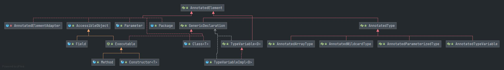
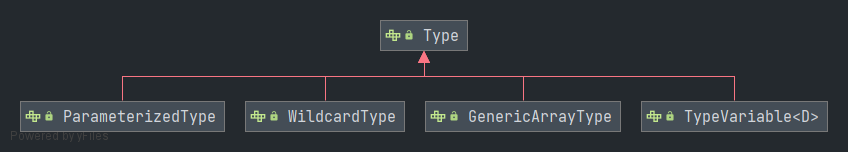
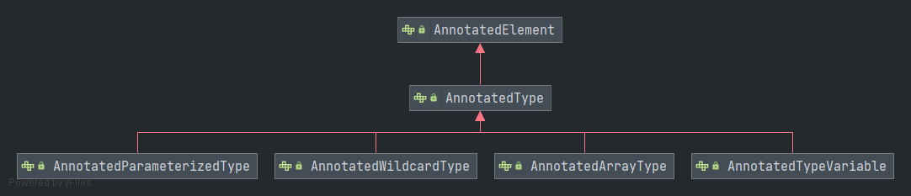
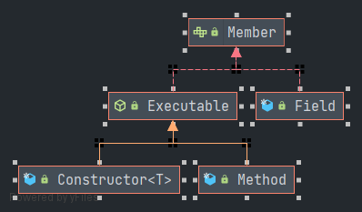

# 第一章-反射核心类库分析

> 学习发射是非常重要的，平时开发的常用的注解以及Spring Aop都需要依赖反射来完成，因此系统地学习一次反射，也有利于阅读开源代码。

## 何为反射

反射库（java.lang.reflect）提供了一个非常丰富且精心设计的工具集，以便编写能够动态操纵Java代码的程序。

能够分析类能力的程序称为反射（reflective），反射机制的功能极其强大，可以在运行时访问Java对象的属性、方法、构造函数等，其中**动态代理**是反射最经典的应用。

------


## 反射真的这么好吗

从Spring的IOC以及AOP层面来看，其对象的依赖注入需要依赖反射来构造对象，AOP则需要依赖动态代理来对方法进行增强，结合此场景来分析，反射就具备以下优点：

- 增加程序的灵活性，避免代码侵入
- 代码简洁，符合单一原则

但反射也是有缺点的：

- 性能开销

- 内部曝光：可以通过[AccessibleObject类的作用](#AccessibleObject)知道原因

  ------

  

## 类库API

> 关于接口部分会详细列出相关源码进行分析，从而了解反射库所能提供的大部分功能，但是关于实现类(Class、Constructor、Method、Field、Parameter)，就不再列举代码了，只是简单地列举常用的API说明。

### AnnotatedElement

此接口定义了注解信息获取的一些接口，如下：

```java
//判断该类上是否存在注解类，通过此源码可以看出它默认实现是通过getAnnotation来实现的
default boolean isAnnotationPresent(Class<? extends Annotation> annotationClass) {
    return getAnnotation(annotationClass) != null;
}

//根据注解类型，获取元素上指定的注解信息
<T extends Annotation> T getAnnotation(Class<T> annotationClass);

//获取元素上所有的注解信息，它会获取父类上被@Inherited标记的注解
Annotation[] getAnnotations();

//获取当前元素所有注解信息，若此元素存在继承关系，
Annotation[] getDeclaredAnnotations();

//根据指定的注解类型，获取声明在当前元素上的注解信息，默认是通过遍历getDeclaredAnnotations()获取的注解数组来实现。
default <T extends Annotation> T getDeclaredAnnotation(Class<T> annotationClass) {
    Objects.requireNonNull(annotationClass);
    // Loop over all directly-present annotations looking for a matching one
    for (Annotation annotation : getDeclaredAnnotations()) {
        if (annotationClass.equals(annotation.annotationType())) {
            // More robust to do a dynamic cast at runtime instead
            // of compile-time only.
            return annotationClass.cast(annotation);
        }
    }
    return null;
}
```
> [!tip]
> 关于@Inherited元注解的作用可以参考：[关于Java中使用@Inherited的说明](https://blog.csdn.net/snow_crazy/article/details/39381695)

通过以下的Uml图，可以看出Field、Class、Constructor、Method、Package都实现了此接口。



------


### <span id = "AccessibleObject">AccessibleObject</span>

通过AnnotatedElement的UML图，可以看出AccessibleObject是AnnotatedElement的一个实现，并且AccessibleObject也作为Field、Method 和 Constructor 对象的基类。

它的主要功能是可以**抑制或取消**默认Java语言访问控制检查的能力，也就是可以通过AccessibleObject类提供的功能来修改类的访问控制（如：反射时可以通过setAccessible(true)来修改其权限，使得其他类可以访问该类的成员变量）。

基于AccessibleObject的强大功能，也让反射拥有了**内部曝光**的缺点了。

以下通过阅读源码，来了解此类的主要功能。

```java
//它实现了AnnotatedElement接口的方法，但是都是以抛异常的方式进行实现，也就是说此类仅仅是负责访问类权限授权的工作，获取注解等相关信息留给子类去实现
//其实也就是单一原则设计理念的体现
public Annotation[] getDeclaredAnnotations()  {
    throw new AssertionError("All subclasses should override this method");
}

//简单来说，就是将成员变量override设置为true, 在设置之前会进行权限校验，不允许修改java.lang.Class constructor的访问权限。
private static void setAccessible0(AccessibleObject obj, boolean flag)
    throws SecurityException {
    if (obj instanceof Constructor && flag == true) {
        Constructor<?> c = (Constructor<?>)obj;
        if (c.getDeclaringClass() == Class.class) {
            throw new SecurityException("Cannot make a java.lang.Class" +
                                        " constructor accessible");
        }
    }
    obj.override = flag;
}

//设置实例是否可以访问，如果设置为true，可以抑制修饰符，直接进行访问
public void setAccessible(boolean flag) throws SecurityException {
    SecurityManager sm = System.getSecurityManager();
    if (sm != null) sm.checkPermission(ACCESS_PERMISSION);
    
    setAccessible0(this, flag);
}
```

------


### Type（泛型系）

Type 是 Java 编程语言中所有类型的公共高级接口。它们包括原始类型、参数化类型、数组类型、类型变量和基本类型。

Type的扩展子接口有以下几种：



其中顶层接口Type中仅定义了一个方法：

```java
//简单的理解就是Type toString()方法
default String getTypeName() {
    return toString();
}
```

------


#### ParameterizedType

ParameterizedType用于表示泛型/参数化类型，它定义的接口如下：

```java
//获取实例类型参数的Type对象数组，也就是获取泛型<>里的类型参数的类型。
//如List<String,String>, 通过此函数获取的是java.lang.String数组
Type[] getActualTypeArguments();

//获取声明此类型的类或接口，如List<String>，通过此函数获取的是java.util.List
Type getRawType();

//通过例子去理解此函数，如通过Map.Entry<T,U>来调用此函数，那么返回的是Map接口，当如果像List<T>这些接口，它属于顶层接口，那么此函数返回的是null
Type getOwnerType();
```

------


#### TypeVariable

TypeVariable用于表示参数化类型中的T、E、K等类型变量，表示泛指任何类，如Map<K,V>接口中的K,V的类型就是TypeVariable。它定义的接口如下：

```java
//返回此类型变量的上界Type对象数组，如<K extends Comparable & Serializable, V>，那么此函数返回的是[java.lang.Comparable,java.io.Serializable]
Type[] getBounds();

//获得声明（定义）这个泛型变量的类型
D getGenericDeclaration();
```

------


#### GenericArrayType

GenericArrayType表示的泛型数组，其组件类型(数组内的元素类型)为ParameterizedType或者TypeVariable。它只定义了一个函数，如下：

```java
//返回表示此数组的组件类型的 Type 对象
Type getGenericComponentType();
```

------


#### WildcardType

WildcardType表示的泛型的通配符表达式，如[?]、[? super T]、[? extends T]。

虽然WildcardType是Type的一个子接口，但并不是Java类型中的一种，它定义的接口如下：

```java
//返回表示此类型变量上边界的 Type 对象的数组。注意，如果不存在显式声明的上边界，则上边界为 Object
Type[] getUpperBounds();

//返回表示此类型变量下边界的 Type 对象的数组。注意，如果不存在显式声明的下边界，则下边界为类型 null。在此情况下，将返回长度为零的数组
Type[] getLowerBounds();
```

------

> [!tip]
> 经过以上几个Type的子接口分析，可以Type接口可以用于描述泛型。

### AnnotatedType（注解系）

AnnotatedType表示当前程序中可能被注解的类型，它的作用于Type接口相似，只是AnnotatedType是用于获取泛型上声明的注解信息，它的扩展接口有以下几种：



通过扩展子接口的命名，可以看出其意义与以上的Type子接口差不多，只不过AnnotatedType的子接口是面向于注解的。

------


##### AnnotatedParameterizedType

AnnotatedParameterizedType表示那些可能带注解的ParameterizedType类型的数据，如Map<String, String>定义的参数类型String, 它是一个ParameterizedType类型，也是AnnotatedParameterizedType参数类型，只是Map<String, String>没有使用注解而已，如果使用上注解，如Map<@Anno String, @Anno String>的话，那么就可以通过AnnotatedParameterizedType来获取参数类型上的注解信息了。

它只定义的一个接口，如下：

```java
//获取带注解的类型参数，如List<@Anno String>, 可以通过此函数获取到java.lang.String的AnnotatedParameterizedType
AnnotatedType[] getAnnotatedActualTypeArguments();
```

------


##### AnnotatedTypeVariable

AnnotatedTypeVariable表示那些可能带注解的TypeVariable类型的数据，如Map<K k, V v>，那么K， V就是TypeVariable类型，但同时也是AnnotatedTypeVariable类型，只是Map<K k, V v>没有使用注解而已，如果使用上注解，如Map<K extends @Anno, V extends @Anno>的话，那么就可以通过AnnotatedTypeVariable来获取K， V的边界注解信息了。

它只定义的一个接口，如下：

```java
//用于获取带注解的边界
AnnotatedType[] getAnnotatedBounds();
```

------

> [!tip]
> 剩下的AnnotatedWildcardType以及AnnotatedArrayType的作用可以参考AnnotatedParameterizedType和AnnotatedTypeVariable的作用分析，也很容易理解。

### <span id = "Member">Member</span>

Member接口用来表示类中的字段、方法或构造函数。通过以下UML图，可以看出常用的一些类都实现了此接口：



Member的接口定义如下：

```java
//获取声明当前成员的类或接口，也就是
public Class<?> getDeclaringClass();

//返回由当前成员对象所表示的底层成员或构造函数的名称
public String getName();

//以一个整数的形式返回当前成员对象的Java语言修饰符(private, public, protect等)
public int getModifiers();
```

------

### Executable

通过[Membert的UML图](#Member)可以看出，Executable的主要功能是从`Method`和`Constructor`抽取出两者可以共用的一些方法例如注解的操作，参数的操作等等，这里不详细展开。

------

### Class

`Class`实现了`Serializable`、`GenericDeclaration`、`Type`、`AnnotatedElement`接口，它提供了类型判断、类型实例化、获取方法列表、获取字段列表、获取父类泛型类型等方法。

|                             方法                             |                             功能                             |
| :----------------------------------------------------------: | :----------------------------------------------------------: |
|             `Class<?>` forName(String className)             |                   传入全类名创建Class实例                    |
|                       T newInstance()                        |   通过当前的Class实例进行实例化对象，返回的就是新建的对象    |
|                      int getModifiers()                      |              native方法，返回当前Class的修饰符               |
|                       String getName()                       |                 返回类名称，虚拟机中类名表示                 |
|                  String getCanonicalName()                   |                返回类名称，便于理解的类名表示                |
|                    String getSimpleName()                    |          返回类名称，源代码中给出的底层类的简单名称          |
|                     Package getPackage()                     |                        返回类的包属性                        |
|                   String getPackageName()                    |                      返回类的包路径名称                      |
|                   String toGenericString()                   |      返回描述此Class的字符串，其中包括类型参数的字面量       |
|        `TypeVariable<Class<T>>[]` getTypeParameters()        |                   获取类定义泛型的类型变量                   |
|                  `Class<?>[]` getClasses()                   |        获取所有的修饰符为public的成员Class，包括父类         |
|              `Class<?>[]` getDeclaredClasses()               |          获取本类所有修饰符的成员Class，不包括父类           |
|             `Constructor<?>[]` getConstructors()             |          获取所有的修饰符为public的构造器，包括父类          |
| `Constructor<T>` getConstructor(`Class<?>... parameterTypes`) |      获取参数类型匹配的修饰符为public的构造器，包括父类      |
|         `Constructor<?>[]` getDeclaredConstructors()         |            获取本类所有修饰符的构造器，不包括父类            |
| `Constructor<T>[]` getDeclaredConstructor(`Class<?>... parameterTypes`) |     获取本类参数类型匹配的所有修饰符的构造器，不包括父类     |
|                    Method[] getMethods()                     |       获取本类所有的修饰符为public的方法列表，包括父类       |
|                Method[] getDeclaredMethods()                 |           获取本类所有修饰符的方法列表，不包括父类           |
| Method getMethod(String name, `Class<?>... parameterTypes`)  | 通过指定方法名和参数类型获取本类修饰符为public的方法，包括父类 |
| Method getDeclaredMethod(String name, `Class<?>... parameterTypes`) | 通过指定方法名和参数类型获取本类不限修饰符的方法，不包括父类 |
|                     Field[] getFields()                      |       获取本类所有的修饰符为public的属性列表，包括父类       |
|                 Field[] getDeclaredFields()                  |           获取本类所有修饰符的属性列表，不包括父类           |
|                 Field getField(String name)                  |    通过指定属性名名获取本类修饰符为public的属性，包括父类    |
|             Field getDeclaredField(String name)              |      通过指定属性名获取本类不限修饰符的属性，不包括父类      |
|                 `Class<?>[] getInterfaces()`                 |               获取类实现的所有接口的Class数组                |
|                Type[] getGenericInterfaces()                 |            获取类实现的所有泛型参数接口的Type数组            |
|              `Class<? super T>` getSuperclass()              | 获取当前类的父类的Class，如果当前类是Object、接口、基本数据类型(primitive)或者void，则返回null |
|                 Type getGenericSuperclass()                  | 获取当前类的泛型参数父类的Type，如果当前类是Object、接口、基本数据类型(primitive)或者void，则返回null |
|            native boolean isInstance(Object obj)             |               判断传入的object是否当前类的实例               |
|       native boolean isAssignableFrom(`Class<?> cls`)        | 判断传入的Class对象是否和当前类相同，或者是否当前类的超类或超接口 |
|                 native boolean isInterface()                 |                      判断当前类是否接口                      |
|                   native boolean isArray()                   |                      判断当前类是否数组                      |
|                 native boolean isPrimitive()                 |                  判断当前类是否基本数据类型                  |
|                    boolean isAnnotation()                    |                    判断当前类是否注解类型                    |
|                    boolean isSynthetic()                     |                      判断当前类是否复合                      |
|             native `Class<?>` getComponentType()             |             如果当前类是数组，返回数组元素的类型             |
|                `Class<?>` getEnclosingClass()                | 返回一个类，当前类(一般是成员类)在这个类(封闭类，相对于内部类的外部类或者说外面一层)中定义 |
|          `Constructor<?>` getEnclosingConstructor()          |           返回构造器，当前类是在这个构造函数中定义           |
|                 Method getEnclosingMethod()                  |              返回方法，当前类是在这个方法中定义              |
|                      Module getModule()                      |                    返回模块，JDK9新增方法                    |

------


### Constructor

`Constructor`用于描述一个类的构造函数。它除了能获取到构造的注解信息、参数的注解信息、参数的信息之外，还有一个很重要的作用是可以抑制修饰符进行实例化，而Class的实例化方法`newInstance`只能实例化修饰符为public的类。

|                         方法                         |                             功能                             |
| :--------------------------------------------------: | :----------------------------------------------------------: |
|            `Class<T>` getDeclaringClass()            |                     获取当前构造的定义类                     |
|                   String getName()                   |                      获取当前构造的名称                      |
|                  int getModifiers()                  |                     获取当前构造的修饰符                     |
|               String toGenericString()               |       返回描述此构造的字符串，其中包括类型参数的字面量       |
| `TypeVariable<Constructor<T>>[]` getTypeParameters() |                 获取类定义泛型参数的类型变量                 |
|           `Class<?>[]` getExceptionTypes()           | 获取当前构造异常类型数组，如果不存在则返回一个长度为0的数组  |
|          Type[] getGenericExceptionTypes()           | 获取当前构造异常类型数组的泛型类型，如果不存在则返回一个长度为0的数组 |
|          Type[] getGenericParameterTypes()           | 获取当前构造参数的泛型类型，如果不存在则返回一个长度为0的数组 |
|       Annotation[][] getParameterAnnotations()       | 获取当前构造参数的注解数组，这里是二维数组的原因是一个参数可以使用多个注解 |
|               int getParameterCount()                |                    获取当前构造参数的数量                    |
|           `Class<?>[]` getParameterTypes()           |                 获取当前构造参数的Class数组                  |
|                boolean isSynthetic()                 |                      当前构造是否复合的                      |
|                 boolean isVarArgs()                  |                   当前构造是否使用不定参数                   |
|           T newInstance(Object...initargs)           | 使用此构造对象表示的构造方法来创建该构造方法的声明类的新实例，并用指定的初始化参数初始化该实例 |
|             Parameter[] getParameters()              | 返回此构造对象的参数Parameter数组，如果没有则返回一个长度为0的数组 |
|           void setAccessible(boolean flag)           |                 抑制构造访问修饰符的权限判断                 |

------


### Method

Method用于描述一个类的方法。它除了能获取方法的注解信息，还能获取方法参数、返回值的注解信息和其他信息。Method常用的方法如下：

|                     方法                     |                             功能                             |
| :------------------------------------------: | :----------------------------------------------------------: |
|        `Class<?>` getDeclaringClass()        |                     获取方法对应的Class                      |
|           Object getDefaultValue()           |                 获取方法上的注解成员的默认值                 |
|       `Class<?>[]` getExceptionTypes()       |  获取方法上的异常类型数组，如果没有则返回一个长度为0的数组   |
|      Type[] getGenericExceptionTypes()       | 获取方法上的异常泛型类型Type数组，如果没有则返回一个长度为0的数组 |
|         Parameter[] getParameters()          | 返回方法的参数Parameter数组，如果没有则返回一个长度为0的数组 |
|           int getParameterCount()            |                     返回方法的参数的数量                     |
|       `Class<?>[]` getParameterTypes()       | 返回方法的参数的类型Class数组，如果没有则返回一个长度为0的数组 |
|   Annotation[][] getParameterAnnotations()   | 返回方法的注解Annotation数组，这里使用二维数组的原因是一个参数可以使用多个注解 |
| `TypeVariable<Method>[]` getTypeParameters() |                 返回方法的泛型参数的类型变量                 |
|      Type[] getGenericParameterTypes()       |                返回方法参数的泛型类型Type数组                |
|          `Class<?>` getReturnType()          |                 返回方法的返回值的类型Class                  |
|         Type getGenericReturnType()          |                返回方法的返回值的泛型类型Type                |
|    AnnotatedType getAnnotatedReturnType()    |          获取方法返回值的注解类型实例AnnotatedType           |
|              boolean isBridge()              |                          是否桥方法                          |
|             boolean isDefault()              |                      是否接口的默认方法                      |
|            boolean isSynthetic()             |                          是否复合的                          |
|             boolean isVarArgs()              |                      是否使用了不定参数                      |
|           String toGenericString()           |              返回方法带有泛型字面量的描述字符串              |
|               String getName()               |                        返回方法的名称                        |
|              int getModifiers()              |                       返回方法的修饰符                       |
|  Object invoke(Object obj, Object... args)   |    对带有指定参数的指定对象调用由此方法对象表示的底层方法    |
|       void setAccessible(boolean flag)       |                 抑制方法访问修饰符的权限判断                 |

------


### Field

`Field`类用来描述一个类里面的属性或者叫成员变量，通过Field可以获取属性的注解信息、泛型信息，获取和设置属性的值等等。Field的主要方法如下：

|               方法                |             功能             |
| :-------------------------------: | :--------------------------: |
|         String getName()          |       返回该属性的名称       |
|        int getModifiers()         |      返回该属性的修饰符      |
|       `Class<?>` getType()        |    返回该属性的类型Class     |
| `Class<?>` getParameterizedType() |   返回该属性的泛型类型Type   |
|       boolean isSynthetic()       |       该属性是否复合的       |
|     boolean isEnumConstant()      |   该属性是否枚举类型的元素   |
|      Object get(Object obj)       |  通过对象实例获取该属性的值  |
| void set(Object obj,Object value) |  通过对象实例设置该属性的值  |
| void setAccessible(boolean flag)  | 抑制属性访问修饰符的权限判断 |

------


### Parameter

`Parameter`用于描述`Method`或者`Constructor`的参数，主要是用于获取参数的名称。因为在Java中没有形式参数的概念，也就是参数都是没有名称的。Jdk1.8新增了Parameter用来填补这个问题，使用javac编译器的时候加上`-parameters`参数的话，会在生成的.class文件中额外存储参数的元信息，这样会导致.class文件的大小增加。当你输入`javac -help`的时候，你会看到-parameters这个选项。获取Parameter的方法是Method或者Constructor的父类Executable的getParamaters方法。一般而言，Parameter是用于获取参数名称的后备方案，因为Jdk1.8之前没有这个类，并且即使使用了Jdk1.8如果javac编译器的时候没有加上`-parameters`参数的话，通过Parameter获取到的参数名称将会是"arg0"、"arg1"..."argn"类似的没有意义的参数名称。一般框架中使用其他方法解析方法或者构造器的参数名称，参考Spring的源码，具体是`LocalVariableTableParameterNameDiscoverer`，是使用ASM去解析和读取类文件字节码，提取参数名称。Parameter的主要方法如下：

|               方法                |                             功能                             |
| :-------------------------------: | :----------------------------------------------------------: |
|         String getName()          |                       返回该参数的名称                       |
|        int getModifiers()         |                      返回该参数的修饰符                      |
|       `Class<?>` getType()        |                    返回该参数的类型Class                     |
| `Class<?>` getParameterizedType() |                   返回该参数的泛型类型Type                   |
|      boolean isNamePresent()      | 该参数的名称是否保存在class文件中，需要编译时加参数-parameters |
|       boolean isImplicit()        |                      该参数是否隐式声明                      |
|       boolean isSynthetic()       |                       该参数是否复合的                       |
|        boolean isVarArgs()        |                      该参数是否不定参数                      |

------

## 总结

Java反射库的类以及接口设计，除了学习它的API，还能看出其实现也是遵循类和函数的单一原则的，每个类所表达的意思与其所负责的功能都是匹配的，不存在一个类负责属于自身范围的功能，像Type 以及 AnnotatedType的设计，也有点策略模式的味道，这些在平时的开发中也是可以作为一种设计参考。