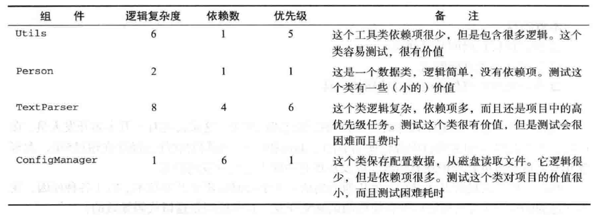
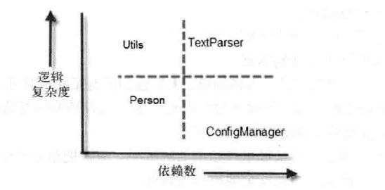
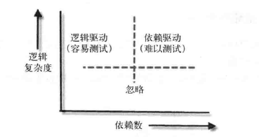

# 设计与流程

## 遗留代码

> [!ATTENTION]
> 给遗留代码增加单元测试，需要考虑以下问题：
> - 有太多工作要做，应该从哪里开始增加测试呢？应该把精力集中在何处？
> - 如果系统没有测试，如何安全地重构代码呢？
> - 测试和修改遗留代码，可以使用什么工具呢？

**从哪里开始增加测试**

首先，我们要为这心已有的组件进行优先级排列，影响组件优先级的因素有以下几个：
- 逻辑复杂度：组件中逻辑的数量，例如嵌套的if语句，switch case语句，可以使用检查复杂度工具来判断逻辑复杂度。
- 依赖数：组件中依赖项的数目。你需要破除多少个依赖项，才能测试这个类呢？
- 优先级：组件在项目中的一般优先级

对以上因素，你可以给每个组件从1（低优先级）到10（高优先级）进行评分。

一个简单的测试可行性表：

根据以上表格的数据，可以创建一个如下所示的图表，图形化地展示组件的逻辑复杂度和依赖数：

通过以上的图示，我们可以从以下两个方面考虑，作为增加测试的起始点：
- 选择复杂度较高但是容易测试的（左上部）
- 选择复杂度较高并且难以测试的（右上部）

**决定选择策略**

- 先易后难策略：适用于团队对单元测试的技术还不熟悉，可以从简单组件开始测试。随着时间的积累，团对将学习到所需的技术，可以处理更复杂的组件和依赖项。
- 先难后易策略：只有当你的团队有单元测试技术方法的经验时，才能使用此策略。

**在重构前编写集成测试**

如果你计划进行代码重构，使其可以进行测试（这样你才能编写单元测试），为了确保在重构时不会破坏原有功能，一个实际的办法是对生产系统编写集成测试。

## 设计与可测试性

在可测试的设计中，你应该很容易为代码的每一段逻辑（循环、if语句和switch等）快速编写一个单元测试，这些单元测试有以下属性：
- 运行速度快
- 相互隔离，即每个测试可以独立运行，或者作为一组测试的一部分运行，可以按任何顺序运行
- 不需要进行任何外部配置
- 产生稳定的通过或者失败的结果

这就是FICC属性：快速、隔离、无需配置和稳定（Fast、Isolated、Configration-free、and Consistent）。

如果编写这样的测试很困难，或者需要很长时间，那这个系统就不是一个可测试的系统。

> [!NOTE]
> 我们也需要把测试看作为系统的一个用户，可测试性设计就成为一种思维方式。

### 可测试性的设计目标

- 默认情况下将方法设置为虚拟方法：你可以在测试中使用派生类重写方法。重写方法可以修改方法的行为，或者消除对外部依赖性的调用。
- 使用基于接口的设计：你可以利用多态性，使用存根或者模拟对象，替换系统中的依赖项。
- 默认情况下将类设置为非密封的：如果类是密封的（Java用的修饰符是final）, 你就无法重写任务虚拟成员。
- 避免在包含逻辑的方法内初始化具体类。使用辅助方法、工厂、控制反转容器或者其他方法获得类实例，但不要直接创建：你可以把自己构造的类实例传递给方法，不必使用真实的实例。
- 避免直接调用静态方法，尽量调用实例方法，再由实例方法调用静态方法：你可以重写实例方法，消除对静态方法的调用（静态方法是不能重写的）。
- 避免在构造函数和静态构造函数中包含逻辑代码：构造函数很难重写。保持构造函数简单，可以简化在测试中对类的继承工作。
- 把单例逻辑和单例持有者分开：如果使用了单例，你可以替换其实例，以便注入一个存根单例或者进行重写。