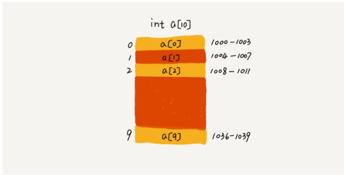

# 数据结构-数组

## 什么是数组？

数组(`Array`)是一种线性表数据结构。它用一组连续的内存空间，来存储一组具有相同类型的数据。

数组具有以下两个特征：

- 是线性结构的：链表、队列、栈也是线性结构的，其实队列和栈也可以基于链表去实现。非线性结构的，也就是树那些了。
- 连续的内存空间和相同类型的数据：这个特性，让数组有了随机访问的超能力。

虽然数组具备随机访问的能力，但数组也存在以下弊端：

- 删除、插入数据（不在尾部删除和插入）: 为了保证数组的连续性，就需要做大量的数据搬移工作。

## 数据的索引为什么是从0开始的？

我们拿一个长度为10的`int`类型的数组`int[] a = new int[10]`来举例。在我画的这个图中，计算机给数组`a[10]`，分配了一块连续内存空间`1000～1039`，其中，内存块的首地址为
`base_address=1000`。



我们知道，计算机会给每个内存单元分配一个地址，计算机通过地址来访问内存中的数据。当计算机需要随机访问数组中的某个元素时，它会首先通过下面的寻址公式，计算出该元素存储的内存地址：

```java
a[i]_address = base_address + i * data_type_size
```

其中`data_type_size`表示数组中每个元素的大小。我们举的这个例子里，数组中存储的是`int`类型数据，所以`data_type_size`就为4个字节。

那么，从数组存储的内存模型上来看，“下标”最确切的定义应该是“偏移（`offset`）”，`a[k]`就表示偏移`k`个`type_size`的位置，所以只要根据以上的公式就能计算出`a[k]`内存地址。但是，如果是从1开始计数，那我们计算数组元素`a[k]`的内存地址就会变为：

```java
a[k]_address = base_address + (k-1)*type_size
```

对比两个公式，我们不难发现，从1开始编号，每次随机访问数组元素都多了一次减法运算，对于CPU来说，就是多了一次减法指令。数组作为非常基础的数据结构，通过下标随机访问数组元素又是其非常基础的编程操作，效率的优化就要尽可能做到极致。所以为了减少一次减法操作，数组选择了从0开始编号，而不是从1开始。

不过以上的并不能算是压倒性的证明，历史原因也是有可能的，比如一些语言都跟随C语言的习惯。

## 实战

### 插入操作

数组的插入操作存在以下三种情况：

- 数组扩容
- 在尾部插入
- 指定索引插入（排除索引等于数组大小-1的情况，因为这个时候是属于尾部插入）

?> 数组复制

在进行复杂度分析前，需要了解一个比较核心的函数`ArraysUtil.copyOf`,
此函数是模仿`JDK`的`System.arrayCopy`来编写的（`Jdk`的`System.arrayCopy`是`native`方法，不便于进行复杂度分析），`ArraysUtil.copyOf`代码如下：

```java
/**
 * 数组拷贝
 *
 * @param source  源数组
 * @param srcPos  拷贝的起始位置
 * @param target  目标数组
 * @param destPos 目标的起始位置
 * @param length  拷贝的长度
 * @param <T>     泛型数组
 */
public <T> void copyOf(T[] source, int srcPos, T[] target, int destPos, int length) {
    if (ObjectUtil.isNull(source)) {                                                // 1 unit time
        throw new IllegalArgumentException("source array is null");
    }
    if (ObjectUtil.isNull(target)) {                                                // 1 unit time
        throw new IllegalArgumentException("target array is null");
    }

    //校验srcPos的正确性
    int sourceArrayLength = source.length;                                          // 1 unit time
    if (source.length <= 0) {                                                       // 1 unit time
        return;
    } else if (srcPos > sourceArrayLength) {                                        // 1 unit time
        throw new IllegalArgumentException("srcPos不能大于source的长度");
    } else if (srcPos < 0) {                                                        // 1 unit time
        srcPos = 0;                                                                 // 1 unit time
    }

    //需要确保下target数组能够装得下
    int targetArrayLength = target.length;                                          // 1 unit time
    if (destPos >= targetArrayLength || length > targetArrayLength || destPos + length > targetArrayLength) {   // 1 unit time
        throw new IllegalArgumentException("目标数组容量不够");
    } else if (destPos < 0) {                                                       // 1 unit time
        destPos = 0;
    } else if (length < 0) {                                                        // 1 unit time
        throw new IllegalArgumentException("length不允许小于0");
    }

    if (srcPos > destPos) {                                                         // 1 unit time
        length++;                                                                   // 1 unit time
    }

    int j = destPos;                                                                // 1 unit time
    for (int i = srcPos; i < length; i++) {                                         // length unit time
        target[j++] = source[i];                                                    // length unit time
    }
}
```

通过以上代码，我们可以看出除了最后循环的部分，其余的代码，基本都是占用1个单位时间，统计起来就是`13unit_time`。关键是最后的循环，我们设定变量`n=length`， 那么它们占用`2n unit_time`,因此，总的时间，如下：

```shell
total = (13+2n)unit_time
```

采用大O计数法来表示，就是`T(n) = O(n)`, 因此这个算法的时间复杂度可以总结如下：

- 最好的情况为`O(1)`: 不需要移动元素
- 最坏的情况为`O(n)`: 整个数组都需要移动
- 平均的时间复杂度为`O(n)`: 在数组上添加元素的概率都一样，那么计算`（1+2+3+...+n)/n`的时间复杂度结果为`O(n)`。

?> 尾部插入

尾部插入数组的代码如下：

```java
@Override
public boolean add(T value) {
    judgeIsNeedCapacity(calculateCapacity(size + 1));
    elementData[size++] = value;
    //判断是否需要扩容
    return true;
}
```

`judgeIsNeedCapacity`的作用是判断是否需要扩容，只有当数组的容量不足时，才会触发扩容操作，本质是创建新数组，并调用以上的`ArraysUtil.copyOf`来复制数组。结合以上的时间复杂度分析，可以得出尾部插入的时间复杂度，如下：

- 最好的情况为`O(1)`: 没有触发扩容，尾部直接添加数据。
- 最坏的情况为`O(n)`: 触发扩容，需要将原数组元素循环复制到新数组
- 平均的时间复杂度为`O(1)`: 假设当前数组的容量为n, 存在以下两种情况需要考虑：
  - 在触发扩容前，每个元素的新增时间复杂度都是`O(1)`， 它们有n种情况。
  - 数组已经装不下新增的元素了，需要触发扩容，它的时间复杂度为`O(n)`，只有1种情况。

  那么整体就有`n+1`种情况，概率为`1/n+1`。因此可以得出它的平均时间复杂度的计算公式为：`1*(1/n+1) + ... + 1*(1/n+1) + n*(1/n+1) = O(1)`

?> 指定索引插入

指定索引插入的代码如下：

```java
@Override
public boolean add(int index, T value) {
    rangeCheckForAdd(index);
    judgeIsNeedCapacity(calculateCapacity(size + 1));
    Object[] targetObject = new Object[elementData.length];
    ArraysUtil.copyOf(elementData, index, targetObject, index + 1, size - index);
    targetObject[index] = value;
    elementData = targetObject;
    return true;
}
```

由以上代码可以看出，最坏的情况下，也就是在头部插入元素，并且触发了扩容（发生了一次全数组复制），头部插入元素又发生了一次全数组复制，此函数的时间复杂度分析如下：

- 最好的情况为`O(1)`：等同于尾部插入
- 最坏的情况为`O(m+n)`：假设触发了扩容操作，扩容的时间复杂度为`O(m)`, 并且是在头部插入元素，它的时间复杂度为`O(n)`，那么它们整体的时间复杂度为`O(m+n)`
- 平均时间复杂度为`O(n)`：假设当前数组的容量为n, 存在以下两种情况需要考虑：
  - 在触发扩容前，每个元素触发扩容的概念都是一样， 它们有n种情况。
  - 数组已经装不下新增的元素了，需要触发扩容，它的时间复杂度为`O(n)`，只有1种情况。

  那么整体就有`n+1`种情况，概率为`1/n+1`。因此可以得出它的平均时间复杂度的计算公式为：`1*(1/n+1) + 2*(1/n+1) + ... + n*(1/n+1) + n*(1/n+1) = O(n)`

### 删除操作

删除操作的代码如下：

```java
@Override
public T remove(int index) {

    //范围检查
    if (index > size) {
        throw new IndexOutOfBoundsException("index is large than size");
    }

    T oldData = (T) elementData[index];
    //判断是否需要移动元素
    int numMoved = size - index - 1;
    if (numMoved > 0) {
        Object[] target = new Object[elementData.length];
        ArraysUtil.copyOf(elementData, index + 1, target, index, numMoved);
        elementData = target;
    }
    elementData[size--] = null;
    return oldData;
}
```

由以上代码，可以看出只有元素需要移动时，才会调用`ArrayUtil.copyOf`方法，并且结合以上插入操作复杂度分析的套路，可以得出删除操作的复杂度，如下：

- 最好的情况为`O(1)`：尾部删除，不需要复制数组
- 最坏的情况为`O(n)`：删除头部元素，需要复制数组
- 平均时间复杂度为`O(n)`：也就是以上`ArraysUtil.copyOf`的平均时间复杂度

## 小结

在实际的开发中，使用`ArrayList`来操纵数组，是比较方便的，同时它也支持数组的动态扩容（扩容为原数组的`1.5倍`），`ArrayList`的尾部插入性能还是挺高的，我们可以预先评估数组的容量，避免数组的频繁扩容，那么`ArrayList`的尾部插入性能是比`LinkedList`要高的。

## 资料

- [数据结构与算法源码](https://github.com/LvanLiu/struct_with_algorithm)
