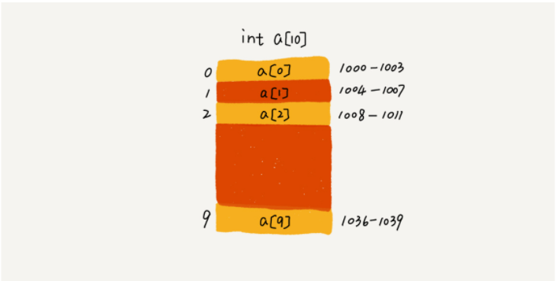

# 数据结构-数组

## 什么是数组？

数组（Array）是一种线性表数据结构。它用一组连续的内存空间，来存储一组具有相同类型的数据。

数组具有以下两个特征：

- 是线性结构的：链表、队列、栈也是线性结构的，其实队列和栈也可以基于链表去实现。非线性结构的，也就是树那些了。
- 连续的内存空间和相同类型的数据：这个特性，让数组有了**随机访问**的超能力。

虽然数组具备随机访问的能力，但数组也存在以下弊端：

- 删除、插入数据（不在尾部删除和插入）: 为了保证数组的连续性，就需要做大量的数据搬移工作。

## 数据的索引为什么是从0开始的？

我们拿一个长度为 10 的 int 类型的数组 int[] a = new int[10] 来举例。在我画的这个图中，计算机给数组 a[10]，分配了一块连续内存空间 1000～1039，其中，内存块的首地址为 base_address = 1000。



我们知道，计算机会给每个内存单元分配一个地址，计算机通过地址来访问内存中的数据。当计算机需要随机访问数组中的某个元素时，它会首先通过下面的寻址公式，计算出该元素存储的内存地址：

```java
a[i]_address = base_address + i * data_type_size
```
其中 data_type_size 表示数组中每个元素的大小。我们举的这个例子里，数组中存储的是 int 类型数据，所以 data_type_size 就为 4 个字节。

那么，从数组存储的内存模型上来看，“下标”最确切的定义应该是“偏移（offset）”，a[k] 就表示偏移 k 个 type_size 的位置，所以只要根据以上的公式就能计算出a[k]内存地址。但是，如果是从1开始计数，那我们计算数组元素 a[k] 的内存地址就会变为：

```java
a[k]_address = base_address + (k-1)*type_size
```

对比两个公式，我们不难发现，从 1 开始编号，每次随机访问数组元素都多了一次减法运算，对于 CPU 来说，就是多了一次减法指令。
数组作为非常基础的数据结构，通过下标随机访问数组元素又是其非常基础的编程操作，效率的优化就要尽可能做到极致。所以为了减少一次减法操作，数组选择了从 0 开始编号，而不是从 1 开始。

不过以上的并不能算是压倒性的证明，历史原因也是有可能的，比如一些语言都跟随C语言的习惯。
