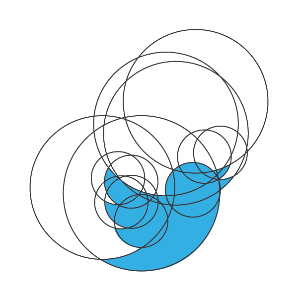
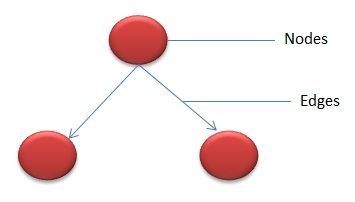
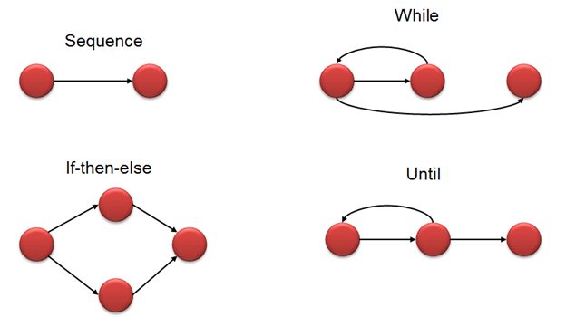

# :dizzy_face: ​圈复杂度

>世界不会在意你的自尊，人们看的只是你的成就。在你没有成就以前，切勿过分强调自尊。——比尔·盖茨

## 概念

圈复杂度（Cyclomatic complexity，简写CC）也称为条件复杂度，是一种代码复杂度的衡量标准。由托马斯·J·麦凯布（Thomas J. McCabe, Sr.）于1976年提出，用来表示程序的复杂度，其符号为VG或是M。它可以用来衡量一个模块判定结构的复杂程度，数量上表现为独立现行路径条数，也可理解为覆盖所有的可能情况最少使用的测试用例数。圈复杂度大说明程序代码的判断逻辑复杂，可能质量低且难于测试和维护。程序的可能错误和高的圈复杂度有着很大关系。

## 圈复杂度计算方法

### 点边计算法

圈复杂度的计算方法很简单，计算公式为：

> *V(G) = E - N + 2*

其中，e表示控制流图中边的数量，n表示控制流图中节点的数量。

几个节点通过边连接。下面是典型的控制流程，如if-else，While，until和正常的流程顺序：

### 节点判定法

其实，圈复杂度的计算还有更直观的方法，因为圈复杂度所反映的是“判定条件”的数量，所以圈复杂度实际上就是等于判定节点的数量再加上1，也即控制流图的区域数，对应的计算公式为：

> *V (G) = P + 1*

其中P为判定节点数，判定节点举例：

1. if语句
2. while语句
3. for语句
4. case语句
5. catch语句
6. and和or布尔操作
7. ?:三元运算符

对于多分支的CASE结构或IF-ELSEIF-ELSE结构，统计判定节点的个数时需要特别注意一点，要求必须统计全部实际的判定节点数，也即每个ELSEIF语句，以及每个CASE语句，都应该算为一个判定节点。

判定节点在模块的控制流图中很容易被识别出来，所以，针对程序的控制流图计算圈复杂度V(G)时，一般采用点边计算法，也即V(G)=e-n+2；而针对模块的控制流图时，可以直接使用统计判定节点数，这样更为简单。

## 圈复杂度的意义

在缺陷称为缺陷之前就捕获它们。

## 圈复杂度与缺陷

一般来说圈复杂度大于10的方法存在很大的出错风险。圈复杂度和缺陷个数有高度的正相关：**圈复杂度最高的模块和方法，其缺陷个数也可能最多。**

## 圈复杂度与结构化测试

此外，它还为测试设计提供很好的参考。一个好的用例设计经验是：**创建数量与被测代码圈复杂度值相等的测试用例，**以此提升用例对代码的分支覆盖率。

## 圈复杂度与TDD

TDD（测试驱动的开发，test-driven development)和低**CC**值之间存在着紧密联系。在编写测试时，开发人员会考虑代码的可测试性，倾向于编写简单的代码，因为复杂的代码难以测试。因此TDD的“代码、测试、代码、测试” 循环将导致频繁重构，驱使非复杂代码的开发。

## 圈复杂度与遗留代码

对于遗留代码的维护或重构，测量圈复杂度特别有价值。一般使用圈复杂度作为提升代码质量的切入点。

## 圈复杂度与CI

在持续集成环境中，可以基于时间变化维度来评估模块或函数的复杂度和增长值。如果**CC**值在不断增长，那么应该开展两项活动：

1. 确保相关测试的有效性，减少故障风险。
2. 评估重构必要性和具体方式，以降低出现代码维护问题的可能性。

## 圈复杂度与软件质量

| 圈复杂度 |   代码状况   | 可测性 | 维护成本 |
| :------: | :----------: | :----: | :------: |
|   1-10   | 清晰、结构化 |   高   |    低    |
|  10-20   |     复杂     |   中   |    中    |
|  20-30   |   非常复杂   |   低   |    高    |
|   >30    |    不可读    | 不可测 |  非常高  |

## 降低圈复杂度的方法

>[!note]
>
>这里面涉及的方法，在《代码的坏味道》中也有涉及。

### 重新组织函数

- 提炼函数：封装对象的行为
- 替换算法：采用更清晰，更直接的算法实现

### 简化条件表达式

- 逆向表达：将逆向的条件提前处理（返回）
- 分解条件：将复杂条件的表达提炼出独立的函数，本质还是基于行为的封装，分离关注点，遵循单一原则
- 合并条件：若语句经过一系列的条件判断，得到的都是相同的结果，那么可以将这些判断合并为一个条件式，并将这个条件式提炼成为一个独立函数
- 移除控制标记：若在语句中，采用标记变量来作为逻辑控制，则可以将这些变量移除，采用break、return取代控制标记
- 以多态取代条件式：多出现于swtich语句，可以采用多态来优化

### 简化函数调用

- 读写分离：由于某个函数既返回对象状态值，又修改对象状态，那么就建立两个不同的函数，其中一个负责查询，另一个负责修改
- 参数化方法：在一个函数内，调用了若干函数做了类似的工作，但在函数本体中却包含了不同的值，那么就可以建立单一函数，以参数表达那些不同的值
- 以明确函数取代参数：若函数实现完全取代于参数值而采取不同反应，那么就要针对该参数的每一个可能值，建立一个独立的函数。

## 参考

- [详解圈复杂度](http://kaelzhang81.github.io/2017/06/18/%E8%AF%A6%E8%A7%A3%E5%9C%88%E5%A4%8D%E6%9D%82%E5%BA%A6/)