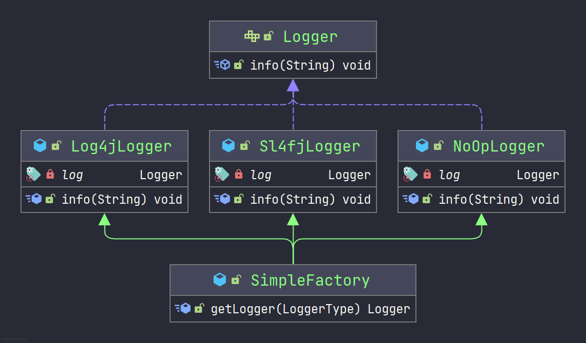

# :last_quarter_moon_with_face: 设计模式——工厂模式

> 轻率和疏忽所造成的祸患不相上下。有很多青年人之所以失败，就是败在做事轻率这一点上。——比尔盖茨

## 简单工厂

简单工厂又叫作静态工厂方法模式，简单来说，简单工厂有一个具体的工厂类，可以生成多个不同的产品，属于创建型设计模式。简单工厂模式不在GoF 23种设计模式之列。

### 应用场景

对于产品种类相对较少的情况，考虑使用简单工厂可以很方便地创建所需产品。使用简单工厂模式的客户端只需要传入工厂类的参数，不需要关系如何创建对象的逻辑。

### UML类图

通过一个日志工厂类图作为示例，如下：



由上图可以看出，简单工厂主要包含三个角色。

1. 简单工厂（SimpleFactory）: 简单工厂的核心类，负责实现创建所有实例的内部逻辑。如工厂类的getLogger(LoggerType)方法可以被客户端使用，根据LoggerType类型来选择构建对应的日志类。
2. 抽象日志（Logger）：是简单工厂创建的所有对象的父类，负责描述所有实例的共有的公共接。如定义日志类的功能。
3. 具体日志实现类：是简单工厂模式的创建目标。

### 代码实现

定义抽象日志接口，代码如下：

```java
public interface Logger {

    void info(String message);
}
```

会有不同的人来实现Logger接口，并且提供各自都有优势的实现，假设有Log4j、Slf4j、NoOp。代码如下：

```java
@Slf4j
public class Log4jLogger implements Logger {

    @Override
    public void info(String message) {
        log.info("log4j logger");
    }
}

@Slf4j
public class NoOpLogger implements Logger {

    @Override
    public void info(String message) {
        log.info("NoOp logger");
    }
}

@Slf4j
public class NoOpLogger implements Logger {

    @Override
    public void info(String message) {
        log.info("NoOp logger");
    }
}
```