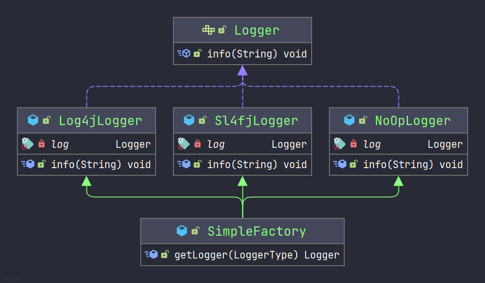
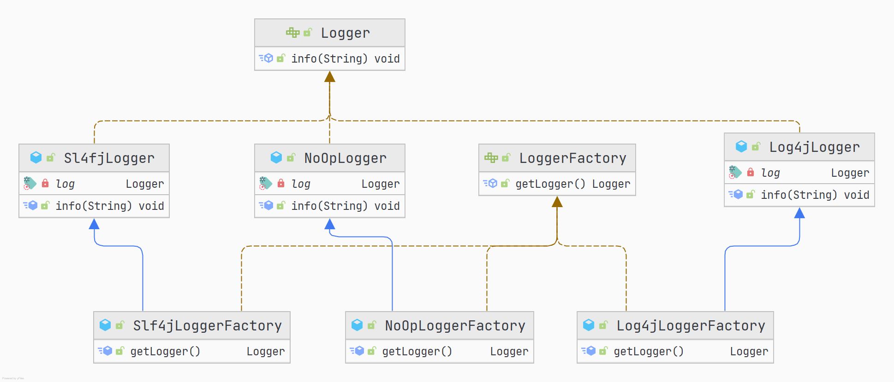

# 设计模式——工厂模式

> 轻率和疏忽所造成的祸患不相上下。有很多青年人之所以失败，就是败在做事轻率这一点上。——比尔盖茨

## 简单工厂

简单工厂又叫作静态工厂方法模式，简单来说，简单工厂有一个具体的工厂类，可以生成多个不同的产品，属于创建型设计模式。简单工厂模式不在GoF 23种设计模式之列。

### 应用场景

对于产品种类相对较少的情况，考虑使用简单工厂可以很方便地创建所需产品。使用简单工厂模式的客户端只需要传入工厂类的参数，不需要关系如何创建对象的逻辑。

### UML类图

通过一个日志工厂类图作为示例，如下：



由上图可以看出，简单工厂主要包含三个角色。

- 简单工厂（SimpleFactory）: 简单工厂的核心类，负责实现创建所有实例的内部逻辑。如工厂类的getLogger(LoggerType)方法可以被客户端使用，根据LoggerType类型来选择构建对应的日志类。
- 抽象日志（Logger）：是简单工厂创建的所有对象的父类，负责描述所有实例的共有的公共接。如定义日志类的功能。
- 具体日志实现类：是简单工厂模式的创建目标。

### 代码实现

定义抽象日志接口，代码如下：

```java
public interface Logger {

    void info(String message);
}
```

会有不同的人来实现Logger接口，并且提供各自都有优势的实现，假设有Log4j、Slf4j、NoOp。代码如下：

```java
@Slf4j
public class Log4jLogger implements Logger {

    @Override
    public void info(String message) {
        log.info("log4j logger");
    }
}

@Slf4j
public class NoOpLogger implements Logger {

    @Override
    public void info(String message) {
        log.info("NoOp logger");
    }
}

@Slf4j
public class NoOpLogger implements Logger {

    @Override
    public void info(String message) {
        log.info("NoOp logger");
    }
}
```

有了各个日志的实现类，还需要一个工厂类来负责构建这些日志类，代码如下：

```java
public class SimpleFactory {

    public Logger getLogger(LoggerType type) {

        if (LoggerType.LOG4J.equals(type)) {
            return new Log4jLogger();
        }
        if (LoggerType.NO_OP.equals(type)) {
            return new NoOpLogger();
        }
        if (LoggerType.SLF4J.equals(type)) {
            return new Sl4fjLogger();
        }
        return null;
    }
}
```

通过以上的代码，可以看出简单工厂的实现主要根据入参LoggerType来构建对应的日志类。

### 小总结

简单工厂模式的代码实现中，有多处if分支判断逻辑，**违背OCP原则**，但是权衡扩展性和可读性，如果不需要频繁的创建产品，而数量也相对较少，使用简单工厂也是没问题的。

## 工厂方法

在简单工厂中，如果if分支判断逻辑太多，代码变得臃肿，违背了高聚合原则，那么我们就可以利用多态来进行优化。因此，工厂方法又叫多态性工厂模式。指定义一个创建对象的接口，但由实现这个接口的类来决定实例化哪个类，工厂方法把类的实例化推迟到子类中进行。

在工厂方法模式中，不再由单一的工厂类生产产品，而是由工厂类的子类实现具体产品的创建。因此，当增加一个产品时，只需增加一个相应的工厂类的子类，实现生产这种产品，便可以解决简单工厂生产太多产品导致其内部代码臃肿的问题，也符合开闭原则。

### 应用场景

工厂方法模式主要适用于以下应用场景。

- 创建对象需要大量重复的代码。
- 客户端（应用层）不依赖产品类实例如何被创建、实现等细节。
- 一个类通过其子类来指定创建哪个对象。

### UML类图



从上图可以看出，工厂方法模式主要包含4个角色。

- 抽象工厂（LoggerFactory）: 工厂方法模式的核心，与应用程序无关。任何在模式中创建的对象的工厂类必须实现这个接口。
- 具体工厂：是实现抽象工厂接口的具体工厂类，包含应用程序密切相关的逻辑，并且被应用程序调用以创建产品对象。
- 抽象日志（Logger）：是简单工厂创建的所有对象的父类，负责描述所有实例的共有的公共接。如定义日志类的功能。
- 具体日志实现类：是简单工厂模式的创建目标。

### 代码实现

定义抽象工厂接口，代码如下：

```java
public interface LoggerFactory {

    Logger getLogger();
}
```

定义具体工厂，实现抽象工厂接口，代码如下：

```java
public class Log4jLoggerFactory extends Log4jLogger implements LoggerFactory {

    @Override
    public Logger getLogger() {

        return new Log4jLogger();
    }
}

public class NoOpLoggerFactory extends NoOpLogger implements LoggerFactory {

    @Override
    public Logger getLogger() {

        return new NoOpLogger();
    }
}

public class Slf4jLoggerFactory extends Sl4fjLogger implements LoggerFactory {

    @Override
    public Logger getLogger() {

        return new Sl4fjLogger();
    }
}
```

> Log4jLogger、NoOpLogger、Slf4jLogger的代码与简单工厂中一样，这里不重复贴出。

### 小总结

实际上，对于大多数的应用场景来说，工厂模式需要额外创建的Factory类，也会增加代码的复杂性，而且，每个Factory类只是做简单的new操作，功能非常单薄（只有一行代码），也没有必要设计成独立的类，所以，在这些应用场景下，简单工厂模式比工厂模式更加好用。

工厂方法模式遵循的原则：

- 迪米特原则
- 里氏替换原则
- 依赖倒置原则

## 抽象工厂

抽象工厂模式（Abstract Factory Pattern）指提供一个创建一系列相关或相互依赖对象的接口，无须指定它们具体的类。意思是客户端不必指定产品的具体类型，创建多个产品族中的产品对象。

在抽象工厂模式中，客户端（应用层）不依赖产品类实例如何被创建、实现等细节，强调一系列相关的产品对象（属于同一产品族）一起创建对象，需要大量重复的代码。

需要提供一个产品类的库，所有产品以同样的接口出现，从而使客户端不依赖具体实现。

### 应用场景

抽象工厂模式适用于需要生成产品族的情景。抽象产品类内部提供了多个其他抽象产品，抽象工厂类定义了产品的创建接口，通过具体的工厂子类，就可以生产相应的产品族对象，供用户端使用。

### 代码实现

定义抽象工厂，代码如下：

```java
public interface LoggerFactoryFamily {

    /**
     * 单线程版本
     */
    Logger getLogger();

    /**
     * 并发版本
     */
    Logger getConcurrentLogger();
}
```

定义具体工厂，代码如下：

```java
public class Log4jFactoryFamily implements LoggerFactoryFamily {

    @Override
    public Logger getLogger() {
        return new Log4jLogger();
    }

    @Override
    public Logger getConcurrentLogger() {
        return new Log4jConcurrentLogger();
    }
}

public class NoOpFactoryFamily implements LoggerFactoryFamily {
    @Override
    public Logger getLogger() {
        return new NoOpLogger();
    }

    @Override
    public Logger getConcurrentLogger() {
        return new NoOpConcurrentLogger();
    }
}

public class Slf4jFactoryFamily implements LoggerFactoryFamily {
    @Override
    public Logger getLogger() {
        return new Sl4fjLogger();
    }

    @Override
    public Logger getConcurrentLogger() {
        return new Slf4jConcurrentLogger();
    }
}
```

### 小总结

> 优点

- 当需要产品族时，抽象工厂可以保证客户端始终只使用同一个产品的产品族。
- 抽象工厂增强了程序的可扩展性，对于新产品族的增加，只需实现一个新的具体工厂即可，不需要对已有代码进行修改，符合开闭原则。

> 缺点

- 规定了所有可能被创建的产品集合，产品族中扩展新的产品困难，需要修改抽象工厂的接口。
- 增加了系统的抽象性和理解难度。
