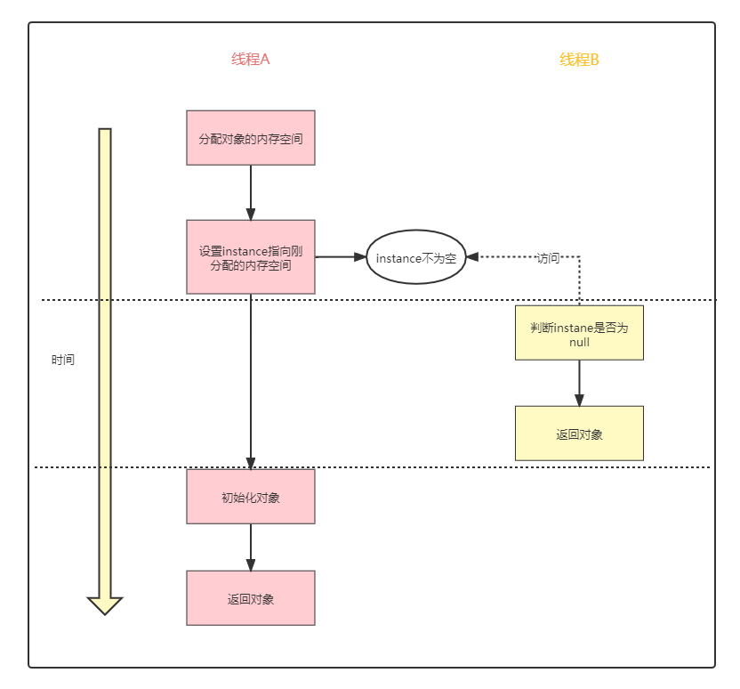
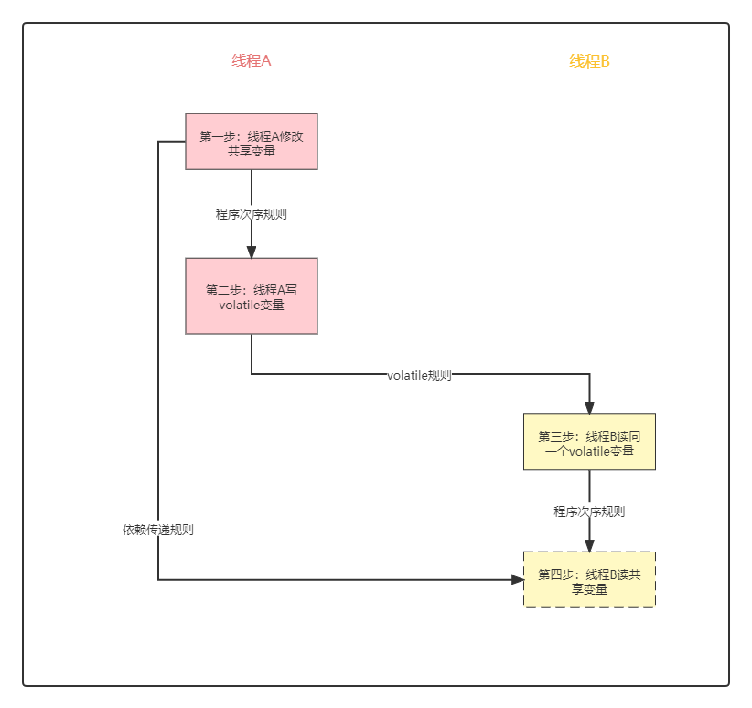
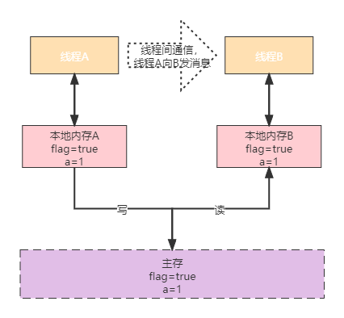
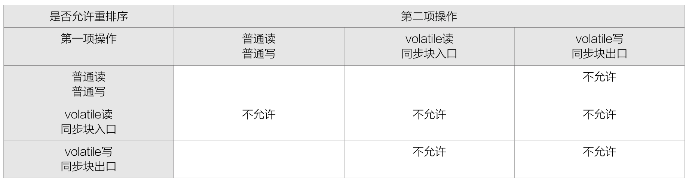
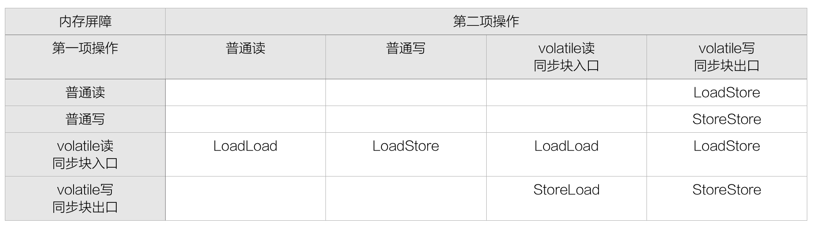

# volatile专题

> :pencil2: 哪里有阴影，哪里就有光. -雨果

## volatile初步了解

Java编程语言允许线程访问共享变量，为了确保共享变量能被准确和一致地更新，线程应该确保通过排他锁单独获得这个变量。Java语言提供了`volatile`，在某些情况下比锁要更加方便。如果一个字段被声明成`volatile`，Java线程内存模型确保所有线程看到这个变量的值是一致的。

如果`volatile`变量修饰符使用恰当的话，他比`synchronized`的使用和执行成本更低，因为它不会引起线程上下文的切换和调度。

## volatile在双重检查单例中的应用

根据 [单例模式](/程序设计/设计模式—单例模式.md) 的学习，可以知道双向检查型单例可以实现单例的懒加载，避免了系统启动的时候，加载了太多的单例，造成大量内存被占用的问题。

我们看下双重检查单例模式的代码：

```java
public class LazySingleton {

    private static volatile LazySingleton instance;

    private LazySingleton() {
    }

    public static LazySingleton getInstance() {
        if (instance == null) {
            synchronized (LazySingleton.class) {
                if (instance == null) {
                    instance = new LazySingleton();
                }
            }
        }
        return instance;
    }
}
```

以上`instance`变量，使用了`volatile`来声明了，为什么使用了双重检查，还需要加上`volatile`呢？

如果去掉了`volatile`，那么这一行代码就会产生问题：

```java
instance = new LazySingleton();
```

构造函数实际上包括了以下三个操作：

```java
memory = allocate();    //给对象分配内存空间
ctorInstance(memory);   //初始化对象
instance = memory;      //设置instance指向刚分配的内存地址
```

那么上面的操作，可能会被重排序，最后的执行时序如下：

```java
memory = allocate();    //给对象分配内存空间
instance = memory;      //设置instance指向刚分配的内存地址
ctorInstance(memory);   //初始化对象
```

以上的重排序，遵循了as-if-serial规则，不会改变单线程程序执行的结果，也就是重排序仅仅是为了提供性能而作的优化而已，但这个只能保证在单CPU的情况下不出问题，如果换成多线程呢？

----

假设存在两个线程，分别为线程A，线程B，线程A正在构造对象，这时候，线程B立即访问这个对象，示意图如下：



当设置`instance`指向分配的内存地址，这个时候`instance`就不为空，那么线程B就有可能访问到尚未初始化的`instance`对象。

因此，为了避免指令重排序的问题，声明`instance`变量时，需要使用`volatile`。

## volatile原理

对于以上的案例，使用了`volatile`来避免了指令重排序的问题,同时，`volatile`还保证了可见性。

以以下代码作为栗子：

```java
instance = new LazySingleton();
```

将其转换为汇编代码后，使用`volatile`声明的变量会多出一个`Lock`前缀指令，`Lock`指令的作用：

- 将当前CPU缓存行的数据立即写回到系统内存
- 这个写回内存的操作会使在其他CPU里缓存了该内存地址的数据无效
- lock前缀指令禁止指令重排

`Lock`前缀指令导致在执行指令期间，声言处理器的`LOCK#`信号，`LOCK#`信号确保在声言该信号期间，处理器可以独占任何共享内存，后面可以通过缓存一致性协议，就可以保证了数据的可见性了。

## volatile内存语义

### volatile写-读建立的happend-before关系

从JSR-133开始（即从JDK5开始），volatile变量的写-读可以实现线程之间的通信。通过下面的栗子来加深理解happend-before关系。

```java
public class VolatileExample {
    private int a = 0;
    private volatile boolean flag = false;

    public void writer() {
        a = 1;              //1
        flag = true;        //2
    }

    public void reader() {  
        if (flag) {         //3
            int i = a;      //4
        }
    }
}
```

假设线程A执行`writer()`方法之后，线程B执行`reader()`方法。根据happens-before规则，这个过程建立的happens-before关系可以分为3类：

- 根据次序规则
  - 1 happend before 2
  - 3 happend before 4
- 根据volatile规则
  - 2 happend 3
- 根据传递性规则
  - 1 happend before 4

将这些关系图示化：



这里A线程写一个`volatile`变量后，B线程读同一个`volatile`变量。A线程在写`volatile`变量之前所有可见的共享变量，在B线程读同一个`volatile`变量后，将立即变得对B线程可见。

!> 由于以上的栗子，变量`a`与变量`flag`之间不存在依赖关系，理论上它们是允许重排序的，但是由于`flag`变量是`volatile`, 编译器会在变量`a`与变量`flag`之间插入了内存屏障，因此保证了以上的次序关系。

### volatile内存语义实现

在Java代码中，`volatile`关键字主要有两层语义：

- 不同线程对volatile变量的值具有内存可见性
- 禁止进行指令重排序

?> 内存可见性的实现

编译在编译`volatile`变量时，会额外生成一个`lock`指令，通过`lock`指令可以使线程B的缓存失效，达到了线程A与线程B之间通信的效果，如下图。



线程A与线程B之间的通信总结:

- 线程A写一个`volatile`变量，实质上是线程A向接下来将要读这个`volatile`变量的某个线程发出了（其对共享变量所做修改的）消息
- 线程B读一个`volatile`变量，实质上是线程B接收了之前某个线程发出的（在写这个`volatile`变量之前对共享变量所做修改的）消息
- 线程A写一个`volatile`变量，随后线程B读这个`volatile`变量，这个过程实质上是线程A通过主内存向线程B发送消息

?> 有序性的实现

`volatile`语义中的有序性是通过内存屏障指令来确保的。为了实现`volatile`关键字语义的有序性，JVM编译器在生成字节码时，会在指令序列中插入内存屏障来禁止特定类型的处理器重排序。

JMM针对编译器制定的`volatile`重排序规则表：



通过上表，总结以下规律：

- 当第二个操作是`volatile`写时，不管第一个操作是什么，都不能重排序。这个规则确保`volatile`写之前的操作不会被编译器重排序到`volatile`写之后
- 当第一个操作是`volatile`读时，不管第二个操作是什么，都不能重排序。这个规则确保volatile读之后的操作不会被编译器重排序到`volatile`读之前
- 当第一个操作是`volatile`写，第二个操作是`volatile`读时，不能重排序

为了实现`volatile`的内存语义，编译器在生成字节码时，会在指令序列中插入内存屏障来禁止特定类型的处理器重排序，如下表。



通过上表，总结以下规律：

- 在每个`volatile`读操作的后面插入一个LoadLoad屏障
- 在每个`volatile`读操作的后面插入一个LoadStore屏障
- 在每个`volatile`写操作的前面插入一个StoreStore屏障
- 在每个`volatile`写操作的后面插入一个StoreLoad屏障

> [!note]
>
> - `volatile`写操作的内存屏障插入策略为：在每个`volatile`写操作前插入StoreStore（SS）屏障，在写操作后面插入StoreLoad屏障。
> - `volatile`读操作的内存屏障插入策略为：在每个`volatile`写操作后插入LoadLoad（LL）屏障和LoadStore屏障，禁止后面的普通读、普通写和前面的`volatile`读操作发生重排序。

## volatile与原子性问题
