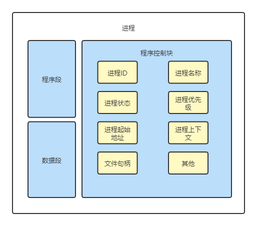
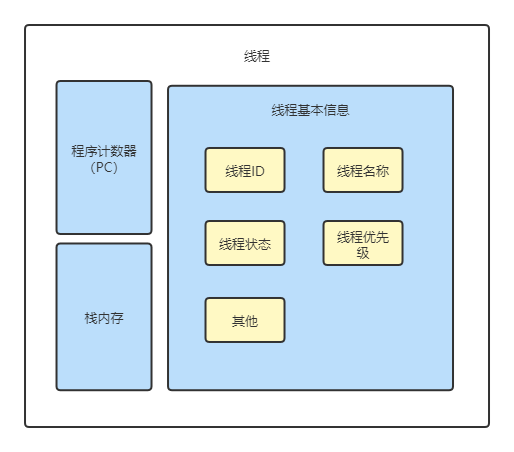
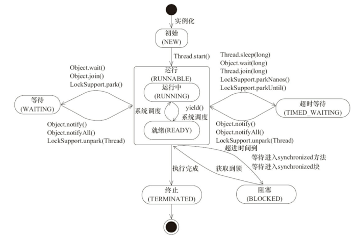

# 并发编程——不得不学的线程

> :pencil2: 不要试图去做一个成功的人，要努力成为一个有价值的人。——爱因斯坦

## 进程

### 概念

进程（Process）是计算机中的程序关于某数据集合上的一次运行活动，是系统进行资源分配和调度的基本单位，是操作系统结构的基础。在早期面向进程设计的计算机结构中，进程是程序的基本执行实体；在当代面向线程设计的计算机结构中，进程是线程的容器。程序是指令、数据及其组织形式的描述，进程是程序的实体。

简单来说，进程是程序的一次启动执行。什么是程序呢？程序是存放在硬盘中的可执行文件，主要包括代码指令和数据。一个进程是一个程序的一次启动和执行，是操作系统将程序装入内存，给程序分配必要的系统资源，并且开始运行程序的指令。

> [!note|label:进程与程序的关系]
>
> 同一个程序可以多次启动，对应多个进程。

### 进程的组成

一般来说，一个进程由程序段、数据段和进程抗旨块三部分组成。大致结构如图。



- <font color=#42b983>程序段</font>：也称为代码段，代码段是进程的程序指令在内存中的位置，包含需要执行的指令集合
- <font color=#42b983>数据段</font>：进程的操作数据在内存中的位置，包含需要操作的数据集合
- <font color=#42b983>程序控制块(PCB)</font>：进程的描述信息和控制信息，是进程存在的唯一标志

----

`PCB`主要由四大部分组成：

- <font color=#42b983>进程的描述信息</font>
  - 进程ID和进程名称，进程ID是唯一的，代表进程的身份
  - 进程状态，比如运行、就绪、阻塞；进程优先级，是进程调度的重要依据
- <font color=#42b983>进程的调度信息</font>
  - 程序起始地址，程序的第一行指令的内存地址，从这里开始程序的执行
  - 通信信息，进程间通信时的消息队列
- <font color=#42b983>进程的资源信息</font>
  - 内存信息，内存占用情况和内存管理所用的数据结构
  - I/O设备信息，所用的I/O设备编号及相应的数据结构
  - 文件句柄，所打开文件的信息
- <font color=#42b983>进程上下文</font>
  - 执行时各种CPU寄存器的值
  - 当前程序计数器(PC)的值
  - 各种栈的值

!> 进程的上下文就是进程的环境，当前进程被迫让出CPU，当前进程的上下文就保存在PCB结构种，供下次恢复运行时使用

### 从JVM看进程

Java编写的程序都运行在Java虚拟机（JVM）中，每当使用Java命令启动一个Java应用程序时，就会启动一个JVM进程。

在这个JVM进程内部，所有Java程序代码都是以线程来运行的。JVM找到程序的入口点`main()`方法，然后运行`main()`方法，这样就产生了一个线程，这个线程被称为主线程。当`main()`方法结束后，主线程运行完成，JVM进程也随即退出。

## 线程

### 概念

线程是指“进程代码段”的一次顺序执行流程。线程是CPU调度的最小单位。一个进程可以有一个或多个线程，各个线程之间共享进程的内存空间、系统资源，进程仍然是操作系统资源分配的最小单位。

### 线程的组成

一个线程主要有三部分组成，主要有线程描述信息、程序计数器(PC)、和栈内存。



- <font color=#42b983>线程描述信息</font>，也是线程的基本信息
  - 线程ID(Thread ID，线程标识符)：线程的唯一标识，同一个进程内的不同线程的ID不会重叠
  - 线程名称：主要是方便用户识别，用户可以指定线程的名字，如果没有指定，系统就会自动分配一个名称
  - 线程优先级：表示线程调度的优先级，优先级越高，获得CPU的执行机会就越大
  - 线程状态：表示当前线程的执行状态，为新建、就绪、运行、阻塞、结束等状态中的一种
- <font color=#42b983>程序计数器</font>：记录着线程下一条指令的代码段内存地址
- <font color=#42b983>栈内存</font>：代码段中局部变量的存储空间，为线程所独立拥有，在线程之间不共享

## 进程与线程的区别

- 线程是“进程代码段”的一次顺序执行流程，一个进程由一个或多个线程组成，一个进程至少有一个线程
- 线程是CPU调度的最小单位，进程是操作系统分配资源的最小单位。线程的划分尺度小于进程，使得多线程程序的并发性高
- 线程是出于高并发的调度诉求从进程的内部演进而来的。线程的出现既充分发挥了CPU的计算性能，又弥补了进度调度笨重的问题
- 进程之间是否相互独立的，但进程内部的各个线程之间并不完全独立。各个线程之间共享进程的方法区内存、堆内存、系统资源（文件句柄、系统信号等）
- 切换速度不同，线程上下文切换比进程上下文切换要快得多，因此，线程也被称之为轻量级进程

## 初识Thread

一个线程在java种使用一个`Thread`实例来描述，以下介绍`Thread`类有一些比较重要的属性和方法。

### 线程ID

线程ID是线程的标识，在进程内唯一，并且该线程ID是由JVM进行管理，线程ID的相关属性和方法如下：

```java
public class Thread implements Runnable {
  //线程Id
  private long tid;

  //获取线程ID
  public long getId() {
    return tid;
  }
} 
```

### 线程名称

线程名称主要用于保存一个`Thread`线程实例的名字，与线程名称相关的属性和方法如下：

```java
public class Thread implements Runnable {
  
  //线程名称
  private volatile String name;

  //构造函数
  public Thread(String name) {
    init(null, null, name, 0);
  }

  //获取线程名称
  public final String getName() {
    return name;
  }

  //设置名称
  public final synchronized void setName(String name) {
    checkAccess();
    if (name == null) {
      throw new NullPointerException("name cannot be null");
    }

    this.name = name;
    if (threadStatus != 0) {
      setNativeName(name);
    }
  }
} 
```

!> 线程名称`name`用了`volatile`来标识，保证了线程名称的有序性和可见性，同时在`setName`方法也加入了`synchronized`同步锁，也保证了更新线程名称的原子性

### 线程的启动和运行

通过`start()`来启动一个线程，当调用`start()`方法后，JVM才会开启一个新的线程来执行用户定义的线程代码逻辑，在这个过程中会为相应的线程分配需要的资源。

然后，`run()`方法只是作为线程代码逻辑的入口，并不是由用户程序来调用的，当调用`start()`方法启动一个线程之后，只要线程获得了CPU执行时间，便进入`run()`方法去执行具体的用户线程代码。

### 线程优先级

Java线程的最大优先级值为10，最小值为1，默认值为5，线程优先级的属性和方法如下：

```java
public class Thread implements Runnable {

  //线程优先级常量
  public final static int MIN_PRIORITY = 1;
  public final static int NORM_PRIORITY = 5;
  public final static int MAX_PRIORITY = 10;

  //线程优先级
  private int priority;

  //获取线程优先级
  public final int getPriority() {
      return priority;
  }

  public final void setPriority(int newPriority) {
    ThreadGroup g;
    checkAccess();
    if (newPriority > MAX_PRIORITY || newPriority < MIN_PRIORITY) {
      throw new IllegalArgumentException();
    }
    if((g = getThreadGroup()) != null) {
      if (newPriority > g.getMaxPriority()) {
        newPriority = g.getMaxPriority();
      }
      setPriority0(priority = newPriority);
    }
  }
} 
```

`setPriority`方法处理的核心，主要是调用到了`Native`的`setPriority0`方法，其他的处理主要检测入参`newPriority`的合法性了。

### 线程状态

线程的状态主要包括：新建、就绪、运行、阻塞、等待、结束。`Threa`中使用了一个枚举定义了其状态，如下：

```java
public enum State {
  NEW,              //新建
  RUNNABLE,         //就绪、运行
  BLOCKED,          //阻塞
  WAITING,          //等待
  TIMED_WAITING,    //计时等待
  TERMINATED;       //结束
}
```

在Java线程的状态中，就绪状态和运行状态在内部用同一种状态`RUNNABLE`来表示。就绪状态表示线程具备运行条件，正在等待获取CPU时间片；运行状态表示线程已经获取了CPU时间片，CPU正在执行线程代码逻辑。
### 取得当前线程

可以通过`Thread.currentThread()`来获取当前线程的`Thread`实例对象。

!> 当前线程，指的是当前CPU上执行的线程。

## 线程的创建

### 继承Tread类创建线程

继承`Thread`类，需要重写`run()`方法，最后通过调用`start()`方法来运行线程。Demo如下：

```java
@Slf4j
public class ThreadExample extends Thread {

    public ThreadExample(int threadNo) {
        super("Thread Example-" + threadNo);
    }

    @Override
    public void run() {
        log.info("{} run", getName());
    }
}

/**
 * 单元测试
 */
@Slf4j
class ThreadExampleTest {

    @Test
    void run() {
        for (int i = 0; i < 2; i++) {
            ThreadExample threadExample = new ThreadExample(i);
            threadExample.start();
        }
        log.info("end");
    }
}
```

### 实现Runnable接口创建线程

`Thread`类的`run()`方法存在这样的一个玄机，代码如下：

```java
public class Thread implements Runnable {

  //执行目标
  private Runnable target;

  //根据传入的Runnable进行构造
  public Thraed(Runnable target) {
    init(null, target, "Thrad-" + nextThreadNum(), 0)
  }

  public void run() {
    if (this.target != null) {
      this.target.run();
    }
  }
}
```

在`Thread`类的`run()`方法中中，如果`target`不为空，那么就执行`target`属性的`run()`方法。而`target`属性是`Thread`类的一个实例属性，并且`target`属性的类型为`Runnable`。

因此，可以通过实现`Runable`接口来创建线程，Demo如下：

```java
@Slf4j
public class RunnableExample implements Runnable {

    @Override
    public void run() {
        log.info("{} run", Thread.currentThread().getName());
    }
}

class RunnableExampleTest {
    @Test
    void run() {
        for (int i = 0; i < 2; i++) {
            RunnableExample runnableExample = new RunnableExample();
            Thread thread = new Thread(runnableExample, "Thread Example-" + i);
            thread.start();
        }
    }
}
```

?> 通过Runable实现创建线程的优缺点

<font color=#42b983>缺点</font>

- 所创建的类并不是线程类，而是线程的target执行目标类，需要将其实例作为参数传入线程类的构造器，才能创建真正的线程
- 如果访问当前线程的属性（甚至控制当前线程），不能直接访问`Thread`的实例方法，必须通过`Thread.currentThread()`获取当前线程实例，才能访问和控制当前线程

<font color=#42b983>优点</font>

- 可以避免由于Java单继承带来的局限性。如果异步逻辑所在类已经继承了一个基类，就没有办法再继承`Thread`类
- 逻辑和数据更好分离。通过实现`Runnable`接口的方法创建多线程更加适合同一个资源被多段业务逻辑并行处理的场景。在同一个资源被多个线程逻辑异步、并行处理的场景中，通过实现`Runnable`接口的方式设计多个`target`执行目标类可以更加方便、清晰地将执行逻辑和数据存储分离，更好地体现了面向对象的设计思想

> [!warning|label:优雅实现Runnable]
>
> - 使用匿名内部类
> - 使用lambda表达式创建，这种更优

## 深入了解Thread构造函数

### 线程的命名

在构造线程的时候可以为线程起一个有特殊意义的名字，这也是比较好的一种做法，尤其在一个线程比较多的程序中，为线程赋予一个包含特殊意义的名字有助于问题的排查和线程的跟踪。

?> 线程的默认命名

`Thread`类存在一些构造函数，没有提供为线程命名的参数，如：

```java
Thread()

Thread(Runnable target)

Thread(ThreadGroup group, Runnable target)
```

通过阅读源码而知，如果没有为线程显示指定一个名字，那么线程将会以`Thread-`作为前缀与一个自增数字进行组合，这个自增数字在整个JVM进程中将会不断自增。

?> 命名线程

能够提供线程命名参数的构造函数有：

```java
Thread(Runnable target, String name)

Thread(String name)

Thread(ThreadGroup group, String name)

Thread(ThreadGroup group, Runnable target, String name, long stackSize)

Thread(ThreadGroup group, String name)

```

?> 修改线程的名字

不论使用默认的命名还是显示的命名，在线程启动之前还有一个机会可以对其进行修改，一旦线程启动，名字将不再被修改。用于修改线程名称的函数是`setName()`。

### 线程的父子关系

`Thread`的所有构造函数，最终都会调用一个静态方法`init`，截取部分源码，如下：

```java
private void init(ThreadGroup g, Runnable target, String name,
                  long stackSize, AccessControlContext acc,
                  boolean inheritThreadLocals) {
    if (name == null) {
        throw new NullPointerException("name cannot be null");
    }

    this.name = name;

    Thread parent = currentThread();
    SecurityManager security = System.getSecurityManager();
    
    ...
}
```

以上的源码中，存在`Thread parent = currentThread()`代码的调用，作用将当前的线程作为父线程。在线程的生命周期中，一个线程的最初状态是`NEW`,没有执行`start`方法之前，它只能算是一个`Thread`的实例，并不意味着一个新的线程被创建，因此`currentThread()`代表的将会是创建它的那个线程，也就是父线程。

> [!note|label:总结]
>
> - 一个线程的创建肯定是由另一个线程完成的
> - 被创建线程的父线程是创建它的线程

### Thread与TreadGroup

?> ThredGroup介绍

在Java程序中，默认情况下，新的线程都会被加入到`main`线程所在的`group`中，`main`线程的`group`名字同线程名。如同线程存在父子关系一样，`ThreadGroup`同样也存在父子关系，它们之间的关系通过下图说明。


无论如何，线程都会被加入某个`ThreadGroup`之中。

?> ThreadGroup创建

创建`ThreadGroup`的语法如下：

```java
public ThreadGroup(String name)

public ThreadGroup(ThreadGroup parent, String name)
```

第一个构造函数为`ThreadGroup`赋予了名字，但是该`ThreadGroup`的父`ThreadGroup`是创建了它的线程所在的`ThreadGroup`；第二个构造函数赋予了`ThreadGroup`名字的同时又显示地指定了父`ThreadGroup`。

?> ThreadGroup的操作

API | 描述
---------|----------
 `enumerate(Thread[] list)` | 将`ThreadGroup`中的`active`线程全部复制到`Thread`数组中, 递归获取子`group`中的`active`线程
 `enumerate(Thread[] list, boolean recurse)` | 将`ThreadGroup`中的`active`线程全部复制到`Thread`数组中，`recurse`标识是否递归
 `enumerate(ThreadGroup[] list)` | 与`enumerate(Thread[] list)`类似，主要用于复制当前的`ThreadGroup`的子`Group`
 `enumerate(ThreadGroup[] list, boolean recurse)` | 递归方式的复制`ThreadGroup`
 `activeCount()` | 获取`ThreadGroup`中活跃的线程，这只是个估计值，不能百分百地保证数字一定正确，该方法会递归获取其他子`ThreadGroup`中的活跃线程
 `activeGroupCount()` | 获取`ThreadGroup`中活跃的子`ThreadGroup`，这也是一个近似估值，该方法也会递归获取所有的子`ThreadGroup`
 `getMaxPriority()` | 获取`ThreadGroup`的优先级，默认`ThreadGroup`的优先级为10，在该`ThreadGroup`中，所有线程的优先级都不能大于`ThreadGroup`的优先级
 `getName()` | 获取`ThreadGroup`的名字
 `getParent()` | 获取`ThreadGroup`的父`ThreadGroup`，如果父`ThreadGroup`不存在，则会返回`null`
 `list` | 该方法没有返回值，执行该方法会将`ThreadGroup`中所有的活跃线程信息全部输出到控制台，也就是`System.out`
 `parentOf(ThreadGroup g)` | 判断当前的`ThreadGroup`是不是给定`ThreadGroup`的父`ThreadGroup`，另外如果给定的`ThreadGroup`就是自己本身，那么该方法也会返回`true`
 `setMaxPriority(int pri)` | 指定`ThreadGroup`的最大优先级，最大优先级不能超过父`ThreadGroup`的最大优先级，执行该方法不仅会改变当前`ThreadGroup`的最大优先级，还会改变所有子`ThreadGroup`的最大优先级
 `interrupt` | 中断一个`ThreadGroup`会导致`ThreadGroup`中所有的`active`线程都被`interrupt`，也就是说`ThreadGroup`中每一个线程的`interrupt`标识都被设置了
 `destroy` | 用于销毁`ThreadGroup`，该方法只针对一个没有任何`active`线程的`ThreadGroup`进行一次`destroy`标记，调用该方法的直接结果就是将自己从父`ThreadGroup`中移除
 `setDaemon` | 将`ThreadGroup`设置为守护线程，该配置不会影响线程的`daemon`属性，如果一个`ThreadGroup`的`daemon`被设置为true, 那么该`ThreadGroup`中没有任何`active`线程的时候，该`ThreadGroup`将自动`destroy`

 > [!attention]
 >
 > - `enumerate`方法获取的线程仅仅是个预估值，并不能百分百地保证当前`ThreadGroup`的活跃线程，比如在调用复制之后，某个线程结束了生命周期或者新的线程加入了，都会导致数据的不准确
 > - `enumerate`方法的返回值`int`相较`Thrad[]`的长度更为真实，比如定义了数组长度的`Thread`数组，那么`enumerate`方法仅仅会将当前活跃的`thread`分别放进数组中，而返回值`int`则代表真实的数量，并非`Thread`数组的长度。

## 守护线程

守护线程是一类比较特殊的线程，一般用于处理一些后台的工作，比如JDK的垃圾回收线程。

通过一段代码来理解守护线程的，如下：

```java
@Slf4j
public class DaemonThreadExample {

    public static void main(String[] args) throws Exception {
        Thread thread = new Thread(() -> {
            while (true) {
                log.info("thread is run");
                try {
                    Thread.sleep(1);
                } catch (InterruptedException e) {
                    e.printStackTrace();
                }
            }
        });

        thread.setDaemon(true);
        thread.start();
        log.info("main thread finished lifecycle");
    }
}
```

上面的代码存在两个线程，一个是由JVM启动的`main`线程，另外一个则是自定义创建的线程，如果没有设置`thread.setDaemon(true)`，那么JVM进程永远不会退出，即使`main`线程正常地结束了自己的生命周期，原因就是因为在JVM进程中还存在一个非守护线程在运行。

如果设置了`thread.setDaemon(true)`，那么该线程就成为守护线程，那么`main`线程结束生命周期后，JVM也会随之退出运行，当然自定义的线程也会结束。

> [!attention]
>
> 线程是否为守护线程和它的父线程有很大的关系，如果父线程是正常线程，那么子线程也是正常线程，反之亦然。如果想要修改它的特性，则可以借助`setDaemon`方法。
> 另外注意的是，`setDaemon`方法只在线程启动之前才能生效。

## 线程的核心原理

### 线程的调度与时间片

由于CPU的计算频率非常高，每秒计算数十亿次，因此可以将CPU的时间从毫秒的维度进行分段，每一小段叫作一个CPU时间片。对于不同的操作系统、不同的CPU，线程的CPU时间片长度都不同。

目前操作系统中主流的线程调度方式是：基于CPU时间片方式进行线程调度。线程只有得到CPU时间片才能执行指令，处于执行状态，没有得到时间片的线程处于就绪状态，等待系统分配下一个CPU时间片。由于时间片非常短，在各个线程之间快速地切换，因此表现出来的特征是很多个线程在“同时执行”或者“并发执行”。

线程的调度模型目前主要分为两种：

- <font color=#42b983>分时调度模型</font>：系统平均分配CPU的时间片，所有线程轮流占用CPU，即在时间片调度的分配上所有线程“人人平等”
- <font color=#42b983>抢占式调度模型</font>：系统按照线程优先级分配CPU时间片。优先级高的线程优先分配CPU时间片，如果所有就绪线程的优先级相同，那么会随机选择一个，优先级高的线程获取的CPU时间片相对多一些

!> 目前大部分操作系统都是使用抢占式调度模型，Java的线程管理和调度是委托给操作系统完成的。

### 线程的生命周期

`Tread`定义了6种状态，分别为：NEW、RUNNABLE、BLOCKED、WAITING、TIMED_WAITING以及TERMINATED状态。

?> NEW状态

Java源码对`NEW`状态的说明是：创建成功但是没有调用`start()`方法启动的`Thread`线程实例都处于`NEW`状态。

当然，并不是`Thread`线程实例的`start()`方法一经调用，其状态就从`NEW`状态到`RUNNABLE`状态，此时并不意味着线程立即获取CPU时间片并且立即执行，中间需要一系列操作系统的内部操作。

?> RUNNABLE状态

Java中的线程管理是通过JNI本地调用的方式委托操作系统的线程管理API完成的。当Java线程的`Thread`实例的`start()`方法被调用后，操作系统中的对应线程进入的并不是运行状态，而是就绪状态。

一个操作系统线程如果处于就绪状态，即该线程已经满足执行条件，但是还不能执行。处于就绪状态的线程需要等待系统的调度，一旦就绪状态被系统选中，获得CPU时间片，线程就开始占用CPU，开始执行线程的代码，这时线程的操作系统状态发生了改变，进入了运行状态。

就绪状态和运行状态都是操作系统中的线程状态。在Java语言中，并没有细分这两种状态，而是将这两种状态合并成同一种状态——`RUNNABLE`状态。因此，在`Thread.State`枚举类中，没有定义线程的就绪状态和运行状态，只是定义了`RUNNABLE`状态。这就是Java线程状态和操作系统中线程状态不同的地方。

?> BLOCKED状态

一个线程因为等待监视锁而被阻塞的状态，也称之为阻塞状态，阻塞的线程不会被分配CPU资源。

?> WAITING状态

一个正在等待的线程的状态，也称之为等待状态。

?> TIME_WAITING状态

线程处于一种特殊的等待状态，准确地说，线程处于限时等待状态。

?> TERMINATED状态

处于`RUNNABLE`状态的线程在`run()`方法执行完成之后就变成终止状态`TERMINATED`了。当然，如果在`run()`方法执行过程中发生了运行时异常而没有被捕获，`run()`方法将被异常终止，线程也会变成`TERMINATED`状态。



## 线程间通信

> [!note]
>
> 线程间通信又称为进程内通信，多个线程实现互斥访问共享资源时会互相发送信号或等待信号，比如线程等待数据到来的通知，线程收到变量改变的信号等。

### volatile和synchronized关键字

Java支持多个线程同时访问一个对象或者对象的成员变量，由于每个线程可以拥有整个变量的拷贝，这里就涉及到JMM模型了，因此为了保证共享变量的可见性，我们可以使用`volatile`来标识一个变量。

!> 尽量避免过多地使用`volatile`，因为它会降低程序执行的效率

`synchronized`关键字可以修饰方法或者以同步块形式来进行使用，主要确保多个线程在同一个时刻，只能有一个线程处于方法或者同步块中，它保证了线程对变量访问的可见性和源子性。

!> 对于并发写的场景，可以使用`synchronized`来保证原子性，如果读变量不加`synchronized`，那就可配合`volatile`来保证可见性。

### 等待/通知机制

一个线程修改了一个对象的值，而另一个线程感知到了变化，然后进行相应的操作，整个过程开始于一个线程，而最终执行又是另一个线程。前者是生产者，后者就是消费者，这种模式隔离了“做什么”和“怎么做”，在功能层面上实现了解耦，体系结构上具备良好的伸缩性。

为了实现这个功能，简单的办法是让消费者线程不断地循环检查变量是否符合预期，在`while`循环中设置不满足的条件，如果条件满足则退出`while`循环，从而完成消费者的工作。如以下代码：

```java
while(value != desire) {
    Thread.sleep(1000);
}
...
```

以上伪代码在条件不满足时就睡眠一段时间，这样做的目的是防止过快的"无效"尝试，这种方式看似能够实现所需的功能，但是却存在如下问题：

- 难以确保及时性
  - 在睡眠时，基本不消耗处理器资源，但是如果睡得太久，就不能及时发现条件已经变化，也就是及时性难以保证。
- 难以降低开销
  - 如果降低睡眠时间，比如休眠1毫秒，这样消费者能更加迅速地发现条件变化，但是却可能消耗更多的处理器资源，造成了无端的浪费。

Java通过内置的等待/通知机制能够很好地解决这个矛盾并实现所需的功能。

这些方法定义在Java的`Object`类上，方法描述如下：

| 方法名称 | 描述 |
| --- | --- |
| notify() | 通知一个在对象上等待的线程，使其从`wait()`方法返回，而返回的前提是该线程获取到了对象的锁 |
| notifyAll() | 通知所有等待在该对象上的线程 |
| wait() | 调用该方法的线程进入`WAITTING`状态，只有等待另外线程的通知或被中断才会返回，需要注意，调用`wait()`方法后，会释放对象的锁 |
| wait(long) | 超时等待一段时间，这里的参数时间是毫秒，也就是等待长达n毫秒，如果没有通知就超时返回 |
| wait(long,int) | 对于超时时间更细粒度的控制，可以达到纳秒 |

等待/通知机制，是指一个线程A调用了对象O的`wait()`方法进入等待状态，而另一个线程B调用了对象0的`notify()`或者`notifyAll()`方法，线程A接收到通知后从对象O的`wait()`方法返回，进而执行后续操作。它们之间的通信是通过对象O来完成交互的。

----

使用以上方法，还需要注意以下细节：

- 使用`wait()`、`notify()`、`notifyAll()`时需要先对调用对象加锁
- 调用`wait()`方法后，线程状态由`RUNNING`变成`WAITTING`，并将当前线程放置到对象的等待队列
- `notify()`、`notifyAll()`方法调用后，等待线程依旧不会从`wait()`返回，需要调用`notify()`或`notifyAll()`的线程释放锁之后，等待线程才有机会从`wait()`返回。
- `notify()`方法将等待队列中的一个等待线程从等待队列中移到同步队列中，而`notifyAll()`方法则是将等待队列中所有的线程全部移到同步队列，被移动的线程状态由`WAITTING`变为`BLOCKED`。
- 从`wait()`方法返回的前提是获得了调用对象的锁。

### 等待/通知的经典范式

等待方范式：

1. 获取对象的锁。
1. 如果条件不满足，那么调用对象的`wait()`方法，被通知后仍要检查条件。
1. 条件满足则执行对象的逻辑。

伪代码如下：

```java
synchronized(对象) {
    while(条件不满足) {
        对象.wait()
    }
    对应的处理逻辑
}
```

----

通知方范式：

1. 获得对象得锁
1. 改变条件
1. 通知所有等待在对象上的线程

伪代码如下：

```java
synchronized(对象) {
    改变条件
    对象.notifyAll()
}
```

### 等待超时

对于以上的等待/通知经典范式，是无法做到超时等待，而超时等待的加入，只需要对以上的经典范式做出非常小的改动。改动的内容如下：

假设超时时间段是`T`，那么推断出在当前时间`now + T`之后就会超时。

定义以下变量：

- 等待持续时间：`remaining=T`
- 超时时间：`future = now + T`

伪代码设计如下：

```java
    public synchronized Object get(long millis) {
        long future = System.currentTimeMillis() + millis;
        long remaining = millis;

        //若满足以下条件，说明仍未获取到result, 同时还没超时，那就继续等待
        while (result == null && remaining > 0) {
            wait(remaining);
            //计算还需等待的时间
            remaining = future - System.currentTimeMillis();
        }
        
        return result;
    }
```

通过以上的伪代码，可以看出等待超时模式就是在等待/通知范式上增加了超时控制，这使得该模式相比原有范式更具有灵活性，因为即使方法执行时间过长，也不会永久阻塞调用者，而是会安按照调用者的要求按时返回。

?> [综合实例](https://github.com/LvanLiu/demo-all-in-one/tree/master/concurrent-demo/src/main/java/com/lvan/concurrentdemo/thread/example/waitnotify)
