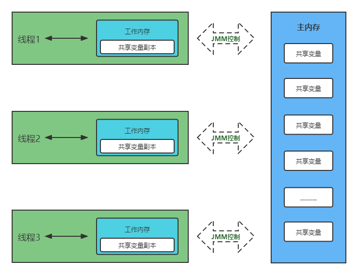
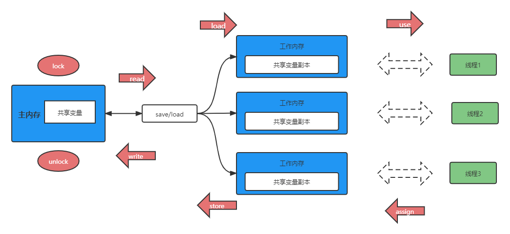

# :cyclone:并发理论基础

> :pencil2: Behind every successful man there's a lot of unsuccessful years.

## 并发编程的挑战

并发编程的挑战主要有：

- 线程的上下文切换
- 资源的限制

### 上下文切换

即使是单核处理器也支持多线程执行代码，CPU 通过给每个线程分配 CPU 时间片来实现这个机制。时间片是CPU分配给各个线程的时间，因为时间片非常短，所以 CPU 通过不停切换线程运行，让我们感觉多个线程是同时进行的，时间片一般是几十毫秒。

单核处理器多个线程执行，其实是属于并发，不是真正意义上并行，实际上每个任务在单核处理上，还是属于串行运行的。

> [!tip]
> 这里引出了两个概念：
>
> - 并行：把每一个任务分配给每一个处理器独立完成。在同一时间点，任务一定是同时运行。
> - 并发：把任务在不同的时间点交给处理器进行处理。在同一时间点，任务并不会同时运行。

CPU通过时间片分配算法来循环执行任务，当前任务执行一个时间片后会切换到下一个任务。但是，在切换前会保存上一个任务的状态，以便下次切换回这个任务时，可以再加载这个任务的状态。所以任务从保存到再加载的过程就是一次上下文切换。

### 减少上下文切换

- 无锁编程
- CAS算法
- 使用最少线程
- 协程

### 资源的限制

资源限制是指在进行并发编程时，程序的执行速度受限于计算机硬件资源或软件资源。

### 资源限制引发的问题

在并发编程中，将代码执行速度加快的原则是将代码中串行执行的部分变成并发执行，但是如果将某段串行的代码并发执行，因为受限于资源，仍然在串行执行，这时候程序不仅不会加快执行，反而会更慢，因为增加了上下文切换和资源调度的时间。

### 解决资源限制引发的问题

- 解决硬件资源，使用集群分担压力
- 解决软件资源，使用池化技术
- 根据不同的资源情况调整并发度

## CPU多级缓存

由于CPU的运算速度比主存（物理内存）的存取速度快很多，为了提高处理速度，现代CPU不直接和主存进行通信，而是在CPU和主存之间设计了多层的Cache（高速缓存），越靠近CPU的高速缓存越快，容量也越小。

根据以上 CPU 缓存结构图，可以看出 CPU 高速缓存有 L1、L2 和 L3（也就是一级缓存、二级缓存、三级缓存）。越靠近 CPU 的高速缓存读取越快，容量也越小。所以 L1 高速缓存容量很小，但存储速度最快，并且仍然只能被一个单独的 CPU 内核使用。 L3 缓存能被同一个 CPU 芯片板上的所有CPU内核共享。最后，系统还拥有一块主存，由系统所有CPU共享。

> [!tip]
>
> 拥有 L3 高速缓存的CPU，CPU 存储数据的命中率可达 95%，也就是说只有不到 5% 的数据需从主存中读取。

----

**CPU通过高速缓存进行数据读取有以下优势：**

- 写缓冲区可以保证指令流水线持续运行，可以避免由于CPU停顿下来等待向内存写入数据而产生的延迟。
- 通过以批处理的方式刷新写缓冲区，以及合并写缓冲区中对同一内存地址的多次写，减少对内存总线的占用。

## 并发编程三大问题

> 由于 CPU 的多级缓存，导致了并发编程的可见性和有序性问题。

### 原子性

所谓原子操作，就是“不可中断的一个或一系列操作”，是指不会被线程调度机制打断的操作。这种操作一旦开始，就一直运行到结束，中间不会有任何线程的切换。

### 可见性

一个线程对共享变量的修改，另一个线程能够立刻可见，我们称该共享变量具备内存可见性。

### 有序性

所谓程序的有序性，是指程序按照代码的先后顺序执行。如果程序执行的顺序与代码的先后顺序不同，并导致了错误的结果，即发生了有序性问题。

## CPU缓存一致性

> 由于每个 CPU 都有自己的缓存，同一份数据可能被缓存在多个 CPU 内核中，那么它们的值可能会不一样，就可能发生了内存的可见性的问题。

### 总线锁和缓存锁

为了解决内存的可见性问题，CPU主要提供了两种解决办法：总线锁和缓存锁。

**1. 总线锁**

操作系统提供了总线锁机制。前端总线（也叫CPU总线）是所有CPU与芯片组连接的主干道，负责CPU与外界所有部件的通信，包括高速缓存、内存、北桥，其控制总线向各个部件发送控制信号，通过地址总线发送地址信号指定其要访问的部件，通过数据总线实现双向传输。

在多CPU的系统中，当其中一个CPU要对共享主存进行操作时，在总线上发出一个LOCK#信号，这个信号使得其他CPU无法通过总线来访问共享主存中的数据，总线锁把CPU和主存之间的通信锁住了，这使得锁定期间，其他CPU不能操作其他主存地址的数据，总线锁的开销比较大，这种机制显然是不合适的。

> [!warning]
>
> 某一个CPU访问主存时，总线锁把CPU和主存的通信给锁住了，其他CPU不能操作其他主存地址的数据，使得效率低下，开销较大。

----

**2. 缓存锁**

相比总线锁，缓存锁降低了锁的粒度。为了达到数据访问的一致，需要各个 CPU 在访问高速缓存时遵循一些协议，在存取数据时根据协议来操作，常见的协议有 MSI、MESI、MOSI 等。最常见的就是 MESI 协议。

就整体而言，缓存一致性机制就是当某CPU对高速缓存中的数据进行操作之后，通知其他CPU放弃存储在它们内部的缓存数据，或者从主存中重新读取。

为了提高处理速度，CPU 不直接和主存进行通信，而是先将系统主存的数据读到内部高速缓存（L1、L2或其他）后再进行操作。但存在操作完不知道何时会写入内存这个问题，即使写回系统中，如果其他 CPU 高速缓存中的值还是旧的，再执行计算就会产生问题。

因此，在多CPU的系统中，为了保证各个CPU的高速缓存中数据的一致性，会实现缓存一致性协议，每个CPU通过嗅探在总线上传播的数据来检查自己的高速缓存中的值是否过期，当CPU发现自己缓存行对应的主存地址被修改时，就会将当前CPU的缓存行设置成无效状态，当CPU对这个数据执行修改操作时，会重新从系统主存中把数据读到CPU的高速缓存中。

----

为了保证高速缓存和内存数据的一致性，有以下两种写入方法：

- **直写：**在数据更新时，同时写入低一级的高速缓存和内存。此模式优点是操作简单，因为所有的数据都会更新到主存，所以其他 CPU 读取主存时都是最新值。此模式的缺点是数据写入速度较慢，因为数据修改之后需要同时写入低一级的高速缓存和主存。

- **回写：**数据更新不会立即反映到主存，而是只写入到高速缓存。只在数据被替换出高速缓存或者变成共享（S）状态时，如果发现数据有变动，才会将最新的数据更新到主存。此模式的的优点是写入速度快，因为发生数据变动时不需要写入主存，所有这种模式占用总线少。此模式的缺点是，实现一致性协议比较复杂。

## 重排序

> 内存屏障又称内存栅栏（Memory Fences），是一系列的CPU指令，它的作用主要是保证特定操作的执行顺序，保障并发执行的有序性，用于解决指令重排序。

为了提高性能，编译器和CPU常常会对指令进行重排序。重排序主要分为两类：编译器重排序和 CPU 重排序。

### 编译器重排序

编译器重排序指的是在代码编译阶段进行指令重排，不改变程序执行结果的情况下，为了提升效率，编译器对指令进行乱序（Out-of-Order）的编译。

> [!tip]
>
> 与其等待阻塞指令（如等待缓存刷入）完成，不如先去执行其他指令。与CPU乱序执行相比，编译器重排序能够完成更大范围、效果更好的乱序优化。

### CPU重排序

为了提供 CPU 的执行效率，流水线都是并行处理的，只要两个指令之间不存在**数据依赖**，就可以对这两个指令乱序。

CPU 重排序包括两类：

- 指令重排序：在不影响程序执行结果的情况下，CPU内核采用ILP（Instruction-LevelParallelism，指令级并行运算）技术来将多条指令重叠执行，主要是为了提升效率。如果指令之间不存在数据依赖性，CPU就可以改变语句的对应机器指令的执行顺序，叫作指令级重排序。
- 内存重排序：由于 CPU 高级缓存的存在，数据的读取和更新都需要经过高速缓存，最后才到主存，但是也因此导致了数据不一致的问题。

> 内存重排序是一种伪排序，也就是说只是看起来像在乱序执行而已。

### As-if-Serial规则

As-if-Serail规则规定了指令无论如何重排序,都必须保证代码在单线程下运行正确.

为了遵守As-if-Serial规则，编译器和CPU不会对存在数据依赖关系的操作进行重排序，因为这种重排序会改变执行结果。但是，如果指令之间不存在数据依赖关系，这些指令可能被编译器和CPU重排序。

> [!attention]
>
> 编译器和CPU遵循了As-if-Serial规则,只能在单CPU执行的情况下保证结果正确,在多核CPU并发执行下,还是会存在有序性的问题.

### 硬件层面的内存屏障

> 缓存一致性协议,只能保证了内存的可见性,但它无法禁止CPU重排序,也就是解决不了有序性的问题.为了保证保证有序性,需要使用内存屏障.

内存屏障又称内存栅栏，是让一个CPU高速缓存的内存状态对其他CPU内核可见的一项技术，也是一项保障跨CPU内核有序执行指令的技术。

---

硬件层常用的内存屏障分为三种：

- 读屏障

读屏障让高速缓存中相应的数据失效。在指令前插入读屏障，可以让高速缓存中的数据失效，强制重新从主存加载数据。并且，读屏障会告诉CPU和编译器，先于这个屏障的指令必须先执行。

- 写屏障

在指令后插入写屏障指令能让高速缓存中的最新数据更新到主存，让其他线程可见。并且，写屏障会告诉CPU和编译器，后于这个屏障的指令必须后执行。

- 全屏障  

全屏障是一种全能型的屏障，具备读屏障和写屏障的能力。Full Barrier又称为StoreLoad Barriers.

----

硬件层的内存屏障有以下作用:

- 阻止屏障两侧的指令重排序

编译器和CPU可能为了使性能得到优化而对指令重排序，但是插入一个硬件层的内存屏障相当于告诉CPU和编译器先于这个屏障的指令必须先执行，后于这个屏障的指令必须后执行。

- 强制让高速缓存的数据失效

硬件层的内存屏障强制把高速缓存中的最新数据写回主存，让高速缓存中相应的脏数据失效。一旦完成写入，任何访问这个变量的线程将会得到最新的值。

## JMM详解

> JMM（Java Memory Model，Java内存模型）并不像JVM内存结构一样是真实存在的运行实体，更多体现为一种规范和规则.

### 什么是JMM

JMM定义了一组规则或规范，该规范定义了一个线程对共享变量写入时，如何确保对另一个线程是可见的。实际上，JMM提供了合理的禁用缓存以及禁止重排序的方法，所以其核心的价值在于解决可见性和有序性。

JMM的另一大价值在于能屏蔽各种硬件和操作系统的访问差异，保证Java程序在各种平台下对内存的访问最终都是一致的。

JMM模型定义了以下两个概念:

- 主存

主要存储的是Java实例对象，所有线程创建的实例对象都存放在主存中，无论该实例对象是成员变量还是方法中的本地变量（也称局部变量），当然也包括共享的类信息、常量、静态变量。由于是共享数据区域，因此多条线程对同一个变量进行访问可能会发现线程安全问题。

- 工作内存

主要存储当前方法的所有本地变量信息（工作内存中存储着主存中的变量副本），每个线程只能访问自己的工作内存，即线程中的本地变量对其他线程是不可见的，即使两个线程执行的是同一段代码，它们也会各自在自己的工作内存中创建属于当前线程的本地变量，当然也包括字节码行号指示器、相关Native方法的信息。

> [!attention]
>
> 由于工作内存是每个线程的私有数据，线程间无法相互访问工作内存，因此存储在工作内存的数据不存在线程安全问题。

----

JMM内存模型规定如下:

- 所有变量存储在主存中
- 每个线程都有自己的工作内存，且对变量的操作都是在工作内存中进行的
- 不同线程之间无法直接访问彼此工作内存中的变量，要想访问只能通过主存来传递

### JMM的操作

JMM定义了一套自己的主存与工作内存之间的交互协议，即一个变量如何从主存拷贝到工作内存，又如何从工作内存写入主存，该协议包含8种操作，并且要求JVM具体实现必须保证其中每一种操作都是原子的、不可再分的。

操作 | 作用对象 | 说明
---------|----------|---------
 Read(读取) | 主存 | Read操作把一个变量的值从主存传输到工作内存,以便随后的Load操作使用
 Load(载入) | 工作内存 | Load操作把Read操作从主存中得到的变量值载入工作内存的变量副本中.变量副本可以简单理解为CPU的高速缓存
 Use(使用) | 工作内存 | Use操作把工作内存中的一个变量值传递给执行引擎.每当JVM遇到一个需要使用变量值的字节码指令时,执行Use操作
 Assign(赋值) | 工作内存 | 执行引擎通过Assign操作给工作内存的变量赋值.每当JVM遇到一个给变量赋值的字节码指令时,执行Assign操作
 Store(存储) | 工作内存 | Store操作把工作内存中的一个变量的值传递到主存中,以便随后的write操作使用
 Write(写入) | 主存 | Write操作把Store操作从工作内存中得到的值放入主存变量中
 Lock(锁定) | 主存 | 把一个变量标识为某个线程独占状态
 Unlock(解锁) | 主存 | 把一个处于锁定状态的变量释放出来,释放后的变量才可以被其他线程锁定

> [!warning]
>
> JMM要求Read和Load、Store和Write必须按顺序执行，但不要求连续执行。也就是说，Read和Load之间、Store和Write之间可插入其他指令。

### JMM如何解决有序性问题

> JMM提供了自己的内存屏障指令，要求JVM编译器实现这些指令，禁止特定类型的编译器和CPU重排序.

由于不同CPU硬件实现内存屏障的方式不同，JMM屏蔽了这种底层CPU硬件平台的差异，定义了不对应任何CPU的JMM逻辑层内存屏障，由JVM在不同的硬件平台生成对应的内存屏障机器码。

----

JMM内存屏障主要有Load和Store两类，具体如下：

- Load Barrier(读屏障):在读指令前插入读屏障，可以让高速缓存中的数据失效，重新从主存加载数据。
- Store Barrier(写屏障):在写指令之后插入写屏障，能让写入缓存的最新数据写回主存。

屏障类型 | 指令示例 | 说明
---------|----------|---------
 LoadLoad | Load1; LoadLoad; Load2; | 在Load2要读取的数据被访问前，使用LoadLoad屏障保证Load1要读取的数据被读取完毕
 StoreStore | Store1; StoreStore; Store2; | 在Store2及后续写入操作执行前，使StoreStore屏障保证Store1的写入结果对其他CPU可见
 LoadStore | Load1; LoadStore; Store2; | 在Store2及后续写入操作执行前，使LoadStore屏障保证Load1要读取的数据被读取完毕
 StoreLoad | Store1; StoreLoad; Load2; | 在Load2及后续所有读取操作执行前，使StoreLoad屏障保证Store1的写入对所有CPU可见

> [!tip]
>
> StoreLoad（SL）屏障的开销是4种屏障中最大的，但是此屏障是一个“全能型”的屏障，兼具其他3个屏障的效果，现代的多核CPU大多支持该屏障。

### Happens-Before规则

> 对于存在Happens-Befaore关系的Java语句,JMM尽量确保这两个Java语句之间的内存可见性和指令有序性。

顺序性规则

一个线程内，按照代码顺序，书写在前面的操作先行发生（Happens-Before）于书写在后面的操作。

该规则就是As-if-Serial规则，仅仅用来保证程序在单线程执行结果的正确性，但是无法保证程序在多线程执行结果的正确性。

volatile规则

对一个volatile变量的写先行发生（Happens-Before）于任意后续对这个volatile变量的读。

传递性规则

如果A操作先行发生于B操作，且B操作先行发生于C操作，那么A操作先行发生于C操作。

监视锁规则

对一个锁的unlock操作先行发生于后面对同一个锁的lock操作，即无论在单线程还是多线程中，同一个锁如果处于被锁定状态，那么必须先对锁进行释放操作，后面才能继续执行lock操作。

start()规则

如果线程A执行ThreadB.start()操作启动线程B，那么线程A的ThreadB.start()操作先行发生于线程B中的任意操作。反过来说，如果主线程A启动子线程B后，线程B能看到线程A在启动操作前的任何操作。

join()规则

如果线程A执行threadB.join()操作并成功返回，那么线程B中的任意操作先行发生于线程A的ThreadB.join()操作。
