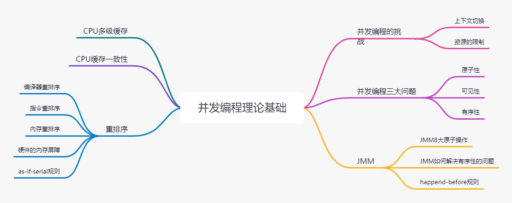

# 并发理论基础

> Behind every successful man there's a lot of unsuccessful years.

## 并发编程的挑战

并发编程的挑战主要有：

- 线程的上下文切换
- 资源的限制

### 上下文切换

即使是单核处理器也支持多线程执行代码，CPU 通过给每个线程分配 CPU 时间片来实现这个机制。时间片是CPU分配给各个线程的时间，因为时间片非常短，所以 CPU 通过不停切换线程运行，让我们感觉多个线程是同时进行的，时间片一般是几十毫秒。

单核处理器多个线程执行，其实是属于并发，不是真正意义上并行，实际上每个任务在单核处理上，还是属于串行运行的。

> [!tip]
> 这里引出了两个概念：
>
> - 并行：把每一个任务分配给每一个处理器独立完成。在同一时间点，任务一定是同时运行。
> - 并发：把任务在不同的时间点交给处理器进行处理。在同一时间点，任务并不会同时运行。

CPU通过时间片分配算法来循环执行任务，当前任务执行一个时间片后会切换到下一个任务。但是，在切换前会保存上一个任务的状态，以便下次切换回这个任务时，可以再加载这个任务的状态。所以任务从保存到再加载的过程就是一次上下文切换。

### 减少上下文切换

- 无锁编程
- CAS算法
- 使用最少线程
- 协程

### 资源的限制

资源限制是指在进行并发编程时，程序的执行速度受限于计算机硬件资源或软件资源。

### 资源限制引发的问题

在并发编程中，将代码执行速度加快的原则是将代码中串行执行的部分变成并发执行，但是如果将某段串行的代码并发执行，因为受限于资源，仍然在串行执行，这时候程序不仅不会加快执行，反而会更慢，因为增加了上下文切换和资源调度的时间。

### 解决资源限制引发的问题

- 解决硬件资源，使用集群分担压力
- 解决软件资源，使用池化技术
- 根据不同的资源情况调整并发度

## CPU多级缓存

由于CPU的运算速度比主存（物理内存）的存取速度快很多，为了提高处理速度，现代CPU不直接和主存进行通信，而是在CPU和主存之间设计了多层的Cache（高速缓存），越靠近CPU的高速缓存越快，容量也越小。

