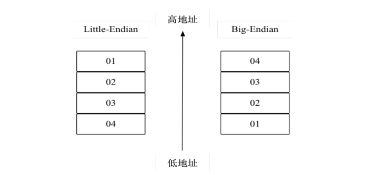

# 深入理解序列化——基础知识

> :pushpin: 明白事理的人使自己适应世界；不明事理的人想让世界适应自己。——萧伯纳

序列化本质上是一种数据编码工作，包含基本类型数据和复杂对象。复杂对象也是由基本类型构成的，所以序列化归根结底是要解决基本类型的数据编码，如整数编码、字符串编码、二进制流编码等。

## 计算机编码

### 比特、字节与字符

比特（bit）是计算机世界里最小的单元，每一个bit的取值是0或1，这便是二进制。1个字节由8个bit构成。字节是最小的存储单位。

字符是个很宽泛的概念，人们生产生活中用到的约定俗成的符号都可以称为字符，字符在计算机系统里是以1个或多个字节来表示的，这个由编码来决定。

### 字节对齐

计算机的存储空间按照字节来划分，理论上任何类型的数据都可以从任意位置开始。但实际情况是不同类型的数据需要按照一定的规则排布在指定的内存地址（一般由编译器来指定）。排布规则里很重要的一条便是字节对齐。

### Big-Endian与Little-Endian

低字节存储在低地址，称为Little-Endian；高字节存储在低地址，称为Big-Endian。

> :bell: 为了统一字节序列的解析，计算机科学家Danny Cohen在1980年提出网络传输统一采用Big-Endian传输字节序列。因此，Big-Endian也被称为网络字节序。

## 字符编码

### 字符集与字符编码

字符集表示字符的集合，从逻辑上对字符进行了编号和定义，但并不规定每个字符如何表示和存储。

### 英文字符集与编码

ASCII（American Standard Code for Information Interchange，美国信息交换标准代码）是基于拉丁字母的编码系统，主要用于显示现代英语和其他西欧语言。

### 中文字符集与编码

- **GB2312**

GB2312编码于1980年被提出，所有汉字字符在计算机内部采用2个字节来表示，每个字节的取值范围为［129-255］，最高位规定为1。小于127的字符与ASCII编码兼容。

· **GBK编码**

GBK是GB2312的扩充，在1995年被提出，除了收录GB2312的所有字符，还收录了其他不常见的简体字、繁体字等。GBK中的英文字符用单字节表示，中文字符用双字节表示。

- **GB18030**

GB18030在2000年被提出，是取代GBK 1.0的国家标准。GB18030还增加了对日文、韩文、藏文、蒙文等文字的支持。GB18030编码采用单字节、双字节和四字节方案，其中单字节、双字节和GBK是完全兼容的，四字节编码的码位收录了中日韩扩展的6582个汉字。

### Unicode字符集与编码

- **Unicode字符集**

Unicode为全世界所有的字符分配了唯一的数字编码，编码从0开始，可以一直往上增加。Unicode字符编码的格式为十六进制，在十六进制数值前增加“U+”前缀。

> :bell: Unicode约定了每个字符的编码，但并没有约定编码如何存储，而UTF-32、UTF-16、UTF-8则用于解决Unicode编码的物理存储问题。

- **UTF-32编码**

UTF-32将字符编码直接转换为二进制数，存储长度为4个字节。

- **UTF-16编码**

UTF-16使用变长字节表示编码：

1. 对于编码在U+0000到U+FFFF之间的字符，用2个字节表示。
2. 对于编码在U+10000到U+10FFFF之间的字符，用4个字节表示。

- **UTF-8编码**

UTF-8是一种针对Unicode编码的可变长度字符编码实现方式，编码长度为1至4字节。它可以用来表示Unicode标准中的任何字符，而且编码中的单字节仍与ASCII兼容，这使得原来处理ASCII字符的软件无须或只需做少部分修改即可继续使用。

## Base64编码

在数据传输的场景中，如果都是英文字符，传输能正常进行；但如果出现非英文字符，如中文字符、日文字符、不可打印字符、多媒体文件等，则可能出现乱码。为了解决上述问题，Base64编码方案被提出。Base64编码基于8 bit分割，以可打印字符为最终体现形式完成对数据的编码。

## Varint编码

很多时候用到的整数往往是比较小的。这些小整数在计算机里和相同类型的大整数占用相同的字节数。在系统之间进行数据传输的时候，小整数有价值的bit不多，如果按照计算机标准字节传送，则会造成传输资源的浪费。以整数1为例，占用4个字节，而有价值的bit是最低位的一个bit，其他值为0的bit传输到目标系统都是无价值的。为了实现小整数高效编码，Varint编码被提出。

> :bell: 从统计学角度看，大多数情况下人们使用的整数都是小正整数，通过Varint编码可以使用更少的字节来表示；但对于大正整数和负整数，Varint编码需要的字节数超过了标准语言定义的字节数。

## ZigZag编码

ZigZag将有符号整数统一映射为无符号整数，再通过Varint编码规则达到数据压缩的效果。

ZigZag编码使用的前提是：在大多数情况下使用的数字都是小整数，比如用户年龄、班级、年级、购物数量等。当数字比较大的时候，需要5字节来表示整数。

> :bell: ZigZag编码机制被用于Thrift、Protocol Buffer、Avro等序列化方案中。

## 初识序列化/反序列化

### 技术背景

在网络传输的过程中，传递的是二进制流。为了将编程中所涉及到的结构体（c语言）、对象（面向对象编码语言）进行传输，序列化的技术应运而生。

### IDL序列化引擎

一般来说，序列化/反序列化分为IDL（Interface Description Language，接口描述语言）和非IDL两类。

两类。非IDL技术方案包含JSON、XML等，提供构造和解析的工具包即可使用，不需要做代码生成的工作。IDL技术方案包含Thrift、Protocol Buffer、Avro等，有比较完整的规约和框架实现。
