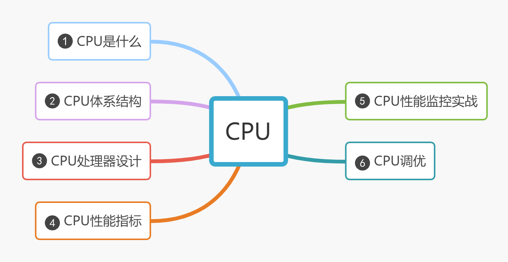

# :thumbsup:关于:computer:CPU的那些事

> 在寻求真理的长征中，唯有学习，不断地学习，勤奋地学习，有创造性的学习，才能越重山， 跨峻岭。 ——华罗庚

> 作为程序员，我们需要培养自己的技术领导力，而基础，是一切技术的根基。 ——lvan

## 概要

CPU是计算机组成里最重要的一个硬件了，我们编写程序的运行都离不开CPU，因此，对CPU的原理有个基本的认知，才知道该如何检查CPU，寻求性能优化的空间。

本篇文章主要是根据以下几个方面进行说明：

## CPU是什么？

> [!NOTE]
> 我们所知道的CPU是中央处理器，那只是一个很表面的认知，这对编程没有任何帮助！

CPU是用来表示计算机内部元件功能的术语，CPU由具有ON/OFF开关功能的**晶体管**构成（也被称为IC（集成电路））。另外，有的CPU在一个集成电路中集成了两个CPU芯片，我们称之为双核CPU。

## CPU体系结构

从硬件来看，CPU是由许多的**晶体管**来构成的，**晶体管只有两个状态，就是开和关**，而触发晶体管的打开和关闭，则需要一个**晶体振荡器**来产生**时钟信号**，
一个时钟信号在物理上对应着+0V ~ +5V电压的变更， 由于存在电压的高低变换，这种变换的电流就会触发晶体管的开和关，其实晶体管的开关状态，也就是对应这二进制的1和0。

从功能方面来看，CPU内部由寄存器、控制器、运算器和时钟四个部分构成，各部分之间由电流信号相互接通。

### 寄存器

不同类型的CPU、其内部寄存器的数量、种类以及寄存器存储的数量范围都是不同的。不过，根据功能，可以将寄存器分为以下几类：

- **累加寄存器：** 存储执行运算的数据和运算后的数据
- **标志寄存器：** 存储运算处理后的CPU的状态
- **程序计数器：** 存储下一条指令所在内存的地址
- **基址寄存器：** 存储数据内存的起始地址
- **变址寄存器：** 存储基址寄存器的相对地址
- **通用寄存器：** 存储任意数据
- **指令寄存器：** 存储指令，CPU内部使用，程序员无法通过程序对该寄存器进行读写操作
- **栈寄存器：** 存储栈区域的起始地址

### 控制器

控制器主要负责把内存上的指令、数据读入寄存器，并根据指令的执行结果来控制整个计算机。

### 运算器

运算器负责运算内存读入寄存器的数据。

### 时钟

时钟主要是负责产生信号，有些计算机的时钟是在外部的。我们可以通过查看计算机的属性信息来了解计算机的时钟频率，如我的笔记本处理器时钟为2.3GHz，
那么这个时钟周期的时间就是1/2.3GHz，可以简单理解为1秒内，CPU可以执行简单指令达到2.8G条。

从理论上来说，主频越高，CPU处理的指令就越多，性能也就越好。但事实并非如此，CPU执行的指令仍受限于流水线的设计。

## 程序是怎么运行的

## CPU处理器设计

## CPU性能指标

## CPU性能监控实战

## CPU调优
