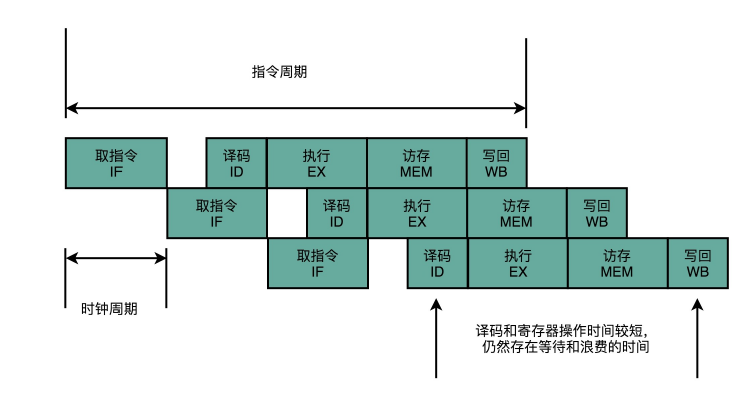

# 关于CPU的那些事

> 在寻求真理的长征中，唯有学习，不断地学习，勤奋地学习，有创造性的学习，才能越重山， 跨峻岭。 ——华罗庚

> 作为程序员，我们需要培养自己的技术领导力，而基础，是一切技术的根基。 ——lvan

## 概要

CPU是计算机组成里最重要的一个硬件了，我们编写程序的运行都离不开CPU，因此，对CPU的原理有个基本的认知，才知道该如何检查CPU，寻求性能优化的空间。

本篇文章主要是根据以下几个方面进行说明：


## CPU是什么？

> [!NOTE]
> 我们所知道的CPU是中央处理器，那只是一个很表面的认知，这对编程没有任何帮助！

CPU是用来表示计算机内部元件功能的术语，CPU由具有ON/OFF开关功能的**晶体管**构成（也被称为IC（集成电路））。另外，有的CPU在一个集成电路中集成了两个CPU芯片，我们称之为双核CPU。

## CPU体系结构

从硬件来看，CPU是由许多的**晶体管**来构成的，**晶体管只有两个状态，就是开和关**，而触发晶体管的打开和关闭，则需要一个**晶体振荡器**来产生**时钟信号**，一个时钟信号在物理上对应着+0V ~ +5V电压的变更， 由于存在电压的高低变换，这种变换的电流就会触发晶体管的开和关，其实晶体管的开关状态，也就是对应这二进制的1和0。

从功能方面来看，CPU内部由寄存器、控制器、运算器和时钟四个部分构成，各部分之间由电流信号相互接通。

### 寄存器

不同类型的CPU、其内部寄存器的数量、种类以及寄存器存储的数量范围都是不同的。不过，根据功能，可以将寄存器分为以下几类：

- **累加寄存器：** 存储执行运算的数据和运算后的数据
- **标志寄存器：** 存储运算处理后的CPU的状态
- **程序计数器：** 存储下一条指令所在内存的地址
- **基址寄存器：** 存储数据内存的起始地址
- **变址寄存器：** 存储基址寄存器的相对地址
- **通用寄存器：** 存储任意数据
- **指令寄存器：** 存储指令，CPU内部使用，程序员无法通过程序对该寄存器进行读写操作
- **栈寄存器：** 存储栈区域的起始地址

### 控制器

控制器主要负责把内存上的指令、数据读入寄存器，并根据指令的执行结果来控制整个计算机。

### 运算器

运算器负责运算内存读入寄存器的数据。

### 时钟

时钟主要是负责产生信号，有些计算机的时钟是在外部的。我们可以通过查看计算机的属性信息来了解计算机的时钟频率，如我的笔记本处理器时钟为2.3GHz，
那么这个时钟周期的时间就是1/2.3GHz，可以简单理解为1秒内，CPU可以执行简单指令达到2.8G条。

从理论上来说，主频越高，CPU处理的指令就越多，性能也就越好。但事实并非如此，CPU执行的指令仍受限于流水线的设计。

## 程序是怎么运行的

> 我们编写的程序，到底是怎样运行起来的呢:question:
> 
> 这里牵扯的知识面还是比较多的，包括编译原理以及计算机组成原理，而这里仅仅是通俗地说下CPU如何运行程序，主要目的是理解CPU的寄存器、控制器、运算器的交互流程以及其作用。

编写完的程序需要翻译（需经过编译、链接、装载）成机器指令，翻译得到的机器指令将会存放到主存中（主存储器，简称主存，主要负责存储数据和指令），当程序启动后，根据时钟信号，控制器会从主存中读取指令和数据到寄存器中，控制器（cpu内部）会从主存中读取指令和数据到寄存器中，这里包括设置程序计数器来记录下一条指令的执行地址，然后CPU通过改变程序计数器的指令地址来选取下一条执行的指令，通过运算器来对寄存器中的数据进行运算，控制器则根据运算结果来控制计算机，如输出结果等。

## CPU处理器设计

### 指令周期、机器周期与时钟周期

**指令周期**

从整体来看，计算机是顺序执行指令的，更深入理解，计算机所执行的每一条指令，都要经过**取得指令**、**指令译码**、**执行指令**三个过程，那么计算机就是不断循环以上三个过程来执行指令的，单个循环周期，我们称之为**指令周期**。

一个指令周期每个步骤都会涉及到控制器、运算器以及寄存器，步骤细分说明如下：
- **取得指令**：程序启动时，CPU会从主存中加载数据和指令，并维护程序计算器的值，那么CPU从**程序计算器**可以读取到下一条指令的地址时，**控制器**会将指令地址上的指令加载到**指令寄存器**中，
  然后将程序计算器自增，以读取下一条指令。
- **指令译码**：根据寄存器里面的指令，进行解析，解析成要进行什么样的操作，属于哪一类别的指令，具体要操作哪些寄存器、数据或内存地址。
- **执行指令**：也就是运行译码后的指令，以进行算术逻辑操作、数据传输或者直接的地址跳转。

主存存储数据和指令，控制器负责**取得指令**，将指令读取到指令寄存器中，控制器再负责对指令寄存器中的指令进行译码，译码后的指令将由**算术逻辑单元（ALU）** 操作，也就是运算器处理。

**机器周期**

机器周期也称CPU周期，在计算机中，为了便于管理，常把一条指令的执行过程划分为多个阶段（如，取指令、指令译码、执行指令），每一个阶段完成一个基本操作。完成一个基本操作所需要的时间称为机器周期。

**时钟周期**

CPU的运行，需要依赖时钟不断地发出信号，那么每个信号的时间，我们称为时钟周期。

**指令周期、时钟周期与机器周期之间的关系：**

一个指令周期包括了多个机器周期，一个机器周期又包括了多个时钟周期。

### 流水线设计

一条指令的执行，至少需要花费一个时钟周期，这里先假设一个时钟周期正好可以处理一条指令，那么剩下的指令就需要排队处理了，这就是**单指令存储器**。

实际上，每一条指令的时钟周期是不一样的，有的指令执行的速度很快，有些则很慢，那么对于单指令存储器来说，为了保证每个指令的时钟周期一致，那么就只能将执行最慢的指令所需的时钟周期作为标准了，那么其他的指令提前执行完了，也需要继续等待时钟周期过去。

为了提升cpu处理的吞吐率，采用了**指令流水线技术**来进行优化。

现在我们都知道，一条指令的执行包括了取指令、指令译码、执行指令三个过程，那么在指令流水线设计中，将以上三个步骤中的执行步骤细分，还包括访存以及写回两个过程，也就是从寄存器或者内存中读书数据，通过ALU进行运算，把结果写回到寄存器或者内存中。

因此，已经不需要将时钟周期设置成整条指令执行的时间，而是拆分完这样的一个一个小步骤需要的时间，同时，每一个阶段的电路再完成对应的任务之后，也不需要等待整个指令执行完成，而是可以直接执行下一条指令的对应阶段——这就是指令流水线设计。

将一条指令拆分为取指令、指令译码、执行指令三个过程，那这就是一个**三级流水线**， 那再加上的访存、写回两个步骤时，那就称为一个**五级流水线**了。五级流水线如图：



>[!warning]
>
>流水线等级越高，处理器的性能不一定会越高！

**结构冒险**

结构冒险，本质上是一个硬件层面的资源竞争的问题，也就是一个硬件电路层面的问题。

CPU在同一个时钟周期，同时在运行两条计算机指令的不同阶段。但是这两个不同的阶段，可能会用到同样的硬件电路，那么用到这些电路的指令就存在冲突的问题了。

问了解决指令冲突的问题，参考了**哈佛结构**的思路，现待的CPU虽然没有在内存层面进行对应得拆分，却在CPU内部得高速缓存部分进行了区分，把高速缓存分成了**指令缓存**与**数据缓存**两部分，以此解决硬件资源竞争的问题。

**数据冒险**

数据冒险，本质上是同时在执行多个指令之间，有数据依赖的情况。这些数据依赖，我们可以分成三个类，分别为先写后读、先读后写、写后再写，其实也就是下一个指令的执行会依赖上一个指令的执行结果，如果执行的顺序保证不了，那得到的运算结果就是错误的。

为了解决数据冒险的问题，可以采用流水线停顿的办法，也就是等指令准备好时再继续执行。但是因为时钟信号会不停在0和1之间自动切换，流水线是没有办法自动停下来的，那么改进的方案是，在指令执行的后面插入一个NOP操作，也就是执行一个其实什么都不做的操作，这个操作也称为**流水线冒泡**。

其实，不管是停顿还是插入NOP操作，都会让流水线退化成单指令周期的CPU，当然，还有其他更高级的解决方案。

**操作数前推**

一般情况下，一条指令的执行完后，需要写回寄存器中，然后下一条指令再读寄存器，为了避免这个操作，可以在硬件层面制作一条旁路，让一条指令的计算结果，可以直接传输给下一条指令，避开了写回寄存器，再读寄存器这个操作，这样直接传输让后面的指令可以更少，减少了流水线停顿的问题——这就是**操作数前推**。

但是，操作数前推并不能减少所有流水线插入NOP操作，仍然会存在部分的流水线冒泡。	

**乱序执行**

即使采用了操作数前推，减少了流水线冒泡，但是归根到底，只要前面指令的特定阶段还没执行完，后面的指令就会被阻塞住。

但是这个阻塞其实是没有必要的，因为尽管代码生成的指令是顺序的，但是后面的指令不需要依赖前面指令的执行结果，完成不必等待前面的指令运算完成。因此，采用了一个种**乱序执行**的方式进行优化。

>[!TIP]
>
>乱序执行，也就是我们常说的指令重排序。

​	乱序的执行的步骤如下：

1. 在取指令和指令译码的时候，乱序执行的CPU会一级一级顺序地进行取指令和指令译码。
2. 指令译码完成后，CPU并不会直接执行指令，而是进行一次指令分发，把指令发到一个称为保留站的地方。
3. 在保留站的指令，并不会立刻执行，而是等待它们所依赖的数据，拿到数据之后，才会继续执行。
4. 一旦指令到达，就可以交给ALU（算术逻辑单元）去执行了。
5. 指令执行的阶段完了之后，并不能立刻将结果写回到寄存器，而需要把结果存放到一个叫做重排序缓冲区中。
6. 在重排序缓冲去中，我们的CPU会按照取指令的顺序，对指令的计算结果重新排序。只有排在前面的指令都已经完成了，才会提交指令，完成整个指令的运算结果。
7. 实际的指令运算结果数据，是先写入存储缓冲区，最终才会写入到高速缓存和内存里。

>[!TIP]
>
>Java并发编程也需要考虑指令重排序的情况！！！

**如何提升CPU的吞吐率**

对于CPU的乱序执行，我们知道处理器在取指令、指令译码阶段还是顺序执行的，也就是在一个时钟周期，只能取一条指令，那么CPU的吞吐率最多也只是1。

为了提升CPU的吞吐率，通过增加硬件的方式，将取指令和译码指令进行并行处理。也就是，可以一次性从内存里面取出多条指令，然后分发给多个并行的指令译码器，进行译码，然后对应交给不同的ALU进行处理（CPU内不止一个ALU），这种是超标量技术。

通过超标量与多发射的技术，就可以提高了CPU的吞吐率。

## CPU性能指标

### 时钟频率

时钟是一个驱动所有处理器逻辑的数字信号，通过cpu指令（机器指令）可能会花费一个甚至多个时钟周期来执行，CPU是以一个特定的频率来执行的。

有些处理器可以改变时钟频率，升频以改进性能或者降频以减少能耗。频率可以根据操作系统请求进行优化，或者处理器自己动态调整。例如内核空闲线程，就可以请求CPU降级频率以节约能耗。

>[!warning]
>
>CPU时钟频率越高，不一定会提升CPU的性能-它取决于快速CPU周期里到底在做什么。

### CPI，IPC

计算程序的CPU执行时间，可以采用以下公式：

```
程序的CPU执行时间 = 指令数 * CPI * Clock Cycle Time
```

CPI为每一条指令的平均时钟周期， Clock Cycle Time每个时钟周期所需的时间，每个时钟周期的时间应该是固定的。对于以上的公式，CPI就是一个很重要的高级指标了，CPI主要是用来描述CPU如何使用它的时钟周期，同时也可以用来理解CPU使用率的本质。

当CPI较高，则表示指令数所需的时钟周期就越多，也就说明CPU经常陷入停滞。反之，较低的CPI则表示CPU基本没有停滞，指令吞吐量高。这些指标指明了性能调优的主要工作方向。

IPC为CPI的倒数，表示每周期的指令数，也可以用来理解CPU的吞吐率。

CPI代表了指令处理的效率，但并不代表指令本身的效率。假设有一个软件改动，加入了一个低效率的循环，这个循环主要在操作CPU 寄存器（没有停滞周期）：这种改动可能会降低总体CPI，但会提高CPU 的使用和利用度。

### CPU使用率

CPU 使用率通过测量一段时间内CPU 实例忙于执行工作的时间比例获得，以百分比表示。它也可以通过测量CPU 未运行内核空闲线程的时间得出，这段时间内CPU 可能在运行一些用户态应用程序线程，或者其他的内核线程，或者在处理中断。

高CPU 使用率并不一定代表着问题，仅仅表示系统正在工作。有些人认为这是ROI的指示器：高度利用的系统被认为有着较好的ROI，而空闲的系统则是浪费。和其他类型的资源（磁盘）不同，在高使用率的情况下，性能并不会出现显著下降，因为内核支持了优先级、抢占和分时共享。这些概念加起来让内核决定了什么线程的优先级更高，并保证它优先运行。

CPU 使用率的测量包括了所有符合条件活动的时钟周期，包括内存停滞周期。虽然看上去有些违反直觉，但CPU 有可能像前面描述的那样，会因为经常停滞等待I/O 而导致高使用率，而不仅是在执行指令。

CPU 使用率通常被分成内核时间和用户时间两个指标。

### 用户时间/内核时间

CPU 花在执行用户态应用程序代码的时间称为用户时间，而执行内核态代码的时间称为内核时间。内核时间包括系统调用、内核线程和中断的时间。当在整个系统范围内进行测量时，用户时间和内核时间之比揭示了运行的负载类型。

CPU 花在执行用户态应用程序代码的时间称为用户时间，而执行内核态代码的时间称为内核时间。内核时间包括系统调用、内核线程和中断的时间。当在整个系统范围内进行测量时，用户时间和内核时间之比揭示了运行的负载类型。

I/O 密集的应用程序的系统调用频率较高，通过执行内核代码进行I/O 操作。例如，一个进行网络I/O 的Web 服务器的用户/内核时间比大约为70/30。

这些数字依赖许多因素，只是用来表示预期的比例。

### 饱和度

一个100%使用率的CPU 被称为是饱和的，线程在这种情况下会碰上调度器延时，因为它们需要等待才能在CPU 上运行，降低了总体性能。这个延时是线程花在等待CPU 运行队列或者其他管理线程的数据结构上的时间。

另一个CPU 饱和度的形式则和CPU 资源控制有关，这个控制会在云计算环境下发生。尽管CPU 并没有100%地被使用，但已经达到了控制的上限，因此可运行的线程就必须等待轮到它们的机会。这个过程对用户的可见度取决于使用的虚拟化技术。

一个饱和运行的CPU 不像其他类型资源那样问题重重，因为更高优先级的工作可以抢占当前线程。

## 最后

现在基于CPU的性能分析以及监控工具也比较多，这一块将会在性能分析那一块统一介绍和说明。

## 参考

- 《程序是怎样跑起来的》
- 《深入浅出计算机组成原理》
- 《性能之巅：洞悉系统、企业与云计算》