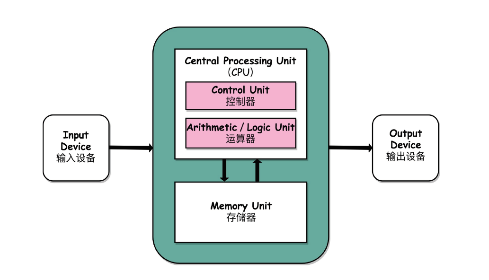

# 计算机组成原理基础-CPU性能

## 计算机基本硬件组成

**计算机的三大件：**

- cpu：计算机最重要的核心配件，负责计算机中的所有“计算”处理。
- 内存：编写的程序、打开的浏览器、运行的游戏都需要加载到内存中才能运行，内存越大，能加载的东西就越多。
- 主板：一个有着各种各样，有时候多大数十乃至上百个插槽的配件。Cpu、内存都要插在主板上。

**计算机三大件的关系：**

cpu从内存中加载数据进行运算，并将运算结果写回内存，cpu与内存之间的通信主要是依赖主板的**芯片组**以及**总线**，其中，**芯片组**控制了数据的流转，也就是数据从哪里到哪里的问题，**总线**则是实际数据传输的高速公路，因此**总线速度**决定了数据能传输得多快。

I/O设备：

- 键盘、鼠标
- 显示器

这些I/0设备都是插在主板上的，作为外部的I/O设备，它们是通过主板上的**南桥芯片组**来控制和CPU之间的通信的。

**南桥**芯片的名字很直观，一方面它在主板上的位置，通常在主板的“南面”，另一方面，它的作用就是作为“桥”，来连接鼠标、键盘以及硬盘这些外部设备和CPU之间的通信。

**特殊设备-显卡：**

显卡之所以特殊，是因为显卡里有除了CPU之外得得另一个处理器，也就是**GPU（图形处理器）**，GPU一样可以做各种“计算”的工作。

## 冯诺依曼体系结构

冯诺依曼体系结构，也叫存储程序计算机，存储程序计算机暗含了两个概念，一个是**可编程**，另一个是可**存储**。

冯诺依曼体系结构：

- 处理器单元：包括算术逻辑单元、处理器寄存器，用来完成各种算术和逻辑运算，也被称作数据通路或者运算器
- 控制器单元：包括指令寄存器和程序计数器的控制器单元，用来控制程序的流程，通常就是不同条件下的分支和跳转。
- 内存：存储数据和指令
- 硬盘
- I/O设备

**现代计算机的CPU=算术逻辑单元+控制器单元**

结构示意图:



## 通过CPU的主频，了解什么是性能

### 什么是性能？

计算机的性能，存在两个标准来衡量，分别是**响应时间**、**吞吐率（带宽）**。一般，我们会把性能定义成响应时间的倒数，也就是：

```java
性能=1/响应时间
```

这样一来，响应时间越短，性能的数值就越大。

### 计算机的计时单位： CPU时钟

虽然时间是一个很自然的用来衡量性能的指标，但是用时间来衡量时，有两个问题：

- 时间是不**准**的：这种方式是通过记录程序结束时间减去程序的开始时间来获得的，是存在误差的，这种时间也被称之为**Wall Clock Time**或者**Elapsed Time**，就是在程序运行期间，挂在墙上的钟走掉的时间。时间之所以不准，主要是由于CPU处于**并发**模式运行其他程序，这部分消耗的时间也统计在内了。
- 即使拿到了CPU时间，也不一定可以直接**比较**出两个程序的性能差异：在同一台计算机上，CPU可能**满载运行**也可能**降频运行**，**降频运行**的时候自然花的时间会多一些。

除了CPU之外，时间性能指标还会受到主板、内存这些其他相关硬件的影响。因此，需要对**时间**这个指标进行拆解，把程序的CPU执行时间变成**CPU时钟周期数**和**时钟周期时间**的乘积。

```java
程序的CPU执行时间=CPU时钟周期数*时钟周期时间
```
**时钟周期时间的解析：**
时钟周期时间与CPU的主频有关系，比如电脑的主频是是2.8GHz，就代表我们的CPU的一个**钟表**能够识别出来的最小的时间间隔。在CPU内部，有一个叫晶体振荡器的东西，简称为晶振。晶振就相当于电子表，晶振带来的一次**滴答**，就是时钟周期时间。

在2.8GHz的Cpu上，它的时钟周期时间，就是1/2.8G。我们的CPU，就是按照这个”**时钟**“提示的时间来进行自己的操作。主频越高，意味着Cpu运行地越快。

**提升性能的方案:**

以下的CPU执行时间的计算，可以再进一步的拆分。

```java
程序的CPU执行时间=CPU时钟周期数*时钟周期时间
```

拆分为:


```java
程序的CPU执行时间=指令数*CPI*时钟周期时间
CPI：每条指令的平均时钟周期数
```
提升性能，主要也是根据以上拆分的公式进行提升，有以下三种方案：

1. 提升主频：最简单的提升性能方案，也就是更换主频更高的CPU。
2. 减少CPI：现代的CPU通过流水线技术（Pipeline），让一条指令需要的Cpu Cycle尽可能地少。
3. 指令数；代表执行我们的程序到底需要多少条指令、用哪些指令。很多编译器也对此作了优化，尽量减少指令数。

## 功耗：CPU的”人体极限“

### 什么是功耗？

Cpu一般都被叫做超大规模集成电路（VSL）。这些电路，实际上都是一个个晶体管组合而成的。CPU在计算，其实就是让晶体管里面的”**开关**“不断地去”**打开**“和”**关闭**“，来组合完成各种运算功能。

想要提高运算速度，可以有以下两种方案：

- 增加密度：在同样面试的CPU里，多放晶体管。
- 提升主频：晶体官里的”开关“更频繁地去”打开“和”关闭“。

但以上两种方案，都会增加功耗，带来耗电和散热问题。

### 如何计算功耗？

CPU的功率，可以使用以下公式来表达：

```java
功耗 ~= 1/2 * 负载电容 * 电压的平方 * 开关频率 * 晶体管数量
```
结合以上提高cpu运算速度的两种方案，可以看出提高开关频率或者增加晶体管数量，都会增加功耗。为了减少功耗的增加，只能在减少电压上做文章了，在整个功耗的公式里面，功耗和电压的平方是成正比的，也就意味着电压下降到原来的1/5，整个功耗会变成原来的1/25。

### 并行优化，理解阿姆达尔定律

实际就是利用多个CPU（多核）来提供性能。

## 总结

不管是提高晶体管的数量，还是利用多核cpu来提高性能，它们都有相应的极限，因此，工程师们就需要从其他方面下功夫了，也产生了以下性能提升的原则和方法：

- 加速大概率事件
- 通过流水线提高性能
- 通过预测提高性能
