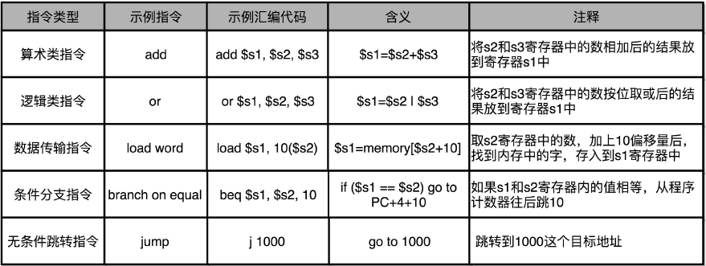
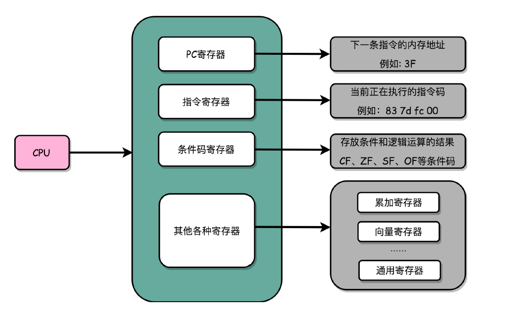
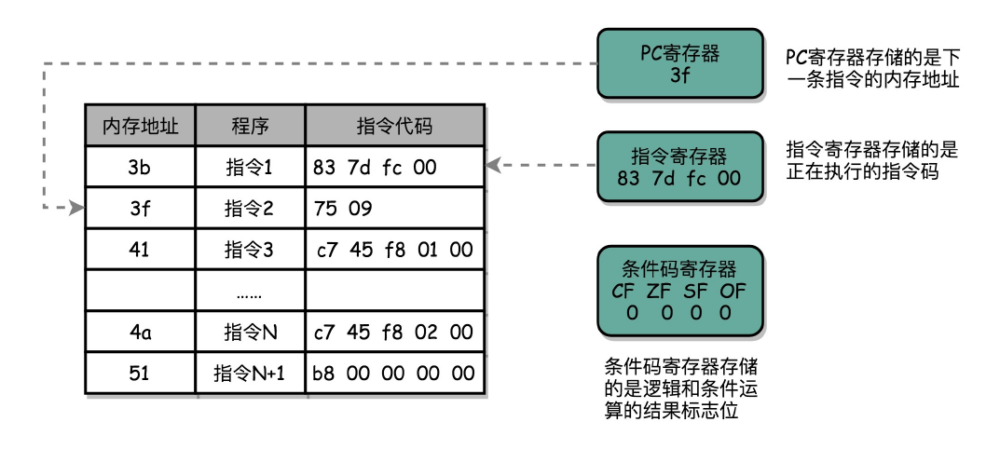

# 计算机组成原理基础-指令

## CPU与指令

从硬件角度来看，CPU就是一个超大规模集成电路，通过电路实现了加法、乘法乃至各种各样的处理器。从软件角度来看，CPU就是一个执行各种计算机指令的逻辑机器，这些计算机指令，也被称为**机器语言**。

存储器存放着计算机指令，因此这些计算机也被称之为存储程序型计算机。

## 高级语言到机器指令

高级语言经过编译器，编程成**汇编语言**，再由汇编器翻译成**机器语言**。

**机器指令分类：**

- 算术类指令：加减乘除在CPU层面，都会变成一条条算术类指令。
- 数据传输类指令：给变量赋值、在内存里读写数据，用的都是数据传输类指令。
- 逻辑类指令：逻辑上的与或非，都是这一类指令。
- 条件分支类指令：日常写的if/else, while等，都是条件分支指令。
- 无条件跳转指令：如函数调用，使用的就是无条件跳转指令。

**示例图：**

## CPU如何执行指令

CPU其实时由一堆寄存器组成，而寄存器就是CPU内部，由多个触发器或锁存器组成的简单电路。N个触发器或者锁存器，就可以组成一个N位（Bit）的寄存器，能够保存N位的数据。比方说，我们用的64位Intel服务器，寄存器就是64位。

一个CPU里包含很多种不同功能的寄存器，主要有以下几种：

- PC寄存器：它也叫**指令地址寄存器**，它用来存放下一条需要执行的计算机指令的内存地址。
- 指令寄存器：用来存放当前正在执行的指令。
- 条件码寄存器：用里面的一个一个标记位（Flag），存放CPU进行算术或逻辑计算的结果。

实际上，一个程序执行的时候，CPU会根据PC寄存器里的地址，从内存里面把需要执行的指令读取到指令寄存器里面执行，然后根据指令长度自增，开始顺序读取下一条指令。可以看到，一个程序的一条条指令，在内存里面是连续保存的，也会一条条顺序加载。

对于跳转指令来说，它会修改PC寄存器里面的地址值。这样，下一条要执行的指令就不是从内存里面顺序加载了。事实上，这些跳转指令的存在，也是我们可以在写程序的时候，使用if...else条件语句和while/for循环语句的原因。

## 函数调用与stack overflow

函数调用的机器指令是**call**。

在多层函数调用模型或者递归调用模型，它们可能是没有限制的调用，因此在所有函数调用返回之前，每一次调用的返回地址都要记录下来，但是我们的CPU里的寄存器数量并不多，比如Intel i7CPU只有16个64位寄存器，调用的层数一多就村不下了。

因此科学家采用了**栈**数据结构来改善此问题，由于栈的**后进先出**的特性，每次程序调用函数之前，都会创建一个**栈帧**，栈帧包括了调用函数的返回地址，入参等，将此栈帧入栈，每个函数调用完毕后，都对应着一个栈帧的出栈。

## 函数内联-优化性能

由于函数调用之间的调用，会产生比较多的指令，会存在性能的消耗，因为CPU要执行的计算次数就多了，因此编译器提供了一种**函数内联**的解决方案，以此来减少CPU需要执行的指令数，根据地址跳转的过程就不再需要了，甚至压栈和出栈的过程都不需要了。

不过内联也是存在代价的，内联意味着，我们可以将复用的程序指令在调用它的地方完全展开了。如果一个函数在很多地方被调用了，那么就会展开很多次，整个程序占用的空间就会变大了。

## 小结

高级语言通过条件分支、循环来实现不同的程序运行流程，回归到计算机可以识别的机器指令级别，其实都只是一个简单的地址跳转而已，也就是一个类似于goto的语句。
